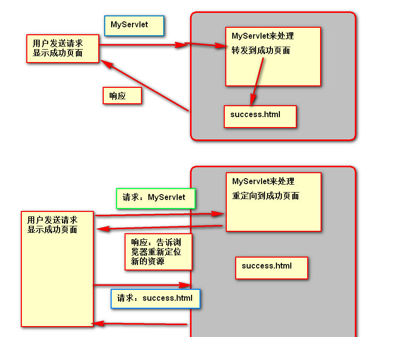
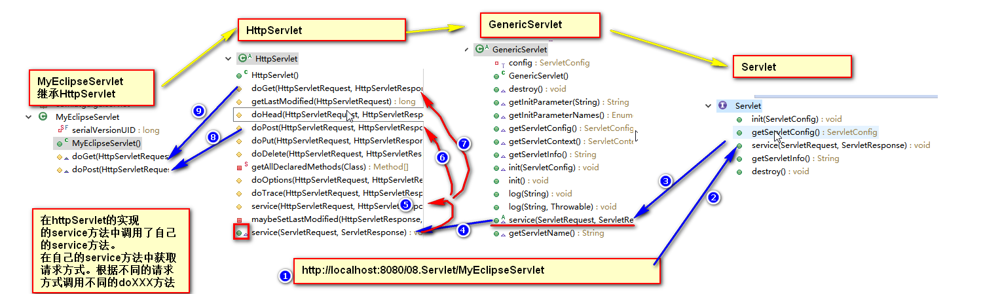
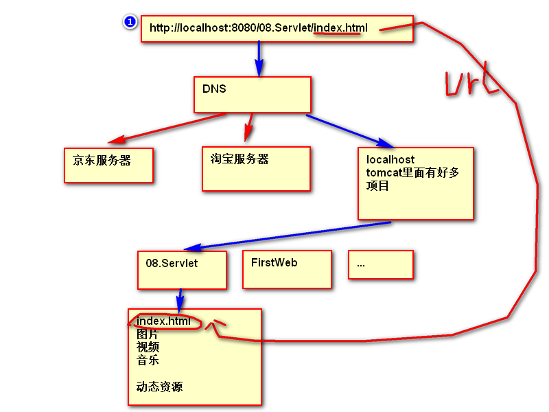

## Servlet的生命周期

生命周期：从出生到死亡的过程

Servlet是跑在Tomcat服务器上的。

一个Servlet只能处理一个指定的请求。应该指定servlet处理哪个请求。需要在web.xml里面配置servlet的详细信息。


当我们第一次访问HelloServlet时：
1）、创建一个Servlet对象
2）、调用Init方法      init()初始化servlet
3）、调用Service方法     service()处理请求
4）、只调用Service方法来处理请求 整个运行期间只创建了一个servlet对象。
servlet是单实例，多线程运行。
5）、当项目从服务器上卸载，服务器会调用destroy方法


## Servlet


```java
public class MyFirstServlet implements Servlet{

	//初始化
	@Override
	public void init(ServletConfig config) throws ServletException {
		// TODO Auto-generated method stub
		
	}

	//获取servlet配置信息
	@Override
	public ServletConfig getServletConfig() {
		// TODO Auto-generated method stub
		return null;
	}

	//服务
	@Override
	public void service(ServletRequest req, ServletResponse res)
			throws ServletException, IOException {
		// TODO Auto-generated method stub
		//service方法是用来处理来自客户端的请求
		System.out.println("我是第一个Servlet");
		//ServletResponse res给浏览器发送一个响应
		//获取一个写数据的对象
		PrintWriter writer = res.getWriter();
		writer.write("HelloWorld");
		
	}

	//获取servlet信息
	@Override
	public String getServletInfo() {
		// TODO Auto-generated method stub
		return "abcd";
	}

	//销毁
	@Override
	public void destroy() {
		// TODO Auto-generated method stub
		
	}
}
```

## ServletContext

1、ServletContext是什么？
一个web应用对应一个ServletContext。代表整个web项目

2、功能？
1)、可以获取web项目的配置信息,获取web项目的初始化参数。
```java
String user = servletContext.getInitParameter("user");
String username = servletContext.getInitParameter("username");
```
2)、获取web的项目路径
```java
String path = servletContext.getContextPath();
System.out.println(path);
```
3)、获取资源的真实路径
虚拟路径：是网络访问使用虚拟路径。每一个虚拟路径应该对应一个实际的资源。
静态资源(文件的形式)，动态资源（只是启动一段程序代码）
真实路径：文件在磁盘中的存储路径
```java
String realPath = servletContext.getRealPath("/index.html");
System.out.println(realPath);
```
4）、可以作为最大的域对象共享数据  域对象：共享数据  4大域对象。application域对象

## 重定向和转发的区别

1、重定向到页面
就是告诉浏览器重新请求一个资源
```java
response.sendRedirect("http://www.baidu.com");
```

2、转发到页面
服务器处理完成以后转交到另外一个资源。
当我们转发的资源是一个页面资源（静态资源），服务器会给浏览器返回这个资源。
当转交给下一个servlet的，servlet可以继续处理。
```java
request.getRequestDispatcher("http://www.baidu.com").forward(request, response);
```

转发&重定向


## ServletConfig

1、ServletConfig是什么？
是封装了servlet配置信息的对象,一个Servlet对应一个ServletConfig,
封装的是当前的servlet的配置信息

2、ServletConfig功能
1)、获取servlet'的 别名:getServletName()
```java
String servletName = config.getServletName();
System.out.println(servletName);
```

2）、获取servlet初始化参数
```java
String username = config.getInitParameter("username");
System.out.println("初始化参数：username=="+username);
```
3）、获取ServletContext对象。代表当前servlet的上下文。代表我当前的web项目信息
```java
ServletContext context = config.getServletContext();
System.out.println(context);
```


## HttpServlet

专门为处理Http请求定制的Servlet

原理图


## HttpServletRequest

代表就是封装浏览器请求信息的对象，收到的浏览器端的请求

1、获取请求数据 get放在url后面 post放在请求体里。

2、获取请求头信息
```java
String userAgent = request.getHeader("User-Agent");
System.out.println("请求头中User-Agent：" + userAgent);
```
3、转发一个页面/资源
```java
//先获取一个请求转发器
RequestDispatcher dispatcher = request.getRequestDispatcher("success.html");
//将请求转发出去
dispatcher.forward(request, response);
```
4、作为域对象共享数据


## HttpServletResponse

代表就是要发送浏览器的响应对象，封装我们的响应信息。

一个请求对应一个响应。

1）可以给浏览器响应字符串
```java
PrintWriter writer = response.getWriter();
writer.write("Hello HttpServlet.....");
```	
2）可以重定向到一个页面或者其他资源。重定向就是服务器告诉浏览器重新请求别的资源
```java
response.sendRedirect("success.html");
```


## 字符乱码

字符乱码存在与以下地方
1）响应给浏览器的数据是乱码
原因：是浏览器不知道数据的类型及编码格式。
解决：告诉浏览器内容类型及编码格式。在响应头里Content-type:text/html;charset=utf-8
方法：3种

2）在第一次操作response之前，设置好内容类型和字符编码，告诉浏览器我传输的数据的内容类型
第一种方式：告诉浏览器编码
```java
response.setContentType("text/html");
response.setCharacterEncoding("utf-8");
```
第二种方式：直接设置响应头
```java
response.addHeader("Content-Type", "text/html;charset=utf-8");
```
第三种方式：设置Content-type字段的值
```java
response.setContentType("text/html;charset=utf-8");
```


当我们在表单中填写中文的时候获取到的也是乱码
1、post乱码原因
浏览器将数据编码并提交上来，但是服务器并不知道编码规则
解决方法：让服务器知道编码规则即可,重新设置请求的编码格式
```java
request.setCharacterEncoding("utf-8");
```

2、get也会乱码   
原因：浏览器将地址栏也编码，服务器不知道，而且8080端口接受到url以后，已经按照默认的解码方法解码了。
所以在request.setCharacterEncoding("utf-8");没用了。
解决办法：修改tomcat的server.xml配置文件  在8080端口配置处添加URIEncoding="utf-8"

3、解决响应乱码
```java
response.setContentType("text/html;charset=utf-8");
```


## 虚拟路径&真实路径
