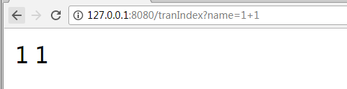
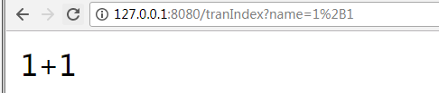

## 什么是URL转码

不管是以何种方式传递url时，如果要传递的url中包含特殊字符，如想要传递一个+，但是这个+会被url会被编码成空格，想要传递&，被url处理成分隔符。 
尤其是当传递的url是经过Base64加密或者RSA加密后的，存在特殊字符时，这里的特殊字符一旦被url处理，就不是原先你加密的结果了。
url特殊符号及对应的编码:

|符号|url中的含义|编码|
|-|-|-|
|+|URL中+号表示空格|%2B|
|空格|URL中的空格可以用+号或者编码|%20|
|/|分隔目录和子目录|%2F|
|?|分隔实际的URL和参数|%3F|
|%|指定特殊字符|%25|
|#|表示书签|%23|
|&|URL中指定的参数间的分隔符|%26|
|=|URL中指定参数的值|%3D|


## URLEncode和URLDecode

接受参数案例tranIndex
```java
@RestController
public class TranController {

	// 接受客户端参数
	@RequestMapping("/tranIndex")
	public String tranIndex(String name) {
		System.out.println("name:" + name);
		return name;
	}
}
```

客户端访问结果

传入+参数变为了空格。

解决办法：将+变为%2B



## Java代码处理转码

URLEncoder.encode和decode
```java
String encode = URLEncoder.encode("1+1", "UTF-8");
String decode = URLDecoder.decode(encode, "UTF-8");
System.out.println("encode:" + encode + ",decode:" + decode);
```

Http接口参数编码处理
```java
String url = "http://127.0.0.1:8080/tranIndex?";
// 参数转码
String strParam = "name=" + URLEncoder.encode("1+1", "utf-8");
String newUrl = url + strParam;
String result = HttpClientUtils.httpGet(newUrl);
System.out.println("result:" + result);
```