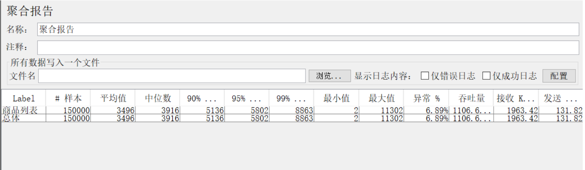
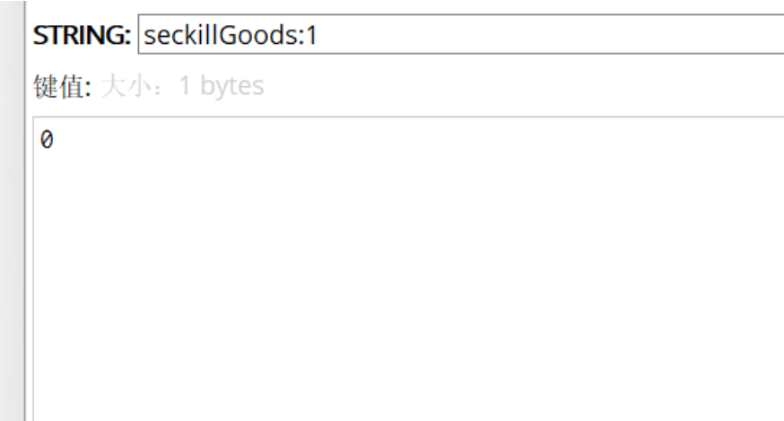

## 数据表设计

一、用户表

```sql
DROP TABLE IF EXISTS `t_user`;
CREATE TABLE `t_user`  (
  `id` int NOT NULL COMMENT '手机号码',
  `nickname` varchar(255) CHARACTER SET utf8mb4 COLLATE utf8mb4_0900_ai_ci NULL DEFAULT NULL COMMENT '昵称',
  `password` varchar(255) CHARACTER SET utf8mb4 COLLATE utf8mb4_0900_ai_ci NULL DEFAULT NULL COMMENT '密码',
  `slat` varchar(255) CHARACTER SET utf8mb4 COLLATE utf8mb4_0900_ai_ci NOT NULL COMMENT '盐',
  `head` varchar(255) CHARACTER SET utf8mb4 COLLATE utf8mb4_0900_ai_ci NULL DEFAULT NULL COMMENT '头像',
  `register_date` datetime NULL DEFAULT NULL COMMENT '注册时间',
  `last_login_date` datetime NULL DEFAULT NULL COMMENT '最后一次登录时间',
  `login_count` int NULL DEFAULT NULL COMMENT '登录次数',
  PRIMARY KEY (`id`) USING BTREE
) ENGINE = InnoDB CHARACTER SET = utf8mb4 COLLATE = utf8mb4_0900_ai_ci ROW_FORMAT = Dynamic;
```

二、商品表

```sql
CREATE TABLE `t_goods`  (
  `id` int NOT NULL AUTO_INCREMENT COMMENT '商品ID',
  `goods_name` varchar(255) CHARACTER SET utf8mb4 COLLATE utf8mb4_0900_ai_ci NULL DEFAULT NULL COMMENT '商品名称',
  `goods_title` varchar(255) CHARACTER SET utf8mb4 COLLATE utf8mb4_0900_ai_ci NULL DEFAULT NULL COMMENT '商品标题',
  `goods_img` varchar(255) CHARACTER SET utf8mb4 COLLATE utf8mb4_0900_ai_ci NULL DEFAULT NULL COMMENT '商品图片',
  `goods_detail` varchar(255) CHARACTER SET utf8mb4 COLLATE utf8mb4_0900_ai_ci NULL DEFAULT NULL COMMENT '商品详情',
  `goods_price` decimal(10, 2) NULL DEFAULT NULL COMMENT '商品价格',
  `goods_stock` int NULL DEFAULT NULL COMMENT '商品库存',
  PRIMARY KEY (`id`) USING BTREE
) ENGINE = InnoDB AUTO_INCREMENT = 1 CHARACTER SET = utf8mb4 COLLATE = utf8mb4_0900_ai_ci ROW_FORMAT = Dynamic;
```

三、订单表

```sql
CREATE TABLE `t_order`  (
  `id` int NOT NULL AUTO_INCREMENT COMMENT '订单ID',
  `user_id` int NULL DEFAULT NULL COMMENT '用户ID',
  `goods_id` int NULL DEFAULT NULL COMMENT '商品ID',
  `deliver_addr_id` int NULL DEFAULT NULL COMMENT '收获地址ID',
  `goods_name` varchar(255) CHARACTER SET utf8mb4 COLLATE utf8mb4_0900_ai_ci NULL DEFAULT NULL COMMENT '商品名称',
  `goods_count` int NULL DEFAULT NULL COMMENT '商品数量',
  `goods_price` decimal(10, 2) NULL DEFAULT NULL COMMENT '商品单价',
  `order_channel` int NULL DEFAULT NULL COMMENT '设备信息',
  `status` int NULL DEFAULT NULL COMMENT '订单状态',
  `create_date` datetime NULL DEFAULT NULL COMMENT '订单创建时间',
  `pay_date` datetime NULL DEFAULT NULL COMMENT '支付时间',
  PRIMARY KEY (`id`) USING BTREE
) ENGINE = InnoDB AUTO_INCREMENT = 1 CHARACTER SET = utf8mb4 COLLATE = utf8mb4_0900_ai_ci ROW_FORMAT = Dynamic;
```

四、秒杀商品表

```sql
CREATE TABLE `t_seckill_goods`  (
  `id` int NOT NULL AUTO_INCREMENT COMMENT '秒杀商品ID',
  `goods_id` int NULL DEFAULT NULL COMMENT '商品ID',
  `seckill_price` decimal(10, 2) NULL DEFAULT NULL COMMENT '秒杀价',
  `stock_count` int NULL DEFAULT NULL COMMENT '库存数量',
  `start_date` datetime NULL DEFAULT NULL COMMENT '秒杀开始时间',
  `end_date` datetime NULL DEFAULT NULL COMMENT '秒杀结束时间',
  PRIMARY KEY (`id`) USING BTREE
) ENGINE = InnoDB CHARACTER SET = utf8mb4 COLLATE = utf8mb4_0900_ai_ci ROW_FORMAT = Dynamic;
```

五、秒杀订单表

```sql
CREATE TABLE `t_seckill_order`  (
  `id` int NOT NULL AUTO_INCREMENT COMMENT '订单ID',
  `user_id` int NULL DEFAULT NULL COMMENT '用户ID',
  `order_id` int NULL DEFAULT NULL COMMENT '订单ID',
  `goods_id` int NULL DEFAULT NULL COMMENT '商品ID',
  PRIMARY KEY (`id`) USING BTREE
) ENGINE = InnoDB CHARACTER SET = utf8mb4 COLLATE = utf8mb4_0900_ai_ci ROW_FORMAT = Dynamic;
```

注意：1）秒杀库存要低于商品库存

## 逆向工程

生产controller层、service层、pojo、mapper、xml等文件


## 秒杀功能

一、商品列表页

跳转到商品列表页
```java
//controller
@RequestMapping("/toList")
public String toLogin(Model model, User user) {
	model.addAttribute("user", user);
	model.addAttribute("goodsList", goodsService.findGoodsVo());
	return "goodsList";
}
```

获取商品列表
```java
//service
List<GoodsVo> findGoodsVo();

```
获取商品列表

```java
//mapper
List<GoodsVo> findGoodsVo();

```
获取商品列表
```xml
<select id="findGoodsVo" resultType="com.xxxx.seckill.vo.GoodsVo">
    SELECT
        g.id,
        g.goods_name,
        g.goods_title,
        g.goods_img,
        g.goods_detail,
        g.goods_price,
        g.goods_stock,
        sg.seckill_price,
        sg.stock_count,
        sg.start_date,
        sg.end_date
    FROM
        t_goods g
        LEFT JOIN t_seckill_goods AS sg ON g.id = sg.goods_id
</select>
```

商品列表页
```html
<div class="panel panel-default">
    <div class="panel-heading">秒杀商品列表</div>
    <table class="table" id="goodslist">
        <tr>
            <td>商品名称</td>
            <td>商品图片</td>
            <td>商品原价</td>
            <td>秒杀价</td>
            <td>库存数量</td>
            <td>详情</td>
        </tr>
        <tr th:each="goods,goodsStat : ${goodsList}">
            <td th:text="${goods.goodsName}"></td>
            <td></td>
            <td th:text="${goods.goodsPrice}"></td>
            <td th:text="${goods.seckillPrice}"></td>
            <td th:text="${goods.stockCount}"></td>
            <td><a th:href="'/goodsDetail.htm?goodsId='+${goods.id}">详情</a></td>
        </tr>
    </table>
</div>
```


二、商品详情页

GoodsController
```java
    /**
     * 跳转商品详情页
     *
     * @param model
     * @param user
     * @param goodsId
     * @return
     */
    @RequestMapping("/toDetail/{goodsId}")
    public String toDetail(Model model, User user, @PathVariable Long goodsId) {
        model.addAttribute("user", user);
        GoodsVo goods = goodsService.findGoodsVoByGoodsId(goodsId);
        model.addAttribute("goods", goods);
        Date startDate = goods.getStartDate();
        Date endDate = goods.getEndDate();
        Date nowDate = new Date();
//秒杀状态
        int secKillStatus = 0;
//剩余开始时间
        int remainSeconds = 0;
//秒杀还未开始
        if (nowDate.before(startDate)) {
            remainSeconds = (int) ((startDate.getTime() - nowDate.getTime()) / 1000);
// 秒杀已结束
        } else if (nowDate.after(endDate)) {
            secKillStatus = 2;
            remainSeconds = -1;
// 秒杀中
        } else {
            secKillStatus = 1;
            remainSeconds = 0;
        }
        model.addAttribute("secKillStatus", secKillStatus);
        model.addAttribute("remainSeconds", remainSeconds);
        return "goodsDetail";
    }
```

GoodsService
```java
/**
* 根据商品id获取商品详情
* @param goodsId
* @return
*/
GoodsVo findGoodsVoByGoodsId(Long goodsId);
```
```java
/**
* 根据商品id获取商品详情
* @param goodsId
* @return
*/
@Override
public GoodsVo findGoodsVoByGoodsId(Long goodsId) {
return goodsMapper.findGoodsVoByGoodsId(goodsId);
}
```

GoodsMapper
```java
/**
* 根据商品id获取商品详情
* @param goodsId
* @return
*/
GoodsVo findGoodsVoByGoodsId(Long goodsId);
```
```xml
<!-- 根据商品id获取商品详情 -->
<select id="findGoodsVoByGoodsId" resultType="com.xxxx.seckill.vo.GoodsVo">
    SELECT
    g.id,
    g.goods_name,
    g.goods_title,
    g.goods_img,
    g.goods_detail,
    g.goods_price,
    g.goods_stock,
    sg.seckill_price,
    sg.stock_count,
    sg.start_date,
    sg.end_date
    FROM
    t_goods AS g
    LEFT JOIN t_seckill_goods AS sg ON g.id = sg.goods_id
    WHERE g.id = #{goodsId}
</select>
```
goodsDetail.html
```html
<body>
<div class="panel panel-default">
    <div class="panel-heading">秒杀商品详情</div>
    <div class="panel-body">
        <span th:if="${user eq null}"> 您还没有登录，请登陆后再操作<br/></span>
        <span>没有收货地址的提示。。。</span>
    </div>
    <table class="table" id="goods">
        <tr>
            <td>商品名称</td>
            <td colspan="3" th:text="${goods.goodsName}"></td>
        </tr>
        <tr>
            <td>商品图片</td>
            <td colspan="3"></td>
        </tr>
        <tr>
            <td>秒杀开始时间</td>
            <td th:text="${#dates.format(goods.startDate, 'yyyy-MM-dd
HH:mm:ss')}"></td>
            <td id="seckillTip">
                <input type="hidden" id="remainSeconds"
                       th:value="${remainSeconds}"/>
                <span th:if="${secKillStatus eq 0}">秒杀倒计时：<span
                        id="countDown"
                        th:text="${remainSeconds}"></span>秒</span>
                <span th:if="${secKillStatus eq 1}">秒杀进行中</span>
                <span th:if="${secKillStatus eq 2}">秒杀已结束</span>
            </td>
            <td>
                <form id="seckillForm" method="post"
                      action="/seckill/doSeckill">
                    <button class="btn btn-primary btn-block" type="submit"
                            id="buyButton">立即秒杀</button>
                    <input type="hidden" name="goodsId" th:value="${goods.id}"/>
                </form>
            </td>
        </tr>
        <tr>
            <td>商品原价</td>
            <td colspan="3" th:text="${goods.goodsPrice}"></td>
        </tr>
        <tr>
            <td>秒杀价</td>
            <td colspan="3" th:text="${goods.seckillPrice}"></td>
        </tr>
        <tr>
            <td>库存数量</td>
            <td colspan="3" th:text="${goods.stockCount}"></td>
</tr>
</table>
</div>
</body>
<script>
    $(function(){
        countDown();
    });
    function countDown(){
        var remainSeconds = $("#remainSeconds").val();
        var timeout;
//秒杀还没开始，倒计时
        if(remainSeconds > 0){
            $("#buyButton").attr("disabled", true);
            timeout = setTimeout(function(){
                $("#countDown").text(remainSeconds - 1);
                $("#remainSeconds").val(remainSeconds - 1);
                countDown();
            },1000);
//秒杀进行中
        }else if(remainSeconds == 0){
            $("#buyButton").attr("disabled", false);
            if(timeout){
                clearTimeout(timeout);
            }
            $("#seckillTip").html("秒杀进行中");
//秒杀已经结束
        }else{
            $("#buyButton").attr("disabled", true);
            $("#seckillTip").html("秒杀已经结束");
        }
    }
</script>
```


三、秒杀功能实现

SeckillController
```java
    @Controller
    @RequestMapping("/seckill")
    public class SeckillController {
        @Autowired
        private IGoodsService goodsService;
        @Autowired
        private ISeckillOrderService seckillOrderService;
        @Autowired
        private IOrderService orderService;
        @RequestMapping("/doSeckill")
        public String doSeckill(Model model, User user, Long goodsId) {
            if (user == null) {
                return "login";
            }
            model.addAttribute("user", user);
            GoodsVo goods = goodsService.findGoodsVoByGoodsId(goodsId);
//判断库存
            if (goods.getStockCount() < 1) {
                model.addAttribute("errmsg", RespBeanEnum.EMPTY_STOCK.getMessage());
                return "seckillFail";
            }
//判断是否重复抢购
            SeckillOrder seckillOrder = seckillOrderService.getOne(new
                    QueryWrapper<SeckillOrder>().eq("user_id", user.getId()).eq(
                    "goods_id",
                    goodsId));
            if (seckillOrder != null) {
                model.addAttribute("errmsg", RespBeanEnum.REPEATE_ERROR.getMessage());
                return "seckillFail";
            }
            Order order = orderService.seckill(user, goods);
            model.addAttribute("order",order);
            model.addAttribute("goods",goods);
            return "orderDetail";
        }
    }
```
OrderService
```java
Order seckill(User user, GoodsVo goods);
```
```java
    @Override
    @Transactional
    public Order seckill(User user, GoodsVo goods) {
//秒杀商品表减库存
        SeckillGoods seckillGoods = seckillGoodsService.getOne(new
                QueryWrapper<SeckillGoods>().eq("goods_id",
                goods.getId()));
        seckillGoods.setStockCount(seckillGoods.getStockCount() - 1);
        seckillGoodsService.updateById(seckillGoods);
//生成订单
        Order order = new Order();
        order.setUserId(user.getId());
        order.setGoodsId(goods.getId());
        order.setDeliveryAddrId(0L);
        order.setGoodsName(goods.getGoodsName());
        order.setGoodsCount(1);
        order.setGoodsPrice(seckillGoods.getSeckillPrice());
        order.setOrderChannel(1);
        order.setStatus(0);
        order.setCreateDate(new Date());
        orderMapper.insert(order);
//生成秒杀订单
        SeckillOrder seckillOrder = new SeckillOrder();
        seckillOrder.setOrderId(order.getId());
        seckillOrder.setUserId(user.getId());
        seckillOrder.setGoodsId(goods.getId());
        seckillOrderService.save(seckillOrder);
        return order;
    }
```

测试
秒杀成功进入订单详情注意查看库存是否正确扣减，订单是否正确生成


四、订单详情页
```html
<body>
<div class="panel panel-default">
    <div class="panel-heading">秒杀订单详情</div>
    <table class="table" id="order">
        <tr>
            <td>商品名称</td>
            <td th:text="${goods.goodsName}" colspan="3"></td>
        </tr>
        <tr>
            <td>商品图片</td>
            <td colspan="2"></td>
        </tr>
        <tr>
            <td>订单价格</td>
            <td colspan="2" th:text="${order.goodsPrice}"></td>
        </tr>
        <tr>
            <td>下单时间</td>
            <td th:text="${#dates.format(order.createDate, 'yyyy-MM-dd
HH:mm:ss')}" colspan="2"></td>
        </tr>
        <tr>
            <td>订单状态</td>
            <td >
                <span th:if="${order.status eq 0}">未支付</span>
                <span th:if="${order.status eq 1}">待发货</span>
                <span th:if="${order.status eq 2}">已发货</span>
                <span th:if="${order.status eq 3}">已收货</span>
                <span th:if="${order.status eq 4}">已退款</span>
                <span th:if="${order.status eq 5}">已完成</span>
            </td>
            <td>
                <button class="btn btn-primary btn-block" type="submit"
                        id="payButton">立即支付</button>
            </td>
        </tr>
        <tr>
            <td>收货人</td>
            <td colspan="2">XXX 18012345678</td>
        </tr>
        <tr>
            <td>收货地址</td>
            <td colspan="2">上海市浦东区世纪大道</td>
        </tr>
    </table>
</div>
</body>
```


## 系统压测

一、使用JMeter压测

二、正式压测

压测商品列表接口

准备5000个线程，循环10次。压测商品列表接口，测试3次，查看结果。

1）线程组


2）HTTP请求默认值


3）HTTP请求


4）结果


压测秒杀接口

创建用户
使用工具类往数据库插入5000用户，并且调用登录接口获取token，写入config.txt
```java
    /**
     * 生成用户工具类
     */
    public class UserUtil {
        private static void createUser(int count) throws Exception {
            List<User> users = new ArrayList<>(count);
//生成用户
            for (int i = 0; i < count; i++) {
                User user = new User();
                user.setId(13000000000L + i);
                user.setLoginCount(1);
                user.setUsername("user" + i);
                user.setRegisterDate(new Date());
                user.setSalt("1a2b3c");
                user.setPassword(MD5Util.inputPassToDbPass("123456", user.getSalt()));
                users.add(user);
            }
            System.out.println("create user");
//插入数据库
            Connection conn = getConn();
            String sql = "insert into t_user(login_count, username, register_date,
            salt, password, id)values(?,?,?,?,?,?)";
            PreparedStatement pstmt = conn.prepareStatement(sql);
            for (int i = 0; i < users.size(); i++) {
                User user = users.get(i);
                pstmt.setInt(1, user.getLoginCount());
                pstmt.setString(2, user.getUsername());
                pstmt.setTimestamp(3, new Timestamp(user.getRegisterDate().getTime()));
                pstmt.setString(4, user.getSalt());
                pstmt.setString(5, user.getPassword());
                pstmt.setLong(6, user.getId());
                pstmt.addBatch();
            }
            pstmt.executeBatch();
            pstmt.close();
            conn.close();
            System.out.println("insert to db");
//登录，生成token
            String urlString = "http://localhost:8080/login/doLogin";
            File file = new File("C:\\Users\\Administrator\\Desktop\\config.txt");
            if (file.exists()) {
                file.delete();
            }
            RandomAccessFile raf = new RandomAccessFile(file, "rw");
            file.createNewFile();
            raf.seek(0);
            for (int i = 0; i < users.size(); i++) {
                User user = users.get(i);
                URL url = new URL(urlString);
                HttpURLConnection co = (HttpURLConnection) url.openConnection();
                co.setRequestMethod("POST");
                co.setDoOutput(true);
                OutputStream out = co.getOutputStream();
                String params = "mobile=" + user.getId() + "&password=" +
                        MD5Util.inputPassToFormPass("123456");
                out.write(params.getBytes());
                out.flush();
                InputStream inputStream = co.getInputStream();
                ByteArrayOutputStream bout = new ByteArrayOutputStream();
                byte buff[] = new byte[1024];
                int len = 0;
                while ((len = inputStream.read(buff)) >= 0) {
                    bout.write(buff, 0, len);
                }
                inputStream.close();
                bout.close();
                String response = new String(bout.toByteArray());
                ObjectMapper mapper = new ObjectMapper();
                RespBean respBean = mapper.readValue(response, RespBean.class);
                String userTicket = ((String) respBean.getObj());
                System.out.println("create userTicket : " + user.getId());
                String row = user.getId() + "," + userTicket;
                raf.seek(raf.length());
                raf.write(row.getBytes());
                raf.write("\r\n".getBytes());
                System.out.println("write to file : " + user.getId());
            }
            raf.close();
            System.out.println("over");
        }
        private static Connection getConn() throws Exception {
            String url = "jdbc:mysql://localhost:3306/seckill?
            useUnicode=true&characterEncoding=UTF-8&serverTimezone=Asia/Shanghai";
            String username = "root";
            String password = "root";
            String driver = "com.mysql.cj.jdbc.Driver";
            Class.forName(driver);
            return DriverManager.getConnection(url, username, password);
        }
        public static void main(String[] args) throws Exception {
            createUser(5000);
        }
    }
```
config.txt

配置秒杀接口测试

线程组


HTTP请求默认值


CVS数据文件设置


HTTP Cookie管理器


HTTP请求


结果


可以看出已经出现了库存超卖的情况


## 页面优化

一、缓存
页面缓存
1)
GoodsController.java
```java
    /**
     * 跳转商品列表页
     *
     * @return
     */
    @RequestMapping(value = "/toList", produces = "text/html;charset=utf-8")
    @ResponseBody
    public String toLogin(HttpServletRequest request,HttpServletResponse
            response,Model model,User user){
        ValueOperations valueOperations=redisTemplate.opsForValue();
//Redis中获取页面，如果不为空，直接返回页面
        String html=(String)valueOperations.get("goodsList");
        if(!StringUtils.isEmpty(html)){
            return html;
        }
        model.addAttribute("user",user);
        model.addAttribute("goodsList",goodsService.findGoodsVo());
// return "goodsList";
//如果为空，手动渲染，存入Redis并返回
        WebContext context=new WebContext(request,response,
                request.getServletContext(),request.getLocale(),
                model.asMap());
        html=thymeleafViewResolver.getTemplateEngine().process("goodsList",
                context);
        if(!StringUtils.isEmpty(html)){
            valueOperations.set("goodsList",html,60,TimeUnit.SECONDS);
        }
        return html;
    }
    /**
     * 跳转商品详情页
     *
     * @param model
     * @param user
     * @param goodsId
     * @return
     */
    @RequestMapping(value = "/toDetail/{goodsId}", produces =
            "text/html;charset=utf-8")
    @ResponseBody
    public String toDetail(HttpServletRequest request,HttpServletResponse
            response,Model model,User user,
                           @PathVariable Long goodsId){
        ValueOperations valueOperations=redisTemplate.opsForValue();
//Redis中获取页面，如果不为空，直接返回页面
        String html=(String)valueOperations.get("goodsDetail:"+goodsId);
        if(!StringUtils.isEmpty(html)){
            return html;
        }
        model.addAttribute("user",user);
        GoodsVo goods=goodsService.findGoodsVoByGoodsId(goodsId);
        model.addAttribute("goods",goods);
        Date startDate=goods.getStartDate();
        Date endDate=goods.getEndDate();
        Date nowDate=new Date();
//秒杀状态
        int secKillStatus=0;
//剩余开始时间
        int remainSeconds=0;
//秒杀还未开始
        if(nowDate.before(startDate)){
            remainSeconds=(int)((startDate.getTime()-nowDate.getTime())/
                    1000);
// 秒杀已结束
        }else if(nowDate.after(endDate)){
            secKillStatus=2;
            remainSeconds=-1;
// 秒杀中
        }else{
            secKillStatus=1;
            remainSeconds=0;
        }
        model.addAttribute("secKillStatus",secKillStatus);
        model.addAttribute("remainSeconds",remainSeconds);
// return "goodsDetail";
//如果为空，手动渲染，存入Redis并返回
        WebContext context=new WebContext(request,response,
                request.getServletContext(),request.getLocale(),
                model.asMap());
        html=thymeleafViewResolver.getTemplateEngine().process("goodsDetail",
                context);
        if(!StringUtils.isEmpty(html)){
            valueOperations.set("goodsDetail:"+goodsId,html,60,
                    TimeUnit.SECONDS);
        }
        return html;
    }
```
2)重新运行项目查看效果


3)测试，可以发现对比之前QPS提升明显


对象缓存
1)
RespBeanEnum.java
```java
MOBILE_NOT_EXIST(500213, "手机号码不存在"),
PASSWORD_UPDATE_FAIL(500214, "密码更新失败"),
```
IUserService.java
```java
RespBean updatePassword(String userTicket,Long id,String password);
```
UserServiceImpl.java
```java
    public RespBean updatePassword(String userTicket, Long id, String password) {
        User user = userMapper.selectById(id);
        if (user == null) {
            throw new GlobalException(RespBeanEnum.MOBILE_NOT_EXIST);
        }
        user.setPassword(MD5Util.inputPassToDbPass(password, user.getSalt()));
        int result = userMapper.updateById(user);
        if (1 == result) {
//删除Redis
            redisTemplate.delete("user:" + userTicket);
            return RespBean.success();
        }
        return RespBean.error(RespBeanEnum.PASSWORD_UPDATE_FAIL);
    }
```

二、页面静态化
商品详情静态化
1)
DetailVo.java
```java
public class DetailVo {
	private User user;
	private GoodsVo goodsVo;
	private int secKillStatus;
	private int remainSeconds;
}
```

GoodsController.java
```java
    public RespBean toDetail(HttpServletRequest request, HttpServletResponse
            response, Model model, User user,
                             @PathVariable Long goodsId) {
        GoodsVo goods = goodsService.findGoodsVoByGoodsId(goodsId);
        Date startDate = goods.getStartDate();
        Date endDate = goods.getEndDate();
        Date nowDate = new Date();
//秒杀状态
        int secKillStatus = 0;
//剩余开始时间
        int remainSeconds = 0;
        //秒杀还未开始
        if (nowDate.before(startDate)) {
            remainSeconds = (int) ((startDate.getTime() - nowDate.getTime()) / 1000);
// 秒杀已结束
        } else if (nowDate.after(endDate)) {
            secKillStatus = 2;
            remainSeconds = -1;
// 秒杀中
        } else {
            secKillStatus = 1;
            remainSeconds = 0;
        }
        DetailVo detailVo = new DetailVo();
        detailVo.setGoodsVo(goods);
        detailVo.setUser(user);
        detailVo.setRemainSeconds(remainSeconds);
        detailVo.setSecKillStatus(secKillStatus);
        return RespBean.success(detailVo);
    }
```

common.js
```js
// 获取url参数
function g_getQueryString(name) {
    var reg = new RegExp("(^|&)" + name + "=([^&]*)(&|$)");
    var r = window.location.search.substr(1).match(reg);
    if (r != null) return unescape(r[2]);
    return null;
};
//设定时间格式化函数，使用new Date().format("yyyy-MM-dd HH:mm:ss");
Date.prototype.format = function (format) {
    var args = {
        "M+": this.getMonth() + 1,
        "d+": this.getDate(),
        "H+": this.getHours(),
        "m+": this.getMinutes(),
        "s+": this.getSeconds(),
    };
    if (/(y+)/.test(format))
        format = format.replace(RegExp.$1, (this.getFullYear() + "").substr(4 -
            RegExp.$1.length));
    for (var i in args) {
        var n = args[i];
        if (new RegExp("(" + i + ")").test(format))
            format = format.replace(RegExp.$1, RegExp.$1.length == 1 ? n : ("00" +
                n).substr(("" + n).length));
    }
    return format;
};
```
goodsDetail.html
```html
<body>
<div className="panel panel-default">
    <div className="panel-heading">秒杀商品详情</div>
    <div className="panel-body">
        <span id="userTip"> 您还没有登录，请登陆后再操作<br/></span>
        <span>没有收货地址的提示。。。</span>
    </div>
    <table className="table" id="goods">
        <tr>
            <td>商品名称</td>
            <td colSpan="3" id="goodsName"></td>
        </tr>
        <tr>
            <td>商品图片</td>
            <td colSpan="3"></td>
        </tr>
        <tr>
            <td>秒杀开始时间</td>
            <td id="startTime"></td>
            <td>
                <input type="hidden" id="remainSeconds"/>
                <!-- <span if="secKillStatus eq 0">秒杀倒计时：<span
                id="countDown"
                text="remainSeconds">
                </span>秒</span>
                <span if="secKillStatus eq 1">秒杀进行中</span>
                <span if="secKillStatus eq 2">秒杀已结束</span>-->
                <span id="seckillTip"></span>
            </td>
            <td>
                <form id="seckillForm" method="post"
                      action="/seckill/doSeckill">
                    <button className="btn btn-primary btn-block" type="submit"
                            id="buyButton">立即秒杀
                    </button>
                    <input type="hidden" name="goodsId" id="goodsId"/>
                </form>
            </td>
        </tr>
        <tr>
            <td>商品原价</td>
            <td colSpan="3" id="goodsPrice"></td>
        </tr>
        <tr>
            <td>秒杀价</td>
            <td colSpan="3" id="seckillPrice"></td>
        </tr>
        <tr>
            <td>库存数量</td>
            <td colSpan="3" id="stockCount"></td>
        </tr>
    </table>
</div>
</body>
<script>
    $(function () {
// countDown();
    getDetails();
}
    );
    function getDetails() {
    var goodsId = g_getQueryString("goodsId");
    $.ajax({
    url: "/goods/detail/" + goodsId,
    type: "GET",
    success: function (data) {
    if (data.code == 200) {
    render(data.obj);
} else {
    layer.msg(data.message);
}
},
    error: function () {
    layer.msg("客户端请求错误");
}
})
}
    function render(detail) {
    var user = detail.user;
    var goods = detail.goodsVo;
    var remainSeconds = detail.remainSeconds;
    if (user) {
    $("#userTip").hide();
}
    $("#goodsName").text(goods.goodsName);
    $("#goodsImg").attr("src", goods.goodsImg);
    $("#startTime").text(new Date(goods.startDate).format("yyyy-MM-dd
    HH:mm:ss"));
    $("#remainSeconds").val(remainSeconds);
    $("#goodsId").val(goods.id);
    $("#goodsPrice").text(goods.goodsPrice);
    $("#seckillPrice").text(goods.seckillPrice);
    $("#stockCount").text(goods.stockCount);
    countDown();
}
    function countDown() {
    var remainSeconds = $("#remainSeconds").val();
    var timeout;
//秒杀还没开始，倒计时
    if (remainSeconds > 0) {
    $("#buyButton").attr("disabled", true);
    $("#seckillTip").html("秒杀倒计时：" + remainSeconds + "秒");
    timeout = setTimeout(function () {
// $("#countDown").text(remainSeconds - 1);
    $("#remainSeconds").val(remainSeconds - 1);
    countDown();
},
    1000
    );
}
//秒杀进行中
    else if (remainSeconds == 0) {
    $("#buyButton").attr("disabled", false);
    if (timeout) {
    clearTimeout(timeout);
}
    $("#seckillTip").html("秒杀进行中");
//秒杀已经结束
} else {
    $("#buyButton").attr("disabled", true);
    $("#seckillTip").html("秒杀已经结束");
}
}
</script>
```
2)测试
秒杀未开始


秒杀进行中


秒杀已结束


秒杀静态化
1)
SeckillController.java

goodsDetail.html

orderDetail.html

applictaion.yml

2)测试


订单详情静态化
1）
OrderController.java

IOrderService.java

OrderServiceImpl.java

OrderDetailVo.java

orderDetail.html

2)效果


3)解决库存超卖

减库存时判断库存是否足够
OrderServiceImpl.java

解决同一用户同时秒杀多件商品。
可以通过数据库建立唯一索引避免

将秒杀订单信息存入Redis，方便判断是否重复抢购时进行查询
OrderServiceImpl.java

seckillController.java

SeckillOrder.java

4)测试
QPS提升并不明显，重点在于是否出现库存超卖现象


## 服务优化

一、RabbitMQ
二、RabbitMQ交换机

三、接口优化

思路：减少数据库访问
1. 系统初始化，把商品库存数量加载到Redis
2. 收到请求，Redis预减库存。库存不足，直接返回。否则进入第3步
3. 请求入队，立即返回排队中
4. 请求出队，生成订单，减少库存
5. 客户端轮询，是否秒杀成功

Redis操作库存

RabbitMQ秒杀

客户端轮询秒杀结果

测试
1）项目启动，Redis预加载库存


2）秒杀成功，数据库及Redis库存数量正确


压测秒杀
1）QPS相比之前有一定提升


2）数据库以及Redis库存数量和订单都正确



优化Redis操作库存
上面代码实际演示会发现Redis的库存有问题，原因在于Redis没有做到原子性。我们采用锁去解决
1）分布式锁
进来一个线程先占位，当别的线程进来操作时，发现已经有人占位了，就会放弃或者稍后再试
线程操作执行完成后，需要调用del指令释放位子
```java
    @Test
    public void testLock01(){
        ValueOperations valueOperations = redisTemplate.opsForValue();
        Boolean isLock = valueOperations.setIfAbsent("k1", "v1");
        if (isLock){
            valueOperations.set("name","xxxx");
            String name = (String) valueOperations.get("name");
            System.out.println(name);
            redisTemplate.delete("k1");
        }else {
            System.out.println("有线程在使用，请稍后");
        }
    }
```
2)为了防止业务执行过程中抛异常或者挂机导致del指定没法调用形成死锁，可以添加超时时间
```java
    @Test
    public void testLock02(){
        ValueOperations valueOperations = redisTemplate.opsForValue();
        Boolean isLock = valueOperations.setIfAbsent("k1","v1",5, TimeUnit.SECONDS);
        if (isLock){
            valueOperations.set("name","xxxx");
            String name = (String) valueOperations.get("name");
            System.out.println(name);
            redisTemplate.delete("k1");
        }else {
            System.out.println("有线程在使用，请稍后");
        }
    }
```
上面例子，如果业务非常耗时会紊乱。举例：第一个线程首先获得锁，然后执行业务代码，但是业务代
码耗时8秒，这样会在第一个线程的任务还未执行成功锁就会被释放，这时第二个线程会获取到锁开始
执行，在第二个线程开执行了3秒，第一个线程也执行完了，此时第一个线程会释放锁，但是注意，他
释放的第二个现成的锁，释放之后，第三个线程进来。

解决方案：

	尽量避免在获取锁之后，执行耗时操作
	将锁的value设置为一个随机字符串，每次释放锁的时候，都去比较随机字符串是否一致，如果一
	致，再去释放，否则不释放。
	释放锁时要去查看所得value，比较value是否正确，释放锁总共三个步骤，这三个步骤不具
	备原子性。
3)Lua脚本
Lua脚本优势：

	使用方便，Redis内置了对Lua脚本的支持
	Lua脚本可以在Rdis服务端原子的执行多个Redis命令
	由于网络在很大程度上会影响到Redis性能，使用Lua脚本可以让多个命令一次执行，可以有
	效解决网络给Redis带来的性能问题

使用Lua脚本思路：

	提前在Redis服务端写好Lua脚本，然后在java客户端去调用脚本
	可以在java客户端写Lua脚本，写好之后，去执行。需要执行时，每次将脚本发送到Redis上
	去执行
	
创建Lua脚本(放在resources目录下)
lock.lua
```lua
if redis.call("get",KEYS[1]) == ARGV[1] then
	return redis.call("del",KEYS[1])
else
	return 0
end
```

调用脚本
RedisConfig.java
```java
@Bean
public DefaultRedisScript<Boolean> script() {
	DefaultRedisScript<Boolean> redisScript = new DefaultRedisScript<>();
	//放在和application.yml 同层目录下
	redisScript.setLocation(new ClassPathResource("lock.lua"));
	redisScript.setResultType(Boolean.class);
	return redisScript;
}
```

Test.java
```java
    @Test
    public void testLock03(){
        ValueOperations valueOperations = redisTemplate.opsForValue();
        String value = UUID.randomUUID().toString();智者乐山仁者乐水●程序员乐字节第 138／155页
                上海市浦东新区汇通南园文化创意园
        优化Redis预减库存
        stock.lua
        RedisConfig.java
        SeckillController.java
//给锁添加一个过期时间，防止应用在运行过程中抛出异常导致锁无法及时得到释放
        Boolean isLock = valueOperations.setIfAbsent("k1",value,5, TimeUnit.SECONDS);
//没人占位
        if (isLock){
            valueOperations.set("name","xxxx");
            String name = (String) valueOperations.get("name");
            System.out.println(name);
            System.out.println(valueOperations.get("k1"));
//释放锁
            Boolean result = (Boolean) redisTemplate.execute(script,
                    Collections.singletonList("k1"), value);
            System.out.println(result);
        }else {
//有人占位，停止/暂缓 操作
            System.out.println("有线程在使用，请稍后");
        }
    }
```

优化Redis预减库存
stock.lua
```lua
if (redis.call('exists', KEYS[1]) == 1) then
	local stock = tonumber(redis.call('get', KEYS[1]));
	if (stock > 0) then
		redis.call('incrby', KEYS[1], -1);
		return stock;
	end;
	return 0;
end;
```
RedisConfig.java
```java
@Bean
public DefaultRedisScript<Long> script() {
	DefaultRedisScript<Long> redisScript = new DefaultRedisScript<>();
	//放在和application.yml同层目录下
	redisScript.setLocation(new ClassPathResource("stock.lua"));
	redisScript.setResultType(Long.class);
	return redisScript;
}
```
SeckillController.java
```java
    @RequestMapping(value = "/doSeckill", method = RequestMethod.POST)
    @ResponseBody
    public RespBean doSeckill(User user, Long goodsId) {
        if (user == null) {
            return RespBean.error(RespBeanEnum.SESSION_ERROR);
        }
        ValueOperations valueOperations = redisTemplate.opsForValue();
//判断是否重复抢购
        String seckillOrderJson = (String) valueOperations.get("order:" +
                user.getId() + ":" + goodsId);
        if (!StringUtils.isEmpty(seckillOrderJson)) {
            return RespBean.error(RespBeanEnum.REPEATE_ERROR);
        }
//内存标记,减少Redis访问
        if (EmptyStockMap.get(goodsId)) {
            return RespBean.error(RespBeanEnum.EMPTY_STOCK);
        }
//预减库存
        Long stock = (Long) redisTemplate.execute(script,
                Collections.singletonList("seckillGoods:" + goodsId), Collections.EMPTY_LIST);
        if (stock < 0) {
            EmptyStockMap.put(goodsId,true);
            return RespBean.error(RespBeanEnum.EMPTY_STOCK);
        }
// 请求入队，立即返回排队中
        SeckillMessage message = new SeckillMessage(user, goodsId);
        mqSender.sendsecKillMessage(JsonUtil.object2JsonStr(message));
        return RespBean.success(0);
    }
```

## 安全优化

秒杀接口地址隐藏

图形验证码

接口限流

## 参考资料

Java高并发秒杀系统
https://www.bilibili.com/video/BV1sf4y1L7KE