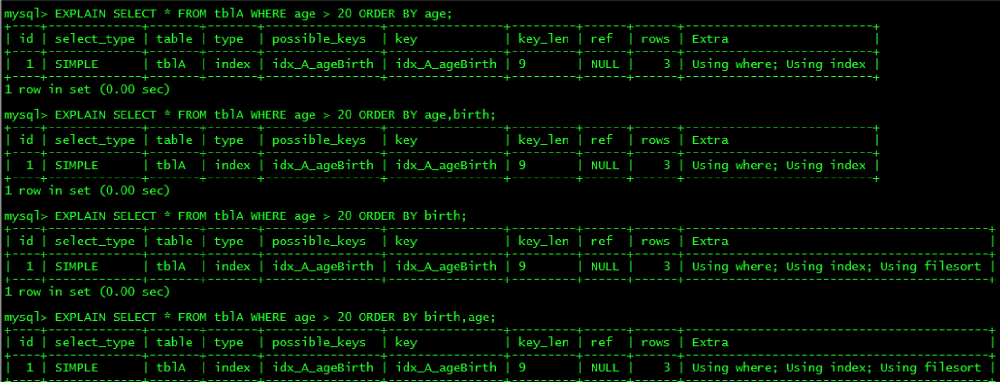
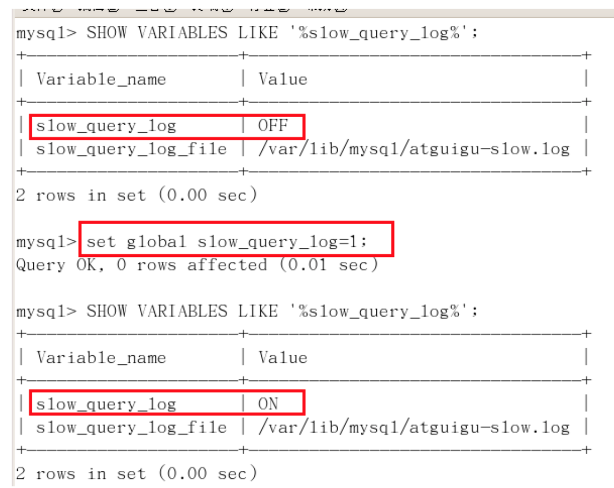
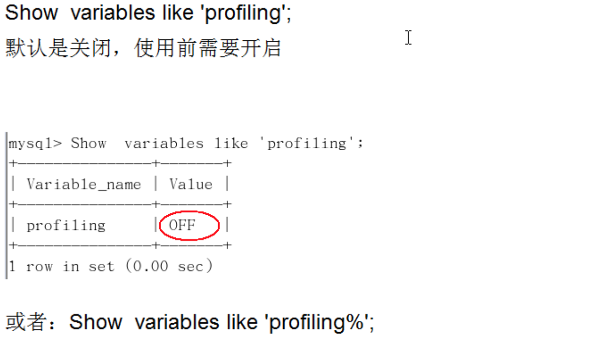
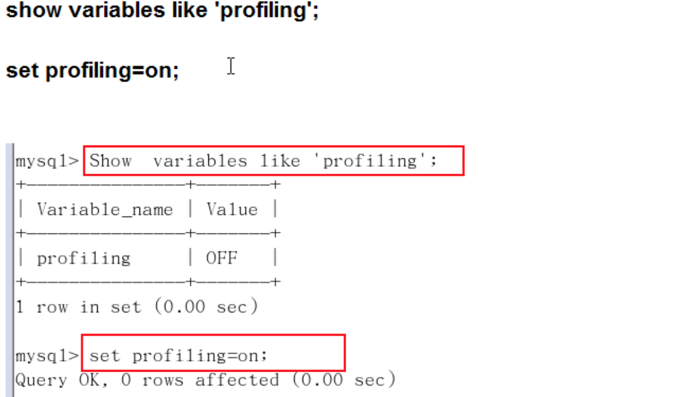
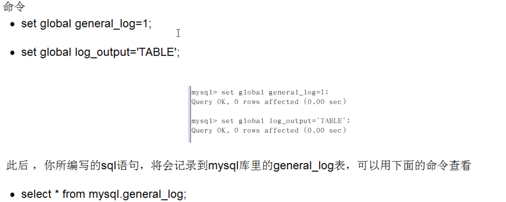

## 前言

- 分析
        
    - 观察，至少跑1天，看看生产的慢SQL情况。
        
    - 开启慢查询日志，设置阈值，比如超过5秒钟的就是慢SQL，并将它抓取出来。
        
    - explain+慢SQL分析
        
    - show profile
        
    - 运维经理 or DBA，进行SQL数据库服务器参数调优。
    
- 总结
        
    - 慢查询的开启并捕获
        
    - explain+慢SQL分析
        
    - show profile查询SQL在Mysql服务器里面的执行细节和生命周期情况
        
    - SQL数据库服务器的参数调优

## 查询优化

- 永远小表驱动大表，类似嵌套循环Nested Loop
    
    - 优化原则：小表驱动大表，即小的数据集驱动大的数据集。
    
    - 当B表的数据集必须小于A表的数据集时，用in优于exists

    
    
    - 当A表的数据集必须小于B表的数据集时，用exists优于in

    
    
    - 注意：A表与B表的ID字段应建立索引。
    
    - EXISTS
            
        - SELECT … FROM table WHERE EXISTS(subquery)
            
        - 该语法可以理解为：将主查询的数据，放到子查询中做条件验证，根据验证结果（TRUE或FALSE）来决定主查询的数据结果是否得以保留。
    
    - 提示
            
        - EXISTS（subquery）只返回TRUE或FALSE，因此子查询中的SELECT也可以是SELECT 1或SELECT ‘X’，官方说法是实际执行时会忽略SELECT清单，因此没有区别。
            
        - EXISTS子查询的实际执行过程可能经过了优化而不是我们理解上的逐条对比，如果担心效率问题，可进行实际检验以确定是否有效率问题。
            
        - EXISTS子查询往往也可以用条件表达式/其他子查询或者JOIN来替代，何种最优需要具体问题具体分析。
    

    
- ORDER BY关键字优化
    
    - ORDER BY子句，尽量使用Index方式排序，避免使用FileSort方式排序
    
        - 建表SQL
    
        
    
        - Case
    
            - case1
    
                

            - case2
    
                
    
        - MySQL支持两种方式的排序
                
            - FileSort和Index，Index效率高。FileSort方式效率较低。
                
            - Using Index，它指MySQL扫描索引本身完成排序。
    
        - ORDER BY满足两种情况，会使用Index方式排序：
                
            - ORDER BY语句使用索引最左前列
                
            - 使用Where子句与ORDER BY子句条件列组合满足索引最左前列
    
    - 尽可能在索引列上完成排序操作，遵照索引建的最佳最前缀
    
    - 如果不在索引列上，filesort有两种算法：
    
        - mysql就要启动双路排序和单路排序
    
            - 双路排序
                    
                - MySQL4.1之前是使用双路排序，字面意思就是两次扫描磁盘，最终得到数据。读取行指针和order by列，对他们进行排序，然后扫描已经排好序的列表，按照列表中的值重新从列表中读取对应的数据输出。
                    从磁盘取排序字段，在buffer进行排序，再从磁盘读取其他字段。
    
                - 取一批数据，要对磁盘进行了两次扫描，众所周知，I\O是很耗时的，所以在mysql4.1之后，出现了第二种改进的算法，就是单路排序
    
                - 单路排序

                    从磁盘读取查询需要的所有列，按照order by列在buffer对它们进行排序，然后扫描排序后的列表进行输出，它的效率更快一些，避免了第二次读取数据。并且把随机IO变成了顺序IO，但是它会使用更多的空间。
    
                - 结论及引申出的问题
    
                    - 由于单路是后出的，总体而言好过双路
    
                    - 但是用单路有问题
    
                        
    
    - 优化策略
            
        - 增大sort_buffer_size参数的设置
            
        - 增大max_length_for_sort_data参数的设置
            
        - Why

            
    
    - 小总结
    
        
    
- GROUP BY关键字优化
        
    - group by实质是先排序后进行分组，遵照索引建的最佳左前缀。
        
    - 当无法使用索引列，增大max_length_for_sort_data参数的设置+增大sort_buffer_size参数的设置。
        
    - where高于having，能写在where限定的条件就不要去having限定了。

## 慢查询日志

- 是什么

    - MySQL的慢查询日志是MySQL提供的一种日志记录，它用来记录在MySQL中响应时间超过阈值的语句，具体指运行时间超过long_query_time值的SQL，则会被记录到慢查询日志中。
    
    - long_query_time的默认值是10，意思是运行10秒以上的语句。
    
    - 由它来查看哪些SQL超出了我们的最大忍耐时间值，比如一条sql执行超过5秒钟，我们就算慢SQL，希望能收集超过5秒的sql，结合之前的explain进行全面分析。
    
- 怎么玩
    
    - 说明
        
        

    - 查看是否开启及如何开启
    
        - 默认：SHOW VARIABLES LIKE ‘%slow_query_log%’;
    
            
    
        - 开启：set global slow_query_log=1;
    
            
            
            
    
    - 那么开启了慢查询日志后，什么样的SQL才会记录到慢查询日志里面呢
    
        
    
    - Case
    
        - 查看当前多少秒算慢：SHOW VARIABLES LIKE ‘long_query_time%’;
    
        - 设置慢的阈值时间：set global long_query_time=3;

            
    
        - 为什么设置后看不出变化（设置3之后，查询依然显示10）：
                
            - 需要重新连接或新开一个会话才能看到修改值。SHOW VARIABLES LIEK ‘long_query_time%’;
                
            - show global variables like ‘long_query_time’;
    
        - 记录慢SQL并后续分析
    
            
    
        - 查询当前系统中有多少条慢查询记录：
    
            
    
    - 配置版
    
        
    
- 日志分析工具mysqldumpslow
    
    在生产环境中，如果要手工分析日志，查找、分析SQL，显然是个体力活，MySQL提供了日志分析工具mysqldumpslow。
    
    - 查看mysqldumpslow的帮助信息

        
        

        - mysqldumpslow --help
        
        - s：是表示按照何种方式排序
        
        - c：访问次数
        
        - I：锁定时间
        
        - r：返回记录
        
        - t：查询时间
        
        - al：平均锁定时间
        
        - ar：平均返回记录数
        
        - at：平均查询时间
        
        - t：即为返回前面多少条的数据
        
        - g：后边搭配一个正则匹配模式，大小写不敏感
    
    - 工作常用参考
    
        

## 批量数据脚本

- 往表里插入1000w数据
    
    - 建表
    
    
    
    
    - 设置参数log_bin_trust_function_creators
    
    
    
    - 创建函数，保证每条数据都不同
    
        - 随机产生字符串
    
            
    
        - 随机产生部门编号
    
            
    
    - 创建存储过程

        - 创建往emp表中插入数据的存储过程

            
            

        - 创建往dept表中插入数据的存储过程
            
            

    - 调用存储过程
    
        - dept
    
            
    
        - emp
    
            
            

## Show Profile

- 是什么：是mysql提供的可以用来分析当前会话中语句执行的资源消耗情况。可以用于SQL的调优的测量
    
- 默认情况下，参数处于关闭状态，并保存最近15次的运行结果
    
- 分析步骤
    
    1. 是否支持，看看当前的mysql版本是否支持
            
        
    
    2. 开启功能，默认是关闭，使用前需要开启
    
        
        

    
    3. 运行SQL
            
        - select * from emp group by id%10 limit 150000;
            
        - select * from emp group by id%20 order by 5;
    
    4. 查看结果，show profiles;

        
    
    5. 诊断SQL，show profile cpu, block io for query [上一步前面的问题SQL数字号码];
    
        
        
    
        - 参数备注
    
            
    
    6. 日常开发需要注意的结论
    
        - converting HEAP to MyISAM：查询结果太大，内存都不够用了往磁盘上搬了
    
        - Creating tmp table：创建临时表

            
                
            - 拷贝数据到临时表
                
            - 用完再删除
    
        - Copying to tmp table on disk：把内存中临时表复制到磁盘，危险！！
    
        - locked

## 全局查询日志

- 配置启用
    
    
    
- 编码启用
    
    
    
- 永远不要在生产环境开启这个功能！

## 参考资料

MySQL_基础+高级篇
https://www.bilibili.com/video/BV12b411K7Zu