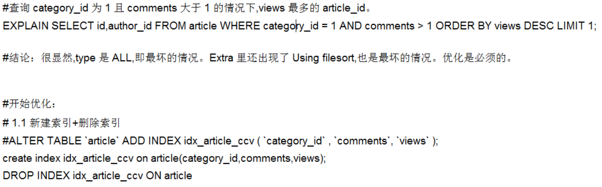
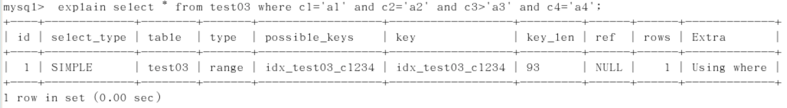

## 性能下降SQL慢

- 执行时间长，等待时间长
        
    - 查询语句写的烂
      
    - 索引失效
        - 单值索引
        - 复合索引
    
    - 关联查询太多join（设计缺陷或不得已的需求）
        服务器调优及各个参数设置（缓冲、线程数等）

## 常见通用的Join查询

- SQL执行顺序

    - 手写

    

    - 机读

    

    - 总结

    

    Join图-7种JOIN

    
    

## 索引简介

- 是什么

    - MySQL官方对索引的定义为：索引（Index）是帮助MySQL高效获取数据的数据结构。可以得到索引的本质：索引是数据结构。

    

    - 你可以简单理解为“排好序的快速查找数据结构”。

        - 详解（B树）

        

        - 结论

        数据本身之外，数据库还维护着一个满足特定查找算法的数据结构，这些数据结构以某种方式指向数据，这样就可以在这些数据结构的基础上实现高级查找算法，这种数据结构就是索引。

        - 一般来说索引本身也很大，不可能全部存储在内存中，因此索引往往以索引文件的形式存储在磁盘上。

        - 我们平常所说的索引，如果没有特别指明，都是指B树（多路搜索树，并不一定是二叉的）结构组织的索引。其中聚集索引，次要索引，覆盖索引，复合索引，前缀索引，唯一索引默认的都是使用B+树索引，统称索引。当然，除了B+树这种类型的索引之外，还有哈希索引（hash index）等。

    - 优势

        - 类似大学图书馆建书目索引，提高数据检索的效率，降低数据库的IO成本。

        - 通过索引列对数据进行排序，降低数据排序的成本，降低了CPU的消耗。

    - 劣势

        - 实际上索引也是一张表，该表保存了主键与索引字段，并指向实体表的记录，所以索引列也是要占用空间的。
        
        - 虽然索引大大提高了查询速度，同时却会降低更新表的速度，如对表进行INSERT、UPDATE和DELETE。因为更新表时，MySQL不仅要保存数据，还要保存一下索引文件每次更新添加了索引列的字段，都会调整因为更新所带来的键值变化后的索引信息。
        
        - 索引只是提高效率的一个因素，如果你的MySQL有大数据量的表，就需要花时间研究建立最优秀的索引，或者优化查询。

    - mysql索引分类

        - 单值索引：即一个索引只包含单个列，一个表可以有多个单列索引

        - 唯一索引：索引列的值必须唯一，但允许有空值

        - 复合索引：即一个索引包含多个列

        - 基本语法

            - 创建：

            create [unique] index indexname on mytable(columnname(length));

            alter mytable add [unique] index [indexname] on (columnname(length))
            
            如果是char，varchar类型，length可以小于字段实际长度；如果是blob和text类型，必须指定length。

            - 删除：drop index [indexname] on mytable;

            - 查看：show index from table_name\G

            - 使用alter命令

            

    - mysql索引结构
      
        - B+树索引

            索引原理

            
            

        - Hash索引

        - full-text全文索引

        - R-Tree索引

    - 哪些情况需要创建索引

        - 主键自动建立唯一索引
        
        - 频繁作为查询条件的字段应该创建索引
        
        - 查询中与其它表关联的字段，外键关系建立索引
        
        - 频繁更新的字段不适合创建索引，因为每次更新不单单是更新了记录，还会更新索引，加重IO负担
        
        - where条件里用不到的字段不创建索引
        
        - 单键/组合索引的选择问题，who？（在高并发下倾向创建组合索引）
        
        - 查询中排序的字段，排序字段若通过索引去访问将大大提高排序速度
        
        - 查询中统计或者分组字段

    - 哪些情况不需要创建索引
      
        - 表记录太少
        
        - 经常增删改的表
          
            Why：提高了查询速度，同时却会降低更新表的速度，如对表进行INSERT、UPDATE和DELETE。因为更新表时，MySQL不仅要保存数据，还要保存一下索引文件。
        
        - 数据重复且分布平均的表字段，因此应该只为最经常查询和最经常排序的数据列建立索引。注意，如果某个数据列包含许多重复的内容，为它建立索引就没有太大的实际效果。

        

## 性能分析

- MySQL Query Optimizer

- MySQL常见瓶颈

    - CPU：CPU在饱和的时候一般发生在数据装入内存或从磁盘上读取数据时候
      
    - IO：磁盘I/O瓶颈发生在装入数据远大于内存容量的时候
      
    - 服务器硬件的性能瓶颈：top，free，iostat和vmstat来查看系统的性能状态

- Explain

    - 是什么（查看执行计划）
            
    
    使用EXPLAIN关键字可以模拟优化器执行SQL查询语句，从而知道MySQL是如何处理你的SQL语句的。分析你的查询语句或是表结构的性能瓶颈。
    
    - 能干嘛
        - 表的读取顺序
        - 数据读取操作的操作类型
        - 哪些索引可以使用
        - 哪些索引被实际使用
        - 表之间的应用
        - 每张表有多少行被优化器查询
    
    - 怎么玩
    
        - Explain+SQL语句
    
        - 执行计划包含的信息

        
    
        - 各字段解释
    
            - id
              
                - select查询的序列号，包含一组数字，表示查询中执行select子句或操作表的顺序
                
                - 三种情况：
                    id相同，执行顺序由上至下
                    id不同，如果是子查询，id的序号会递增，id值越大优先级越高，越先被执行
                    id相同不同，同时存在
                
                - 衍生：DERIVED
    
            - select_type：
    
                - 有哪些

                
    
                - 查询的类型，主要是用于区别普通查询、联合查询、子查询等的复杂查询
                    1. SIMPLE：简单的select查询，查询中不包含子查询或者UNION。
                    2. PRIMARY：查询中包含任何复杂的子部分，最外层查询则被标记为PRIMARY。
                    3. SUBQUERY：在FROM列表中包含的子查询被标记为DERIVED（衍生），MySQL会递归执行这些子查询，把结果放在临时表里。
                    4. DERIVED：在FROM列表中包含的子查询被标记为DERIVED（衍生）。MySQL会递归执行这些子查询，把结果放在临时表里。
                    5. UNION：若第二个SELECT出现在UNION之后，则被标记为UNION；若UNION包含在FROM子句的子查询中，外层SELECT将被标记为：DERIVED。
                    6. UNION RESULT：从UNION表中获取结果的SELECT。
    
            - table：显示这一行的数据是关于哪些表的。
    
            - type：
    
                - 
                
                - 访问类型排序
                
                    type显示的是访问类型，是较为重要的一个指标，结果值从最好到最坏依次是：
                
                    system>const>eq_ref>ref>fulltext>ref_or_null>index_merge>unique_subquery>index_subquery>range>index>All
                
                - 显示查询使用了何种类型，从最好到最差依此是：
                
                    system>const>eq_ref>ref>range>index>All
                
                - system：表只有一行记录（等于系统表），这是const类型的特例，平时不会出现，这个也可以忽略不计。
                
                - const：表示通过索引一次就找到了，const用于比较primary key或则unique索引。因为只匹配一行数据，所以很快。如将主键置于where列表中，MySQL就能将该查询转换为一个常量。
                
                - eq_ref：唯一性索引扫描，对于每个索引键，表中只有一条记录与之匹配。常见于主键或唯一索引扫描。
                
                - ref：非唯一性索引扫描，返回匹配某个单独值的所有行。本质上也是一种索引访问，它返回所有匹配某个单独值的行，然而，它可能会找到多个符合条件的行，所以它应该属于查找和扫描的混合体。
                
                - range：只检索给定范围的行，使用一个索引来选择行。key列显示使用了哪个索引。一般就是在你的where语句中出现了between、<、>、in等的查询。这种范围扫描索引扫描比全表扫描要好，因为它只需要开始于索引的某一点，而结束于另一点，不会扫描全部索引。
                
                - index：Full Index Scan，index与All区别为index类型只遍历索引树。这通常比All快，因为索引文件通常比数据文件小。（也就是说虽然all和index都是读全表，但index是从索引中读取的，而all是从硬盘中读的）
                
                - all：Full Table Scan，将遍历全表以找到匹配的行。
                
                - 一般来说，得保证查询至少达到range级别，最好能达到ref。
    
        - possible_keys：显示可能应用在这张表中的索引，一个或多个。查询涉及到的字段上若存在索引，则该索引将被列出。但不一定被查询实际使用。
    
        - key：实际使用的索引。如果为NULL，则没有使用索引。查询中若使用了覆盖索引，则该索引仅出现在key列表中，不会出现在possible_keys列表中。（覆盖索引：查询的字段与建立的复合索引的个数一一吻合）
    
        - key_len：表示索引中使用的字节数，可通过该列计算查询中使用的索引的长度。在不损失精确性的情况下，长度越短越好。key_len显示的值为索引字段的最大可能长度，并非实际使用长度，即key_len是根据表定义计算而得，不是通过表内检索出的。
    
        - ref：显示索引的哪一列被使用了，如果可能的话，是一个常数。哪些列或常量被用于查找索引列上的值。查询中与其它表关联的字段，外键关系建立索引。
    
        - rows：根据表统计信息及索引选用情况，大致估算出找到所需的记录所需要读取的行数。
    
        - Extra：包含不适合在其他列中显示但十分重要的额外信息。
    
            - Using filesort：说明mysql会对数据使用一个外部的索引排序，而不是按照表内的索引顺序进行读取。MySQL中无法利用索引完成的排序操作成为“文件排序”。
                
            - Using temporary：使用了临时表保存中间结果，MySQL在对查询结果排序时使用临时表。常见于排序order by和分组查询group by。
                
            - Using index：表示相应的select操作中使用了覆盖索引（Covering Index），避免访问了表的数据行，效率不错！如果同时出现using where，表明索引被用来执行索引键值的查找；如果没有同时出现using where，表明索引用来读取数据而非执行查找动作。
                
            
                
            - Using where：表明使用了where过滤。
                
            - Using join buffer：使用了连接缓存。
                
            - impossible where：where子句的值总是false，不能用来获取任何元组。（查询语句中where的条件不可能被满足，恒为False）
                
            - select tables optimized away：在没有GROUPBY子句的情况下，基于索引优化MIN/MAX操作或者对于MyISAM存储引擎优化COUNT(*)操作，不必等到执行阶段再进行计算，查询执行计划生成的阶段即完成优化。
                
            - distinct：优化distinct操作，在找到第一匹配的元组后即停止找相同值的动作。
    
        - 热身Case

        
        

## 索引优化

- 索引分析
    
    - 单表

        - 建表SQL

        
    
        - 案例
    
        
        
        

        - 两表

            - 建表SQL

            

            - 案例

            
            
            

            - 总结：左连接建右表，右连接建左表。

            - 理由：以左连接为例，左表的信息全都有，所以右表需要查找，所以建立右表index。
        
        - 三表
    
            - 建表SQL
    
            
    
            - 案例
    
            

            - 总结：Join语句的优化
                
                - 尽可能减少Join语句中的NestedLoop的循环总次数：“永远用小结果集驱动大的结果集”。
                
                -  优先优化NestedLoop的内层循环。
                
                - 保证Join语句中被驱动表上Join条件字段已经被索引。
                
                - 当无法保证被驱动表的Join条件字段被索引且内存资源充足的前提下，不要太吝惜JoinBuffer的设置。
    
- 索引失效（应该避免）
    
    - 建表SQL
    
    

    - 案例（索引失效）
    
        1. 全值匹配我最爱
    
            
            

        2. 最佳左前缀法则：

            
                
            如果索引了多列，要遵守最左前缀法则。指的是查询从索引的最左前列开始并且不跳过索引中的列。（带头大哥不能死，中间兄弟不能断哈哈哈）
    
        3. 不在索引列上作任何操作（计算、函数、（自动or手动）类型转换），会导致索引失效而转向全表扫描
    
            
    
        4. 存储引擎不能使用索引中范围条件右边的列
    
            
            
            中间兄弟别搞范围，要搞等值
    
        5. 尽量使用覆盖索引（只访问索引的查询（索引列和查询列一致）），减少select *
    
            
                
            - 按需取数据，用多少取多少，尽量与索引一致
                
            - Extra中出现了using index很好！
    
        6. mysql在使用不等于（！=或者<>）的时候无法使用索引会导致全表扫描
    
            
    
        7. is null，is not null也无法使用索引
    
            
    
        8. like以通配符开头(‘%abc…’)mysql索引失效会变成全表扫描的操作
    
            
            

            - 问题：解决like ‘%字符串%’时索引不被使用的方法？
            
                - like查询%加右边

                - 用到什么索引就查什么字段，即索引覆盖
    
                    
    
        9. 字符串不加单引号索引失效
    
            
    
            该问题同问题3，是索引列上做了类型转换！
            VARCHAR类型绝对不能失去单引号
    
        10. 少用or，用它来连接时会索引失效
    
            
    
        11. 小总结
    
            
 
            - 优化总结口诀：
    
                全值匹配我最爱，最左前缀要遵守；
    
                带头大哥不能死，中间兄弟不能断；
    
                索引列上少计算，范围之后全失效；
    
                LIKE百分写最右，覆盖索引不写星；
    
                不等空值还有or，索引失效要少用；
    
                VAR引号不可丢，SQL高级也不难！
    
    - 面试题讲解
    
        - 题目SQL
    
            
            
            
            
            
    
        - 答案

            1）

            2）

            3）

            4）

            5）
            c3的作用在排序而不是查找，用到了但是没有统计在结果中

            6）

            7）
            出现了filesort

            8）

            8.1 
            只用c1一个字段索引，但是c2、c3用于排序，无filesort

            8.2 
            出现了filesort，我们建的索引是1234，它没有按照顺序来，3和2颠倒了

            9）

            10）
            
            用c1、c2两个字段索引，但是c2、c3用于排序，无filesort

            
            本例有常量c2的情况，因此排序就相当于order by c3,常量，所以没有出现filesort的情况

            

            11）

            12）

        - 定值、范围还是排序，一般order by是给个范围
    
        - group by基本上都需要进行排序，会有临时表产生

    
- 一般性建议
        
    - 对于单键索引，尽量选择针对当前query过滤性更好的索引
    
    - 在选择组合索引的时候，当前Query中过滤性最好的字段在索引字段顺序中，位置越靠前越好
    
    - 在选择组合索引的时候，尽量选择可以能够包含当前query中的where字句中更多字段的索引
    
    - 尽可能通过分析统计信息和调整query的写法来达到选择合适索引的目的

## 参考资料

MySQL_基础+高级篇
https://www.bilibili.com/video/BV12b411K7Zu