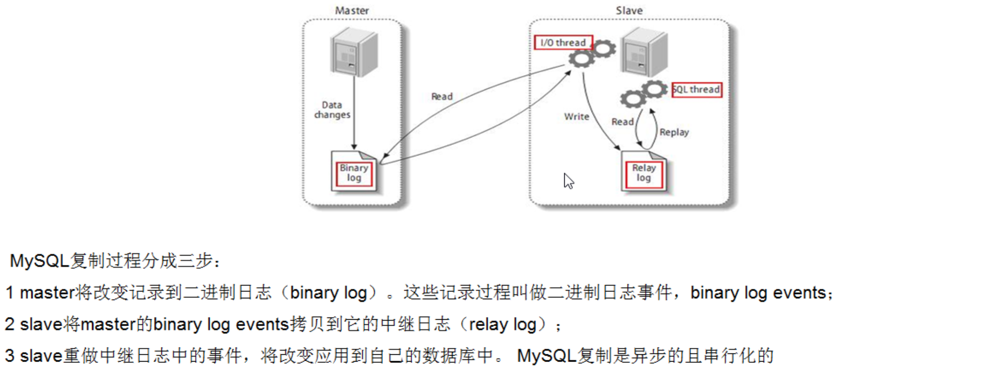
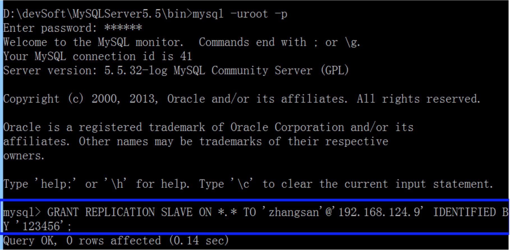
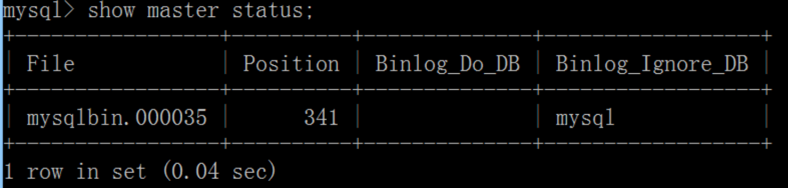
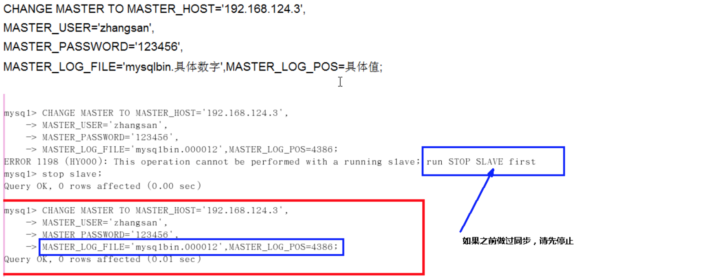
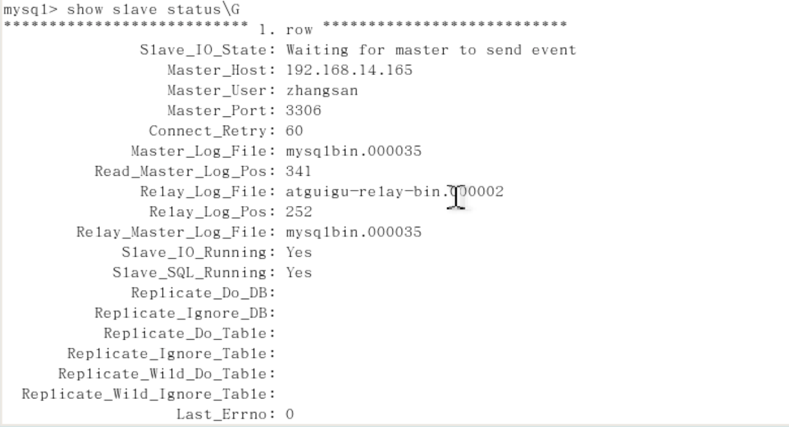

## 复制的基本原理

- slave会从master读取binlog来进行数据同步

- 三步骤+原理图

    

- 复制的基本原则

    - 每个slave只有一个master

    - 每个slave只能有一个唯一的服务器ID

    - 每个master可以有多个slave

- 复制的最大问题

    延时

- 一主一从常见配置

    - mysql版本一致且后台以服务运行
    
    - 主从都配置在[mysqld]结点下，都是小写
    
    - 主机修改my.ini配置文件
        
        1. 【必须】从服务器唯一ID
            
            - server-id=2
        
        2. 【必须】启用二进制日志

            - log-bin=自己本地的路径/mysqlbin

            - log-bin=D:/devSoft/MySQLServer5.5/data/mysqlbin

        3. 【可选】启用错误日志

            - log-err=自己本地的路径/mysqlerr

            - log-bin=D:/devSoft/MySQLServer5.5/data/mysqlerr

        4. 【可选】根目录 

            - basedir=自己本地路径

            - log-bin="D:/devSoft/MySQLServer5.5/"

        5. 【可选】临时目录

            - temdir=自己本地路径
            
            - tmpdir="D:/devSoft/MySQLServer5.5/"

        6. 【可选】数据目录

            - datadir=自己本地路径/Data/

            - log-bin="D:/devSoft/MySQLServer5.5/Data"

        7. read-only=0

            - 主机，读写都可以

        8. 【可选】设置不要复制的数据库

            - binlog-ignore-db=mysql

        9. 【可选】设置需要复制的数据库

            - binlog-do-db=需要复制的主数据库名字

    - 从机修改my.cnf配置文件

        - 【必须】从服务器唯一ID
            
        - 【可选】启用二进制日志

    - 因修改过配置文件，请主机+从机都重启后台mysql服务
    
    - 主机从机都关闭防火墙
        
        - windows手动关闭
        
        - 关闭虚拟机linux防火墙：service iptables stop
    
    - 在Windows主机上建立账户并授权slave
    
        - GRANT REPLICATION SLAVE ON *.* TO 'zhangsan' @ '192.168.14.167【从机数据库IP】' IDENTIFIED BY '123456';
            
            

        - flush privileges;
    
        - 查询master的状态
    
            - show master status
    
                
    
            - 记录下File和Position的值
    
        - 执行完此步骤后不要再操作主服务器MYSQL，防止主服务器状态值变化
    
    - 在Linux从机上配置需要复制的主机
    
        - CHANGE MASTER TO MASTER_HOST='主机IP', MASTER_USER='zhangsan', MASTER_PASSWORD='123456', MASTER_LOG_FILE='file名字', MASTER_LOG_POS=position数字;
    
            
    
        - 启动从服务器复制功能
            
            - start slave;
    
        - show slave status\G【\G是为了以键值的形式显示，好看一些】
            
            

            - 下面两个参数都是Yes，则说明主从配置成功！
    
            - Slave_IO_Running：Yes
    
            - Slave_SQL_Running：Yes
        
    - 主机新建库、新建表、insert记录，从机复制
    
    - 如何停止从服务复制功能
        
        - stop slave;

## 参考资料

MySQL_基础+高级篇
https://www.bilibili.com/video/BV12b411K7Zu