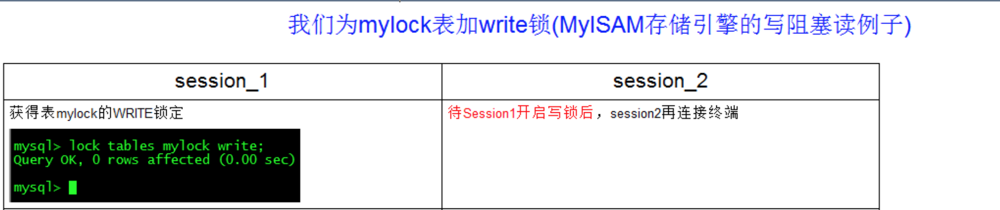

## 概述

- 定义

    

- 生活购物

    

- 锁的分类
        
    - 从对数据操作的类型（读/写）分
            
        - 读锁（共享锁）：针对同一份数据，多个读操作可以同时进行而不会互相影响。
            
        - 写锁（排它锁）：当前写操作没有完成前，它会阻断其他写锁和读锁。
        
    - 从对数据操作的粒度分
            
        - 表锁
            
        - 行锁

- 三锁

    开销、加锁速度、死锁、粒度、并发性能
    只能就具体应用的特点来说那种锁更合适

    - 表锁（偏读）

        - 特点：偏向MyISAM存储引擎，开销小，加锁快；无死锁；锁定粒度大，发生锁冲突的概率最高，并发度最低。
    
        - 案例分析
    
            - 建表SQL

                
                
                
        
            - 加读锁

                
                
                
                
    
            - 加写锁

                
                
                
        
        - 案例结论

            
            
    
        - 表锁分析

            
            

    - 行锁（偏写）

        - 特点
        
            -偏向Innodb存储引擎，开销大，加锁慢；会出现死锁；锁定粒度小，发生锁冲突的概率最低，并发度也最高。
        
            - Innodb与MyISAM的最大不同有两点：一是支持事务（TRANSACTION）；二是采用了行级锁
    
        - 由于行锁支持事务，复习老知识
    
            - 事务（Transaction）及其ACID属性
    
                
    
            - 并发事务处理带来的问题
    
                - 更新丢失（Lost Update）
    
                    
    
                - 脏读（Dirty Reads）
    
                    
    
                - 不可重复读（Non-Repeatable Reads）
    
                    
    
                - 幻读（Phantom Reads）
    
                    
    
            - 事务隔离级别
    
                
    
        - 案例分析
    
            - 建表SQL
    
                
                
    
            - 行锁定基本演示
    
                
    
            - 无索引行锁升级为表锁
            
                如果在更新数据的时候出现了强制类型转换导致索引失效，使得行锁变表锁，即在操作不同行的时候，会出现阻塞的现象。
    
            - 间隙锁危害
    
                
                
    
            - 面试题：常考如何锁定一行
            
                
    
        - 案例结论
        
            
    
        - 行锁分析
    
            
            
    
        - 优化建议
        
            - 尽可能让所有数据检索都通过索引来完成，避免无索引行锁升级为表锁。
        
            - 合理设计索引，尽量缩小锁的范围。
        
            - 尽可能减少索引条件，避免间隙锁。
        
            - 尽量控制事务大小，减少锁定资源量和时间长度。
        
            - 尽可能低级别事务隔离。

    - 页锁

        - 开销和加锁时间介于表锁和行锁之间；会出现死锁；锁定粒度介于表锁和行锁之间，并发度一般。

## 参考资料

MySQL_基础+高级篇
https://www.bilibili.com/video/BV12b411K7Zu