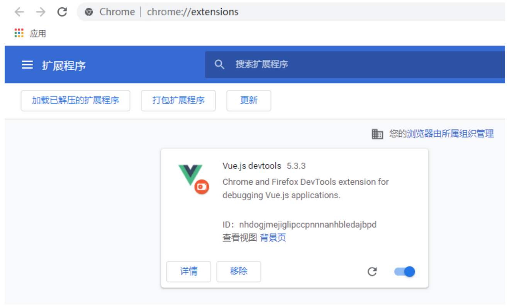

## 1 、创建SpringBoot项目

## 1.1、新建项目

##### 注意：Java版本选择 8


## 1.2、添加依赖

##### 添加SpringBoot web依赖

## 1.3、配置application.yml文件

```
<dependency>
<groupId>org.springframework.boot</groupId>
<artifactId>spring-boot-starter-web</artifactId>
</dependency>
```
```
server:
port: 8090 #服务端口
```
```
spring:
application:
name: payment-demo # 应用名称
```

### 1.4、创建controller

##### 创建controller包，创建ProductController类

### 1.5、测试

##### 访问：http://localhost:8090/api/product/test

## 2 、引入Swagger

##### 作用：自动生成接口文档和测试页面。

### 2.1、引入依赖

### 2.2、Swagger配置文件

```
package com.xxx.paymentdemo.controller;
```
```
import org.springframework.web.bind.annotation.GetMapping;
import org.springframework.web.bind.annotation.RequestMapping;
import org.springframework.web.bind.annotation.RestController;
```
```
@RestController
@RequestMapping("/api/product")
@CrossOrigin //跨域
public class ProductController {
```
```
@GetMapping("/test")
public String test(){
```
```
return "hello";
}
}
```
```
<!--swagger-->
<dependency>
<groupId>io.springfox</groupId>
<artifactId>springfox-swagger2</artifactId>
<version>2.7.0</version>
</dependency>
```
```
<!--swagger ui-->
<dependency>
<groupId>io.springfox</groupId>
<artifactId>springfox-swagger-ui</artifactId>
<version>2.7.0</version>
</dependency>
```

##### 创建config包，创建Swagger2Config类

### 2.3、Swagger注解

##### controller中可以添加常用注解

### 2.4、测试

##### 访问：http://localhost:8090/swagger-ui.html

## 3 、定义统一结果

##### 作用：定义统一响应结果，为前端返回标准格式的数据。

### 3.1、引入lombok依赖

##### 简化实体类的开发

```
package com.xxx.paymentdemo.config;
```
```
import org.springframework.context.annotation.Bean;
import org.springframework.context.annotation.Configuration;
import springfox.documentation.builders.ApiInfoBuilder;
import springfox.documentation.spi.DocumentationType;
import springfox.documentation.spring.web.plugins.Docket;
import springfox.documentation.swagger2.annotations.EnableSwagger2;
```
```
@Configuration
@EnableSwagger
public class Swagger2Config {
```
```
@Bean
public Docket docket(){
return new Docket(DocumentationType.SWAGGER_2)
.apiInfo(new ApiInfoBuilder().title("微信支付案例接口文
档").build());
}
}
```
```
@Api(tags="商品管理") //用在类上
```
```
@ApiOperation("测试接口") //用在方法上
```

### 3.2、创建R类

##### 创建统一结果类

### 3.3、修改controller

##### 修改test方法，返回统一结果

```
<!--实体对象工具类：低版本idea需要安装lombok插件-->
<dependency>
<groupId>org.projectlombok</groupId>
<artifactId>lombok</artifactId>
</dependency>
```
```
package com.xxx.paymentdemo.vo;
```
```
import lombok.NoArgsConstructor;
import lombok.Setter;
```
```
import java.util.HashMap;
import java.util.Map;
```
```
@Data //生成set、get等方法
public class R {
```
```
private Integer code;
private String message;
private Map<String, Object> data = new HashMap<>();
```
```
public static R ok(){
R r = new R();
r.setCode( 0 );
r.setMessage("成功");
return r;
}
```
```
public static R error(){
R r = new R();
r.setCode(- 1 );
r.setMessage("失败");
return r;
}
```
```
public R data(String key, Object value){
this.data.put(key, value);
return this;
}
```
###### }


### 3.4、配置json时间格式

### 3.5、Swagger测试

## 4 、创建数据库

### 4.1、创建数据库

### 4.2、IDEA配置数据库连接

#### （ 1 ）打开数据库面板


```
@ApiOperation("测试接口")
@GetMapping("/test")
public R test(){
```
```
return R
.ok()
.data("message", "hello")
.data("now", new Date());
}
```
```
spring:
jackson: #json时间格式
date-format: yyyy-MM-dd HH:mm:ss
time-zone: GMT+
```
```
mysql - uroot - p
mysql> create database payment_demo;
```

#### （ 2 ）添加数据库


#### （ 3 ）配置数据库连接参数


### 4.3、执行SQL脚本

##### payment_demo.sql


## 5 、集成MyBatis-Plus

### 5.1、引入依赖

### 5.2、配置数据库连接

### 5.3、定义实体类

##### BaseEntity是父类，其他类继承BaseEntity


### 5.4、定义持久层

##### 定义Mapper接口继承 BaseMapper<>，

##### 定义xml配置文件


```
<!--mysql驱动-->
<dependency>
<groupId>mysql</groupId>
<artifactId>mysql-connector-java</artifactId>
</dependency>
```
###### <!--持久层-->

```
<dependency>
<groupId>com.baomidou</groupId>
<artifactId>mybatis-plus-boot-starter</artifactId>
<version>3.3.1</version>
</dependency>
```
```
spring:
datasource: #mysql数据库连接
driver-class-name: com.mysql.cj.jdbc.Driver
url: jdbc:mysql://localhost:3306/payment_demo?
serverTimezone=GMT%2B8&characterEncoding=utf-
username: root
password: 123456
```

### 5.5、定义MyBatis-Plus的配置文件

##### 在config包中创建配置文件 MybatisPlusConfig

### 5.6、定义yml配置文件

##### 添加持久层日志和xml文件位置的配置

### 5.7、定义业务层

```
package com.xxx.paymentdemo.config;
```
```
import org.mybatis.spring.annotation.MapperScan;
import org.springframework.context.annotation.Configuration;
import org.springframework.transaction.annotation.EnableTransactionManagement;
```
```
@Configuration
@MapperScan("com.xxx.paymentdemo.mapper") //持久层扫描
@EnableTransactionManagement //启用事务管理
public class MybatisPlusConfig {
```
###### }

```
mybatis-plus:
configuration: #sql日志
log-impl: org.apache.ibatis.logging.stdout.StdOutImpl
mapper-locations: classpath:com/xxx/paymentdemo/mapper/xml/*.xml
```

##### 定义业务层接口继承 IService<>

##### 定义业务层接口的实现类，并继承 ServiceImpl<,>


### 5.8、定义接口方法查询所有商品

##### 在 public class ProductController 中添加一个方法

### 5.9、Swagger中测试

### 5.10、pom中配置build节点

##### 因为maven工程在默认情况下 src/main/java 目录下的所有资源文件是不发布到 target 目录下的，我们

##### 在 pom 文件的 节点下配置一个资源发布过滤器

```
@Resource
private ProductService productService;
```
```
@ApiOperation("商品列表")
@GetMapping("/list")
public R list(){
List<Product> list = productService.list();
return R.ok().data("productList", list);
}
```

## 6 、搭建前端环境

### 6.1、安装Node.js

##### Node.js是一个基于JavaScript引擎的服务器端环境，前端项目在开发环境下要基于Node.js来运行

##### 安装：node-v14.18.0-x64.msi

### 6.2、运行前端项目

##### 将项目放在磁盘的一个目录中，例如 D:\demo\payment-demo-front

##### 进入项目目录，运行下面的命令启动项目：

### 6.3、安装VSCode

##### 如果你希望方便的查看和修改前端代码，可以安装一个VSCode

##### 安装：VSCodeUserSetup-x64-1.56.

##### 安装插件：


```
<!-- 项目打包时会将java目录中的*.xml文件也进行打包 -->
<resources>
<resource>
<directory>src/main/java</directory>
<includes>
<include>**/*.xml</include>
</includes>
<filtering>false</filtering>
</resource>
</resources>
```
```
npm run serve
```

## 7 、Vue.js入门

##### 官网：https://cn.vuejs.org/

##### Vue.js是一个前端框架，帮助我们快速构建前端项目。

##### 使用vue有两种方式，一个是传统的在 html 文件中引入 js 脚本文件的方式，另一个是脚手架的方式。

##### 我们的项目，使用的是脚手架的方式。

### 7.1、安装脚手架

##### 配置淘宝镜像

##### 全局安装脚手架

### 7.2、创建一个项目

##### 先进入项目目录（Ctrl + ~），然后创建一个项目

### 7.3、运行项目

```
#经过下面的配置，所有的 npm install 都会经过淘宝的镜像地址下载
npm config set registry https://registry.npm.taobao.org
```
```
npm install - g @vue/cli
```
```
vue create vue-demo
```

##### 指定运行端口

### 7.4、数据绑定

##### 修改 src/App.vue

### 7.5、安装Vue调试工具

##### 在Chrome的扩展程序中安装：Vue.jsDevtools.zip

#### （ 1 ）扩展程序的安装



```
npm run serve
```
```
npm run serve -- --port 8888
```
###### <!--定义页面结构-->

```
<template>
<div>
<h1>Vue案例</h1>
<!-- 插值 -->
<p>{{course}}</p>
</div>
</template>
```
###### <!--定义页面脚本-->

```
<script>
export default {
// 定义数据
data () {
return {
course: '微信支付'
}
}
}
</script>
```

#### （ 2 ）扩展程序的使用


### 7.6、双向数据绑定

##### 数据会绑定到组件，组件的改变也会影响数据定义

### 7.7、事件处理

#### （ 1 ）定义事件

```
<p>
<!-- 指令 -->
<input type="text" v-model="course">
</p>
```
###### // 定义方法

```
methods: {
toPay(){
console.log('去支付')
}
}
```

#### （ 2 ）调用事件
