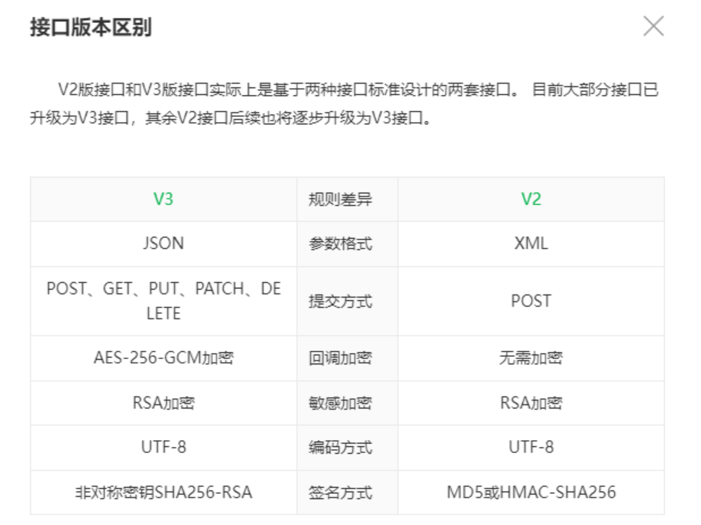
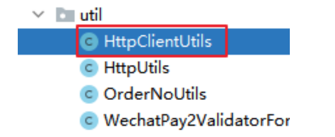

## 1 、V2和V3的比较



## 2 、引入依赖和工具

## 2.1、引入依赖

```
throw new RuntimeException("下载账单异常, 响应码 = " + statusCode+ ",
下载账单返回结果 = " + bodyAsString);
}
```
```
return bodyAsString;
```
```
} finally {
response.close();
}
}
```
###### <!--微信支付-->

```
<dependency>
<groupId>com.github.wxpay</groupId>
<artifactId>wxpay-sdk</artifactId>
<version>0.0.3</version>
</dependency>
```

### 2.1、复制工具类



### 2.3、添加商户APIv2 key

##### yml文件

##### WxPayConfig.java

### 2.4、添加枚举

##### enum WxApiType

##### enum WxNotifyType

## 3 、统一下单

### 3.1、创建WxPayV2Controller

```
# APIv2密钥
wxpay.partnerKey: T6m9iK73b0kn9g5v426MKfHQH7X8rKwb
```
```
private String partnerKey;
```
###### /**

```
* Native下单V2
*/
NATIVE_PAY_V2("/pay/unifiedorder"),
```
###### /**

###### * 支付通知V2

###### */

```
NATIVE_NOTIFY_V2("/api/wx-pay-v2/native/notify"),
```
```
package com.xxx.paymentdemo.controller;
```
```
import com.xxx.paymentdemo.service.WxPayService;
import com.xxx.paymentdemo.vo.R;
import io.swagger.annotations.Api;
import io.swagger.annotations.ApiOperation;
import lombok.extern.slf4j.Slf4j;
import org.springframework.web.bind.annotation.*;
```
```
import javax.annotation.Resource;
import javax.servlet.http.HttpServletRequest;
```

### 3.2、WxPayService

##### 接口：

##### 实现：

```
import java.util.Map;
```
```
@CrossOrigin //跨域
@RestController
@RequestMapping("/api/wx-pay-v2")
@Api(tags = "网站微信支付APIv2")
@Slf4j
public class WxPayV2Controller {
```
```
@Resource
private WxPayService wxPayService;
```
###### /**

```
* Native下单
* @param productId
* @return
* @throws Exception
*/
@ApiOperation("调用统一下单API，生成支付二维码")
@PostMapping("/native/{productId}")
public R createNative(@PathVariable Long productId, HttpServletRequest
request) throws Exception {
```
```
log.info("发起支付请求 v2");
```
```
String remoteAddr = request.getRemoteAddr();
Map<String, Object> map = wxPayService.nativePayV2(productId,
remoteAddr);
return R.ok().setData(map);
}
```
###### }

```
Map<String, Object> nativePayV2(Long productId, String remoteAddr) throws
Exception;
```
```
@Override
public Map<String, Object> nativePayV2(Long productId, String remoteAddr) throws
Exception {
```
```
log.info("生成订单");
```
###### //生成订单

```
OrderInfo orderInfo = orderInfoService.createOrderByProductId(productId);
String codeUrl = orderInfo.getCodeUrl();
if(orderInfo != null && !StringUtils.isEmpty(codeUrl)){
log.info("订单已存在，二维码已保存");
//返回二维码
Map<String, Object> map = new HashMap<>();
map.put("codeUrl", codeUrl);
```

map.put("orderNo", orderInfo.getOrderNo());
return map;
}

log.info("调用统一下单API");

HttpClientUtils client = new
HttpClientUtils("https://api.mch.weixin.qq.com/pay/unifiedorder");

###### //组装接口参数

Map<String, String> params = new HashMap<>();
params.put("appid", wxPayConfig.getAppid());//关联的公众号的appid
params.put("mch_id", wxPayConfig.getMchId());//商户号
params.put("nonce_str", WXPayUtil.generateNonceStr());//生成随机字符串
params.put("body", orderInfo.getTitle());
params.put("out_trade_no", orderInfo.getOrderNo());

###### //注意，这里必须使用字符串类型的参数（总金额：分）

String totalFee = orderInfo.getTotalFee() + "";
params.put("total_fee", totalFee);

params.put("spbill_create_ip", remoteAddr);
params.put("notify_url",
wxPayConfig.getNotifyDomain().concat(WxNotifyType.NATIVE_NOTIFY.getType()));
params.put("trade_type", "NATIVE");

//将参数转换成xml字符串格式：生成带有签名的xml格式字符串
String xmlParams = WXPayUtil.generateSignedXml(params,
wxPayConfig.getPartnerKey());
log.info("\n xmlParams：\n" + xmlParams);

client.setXmlParam(xmlParams);//将参数放入请求对象的方法体
client.setHttps(true);//使用https形式发送
client.post();//发送请求
String resultXml = client.getContent();//得到响应结果
log.info("\n resultXml：\n" + resultXml);
//将xml响应结果转成map对象
Map<String, String> resultMap = WXPayUtil.xmlToMap(resultXml);

###### //错误处理

if("FAIL".equals(resultMap.get("return_code")) ||
"FAIL".equals(resultMap.get("result_code"))){
log.error("微信支付统一下单错误 ===> {} ", resultXml);
throw new RuntimeException("微信支付统一下单错误");
}

###### //二维码

codeUrl = resultMap.get("code_url");

###### //保存二维码

String orderNo = orderInfo.getOrderNo();
orderInfoService.saveCodeUrl(orderNo, codeUrl);

###### //返回二维码

Map<String, Object> map = new HashMap<>();
map.put("codeUrl", codeUrl);
map.put("orderNo", orderInfo.getOrderNo());


## 4 、支付回调

```
return map;
}
```
```
@Resource
private WxPayService wxPayService;
```
```
@Resource
private WxPayConfig wxPayConfig;
```
```
@Resource
private OrderInfoService orderInfoService;
```
```
@Resource
private PaymentInfoService paymentInfoService;
```
```
private final ReentrantLock lock = new ReentrantLock();
```
###### /**

###### * 支付通知

###### * 微信支付通过支付通知接口将用户支付成功消息通知给商户

###### */

```
@PostMapping("/native/notify")
public String wxNotify(HttpServletRequest request) throws Exception {
```
```
System.out.println("微信发送的回调");
Map<String, String> returnMap = new HashMap<>();//应答对象
```
###### //处理通知参数

```
String body = HttpUtils.readData(request);
```
###### //验签

```
if(!WXPayUtil.isSignatureValid(body, wxPayConfig.getPartnerKey())) {
log.error("通知验签失败");
//失败应答
returnMap.put("return_code", "FAIL");
returnMap.put("return_msg", "验签失败");
String returnXml = WXPayUtil.mapToXml(returnMap);
return returnXml;
}
```
```
//解析xml数据
Map<String, String> notifyMap = WXPayUtil.xmlToMap(body);
//判断通信和业务是否成功
if(!"SUCCESS".equals(notifyMap.get("return_code")) ||
!"SUCCESS".equals(notifyMap.get("result_code"))) {
log.error("失败");
//失败应答
returnMap.put("return_code", "FAIL");
returnMap.put("return_msg", "失败");
String returnXml = WXPayUtil.mapToXml(returnMap);
return returnXml;
}
```

###### //获取商户订单号

String orderNo = notifyMap.get("out_trade_no");
OrderInfo orderInfo = orderInfoService.getOrderByOrderNo(orderNo);
//并校验返回的订单金额是否与商户侧的订单金额一致
if (orderInfo != null && orderInfo.getTotalFee() !=
Long.parseLong(notifyMap.get("total_fee"))) {
log.error("金额校验失败");
//失败应答
returnMap.put("return_code", "FAIL");
returnMap.put("return_msg", "金额校验失败");
String returnXml = WXPayUtil.mapToXml(returnMap);
return returnXml;
}

###### //处理订单

if(lock.tryLock()){
try {
//处理重复的通知
//接口调用的幂等性：无论接口被调用多少次，产生的结果是一致的。
String orderStatus = orderInfoService.getOrderStatus(orderNo);
if(OrderStatus.NOTPAY.getType().equals(orderStatus)){
//更新订单状态
orderInfoService.updateStatusByOrderNo(orderNo,
OrderStatus.SUCCESS);

###### //记录支付日志

paymentInfoService.createPaymentInfo(body);
}
} finally {
//要主动释放锁
lock.unlock();
}
}

returnMap.put("return_code", "SUCCESS");
returnMap.put("return_msg", "OK");
String returnXml = WXPayUtil.mapToXml(returnMap);
log.info("支付成功，已应答");
return returnXml;
}


