## 1 、引入支付参数

## 1.1、定义微信支付相关参数

##### 将资料文件夹中的 wxpay.properties 复制到resources目录中

##### 这个文件定义了之前我们准备的微信支付相关的参数，例如商户号、APPID、API秘钥等等

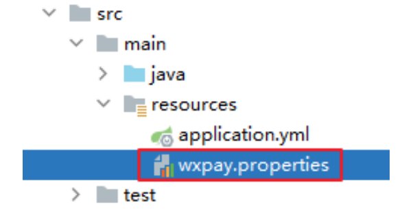

## 1.2、读取支付参数

##### 将资料文件夹中的 config 目录中的 WxPayConfig.java 复制到源码目录中。

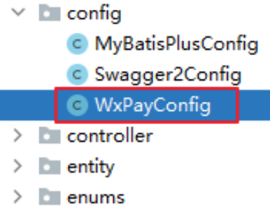

## 1.3、测试支付参数的获取

##### 在 controller 包中创建 TestController

```
<p>
<!-- 事件 -->
<button @click="toPay()">去支付</button>
</p>
```
```
package com.xxx.paymentdemo.controller;
```

### 1.4、配置 Annotation Processor

##### 可以帮助我们生成自定义配置的元数据信息，让配置文件和Java代码之间的对应参数可以自动定位，方

##### 便开发。

### 1.5、在IDEA中设置 SpringBoot 配置文件

##### 让IDEA可以识别配置文件，将配置文件的图标展示成SpringBoot的图标，同时配置文件的内容可以高

##### 亮显示

##### File -> Project Structure -> Modules -> 选择小叶子


```
import com.xxx.paymentdemo.config.WxPayConfig;
import com.xxx.paymentdemo.vo.R;
import io.swagger.annotations.Api;
import org.springframework.web.bind.annotation.GetMapping;
import org.springframework.web.bind.annotation.RequestMapping;
import org.springframework.web.bind.annotation.RestController;
```
```
import javax.annotation.Resource;
```
```
@Api(tags = "测试控制器")
@RestController
@RequestMapping("/api/test")
public class TestController {
```
```
@Resource
private WxPayConfig wxPayConfig;
```
```
@GetMapping("/get-wx-pay-config")
public R getWxPayConfig(){
```
```
String mchId = wxPayConfig.getMchId();
return R.ok().data("mchId", mchId);
}
}
```
```
<dependency>
<groupId>org.springframework.boot</groupId>
<artifactId>spring-boot-configuration-processor</artifactId>
<optional>true</optional>
</dependency>
```

##### 点击（+） 图标

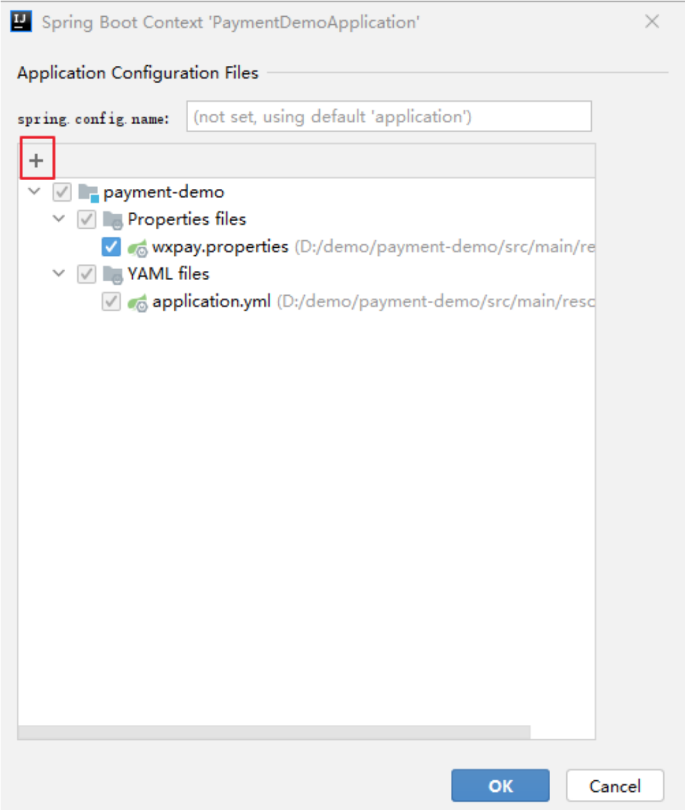

##### 选中配置文件：

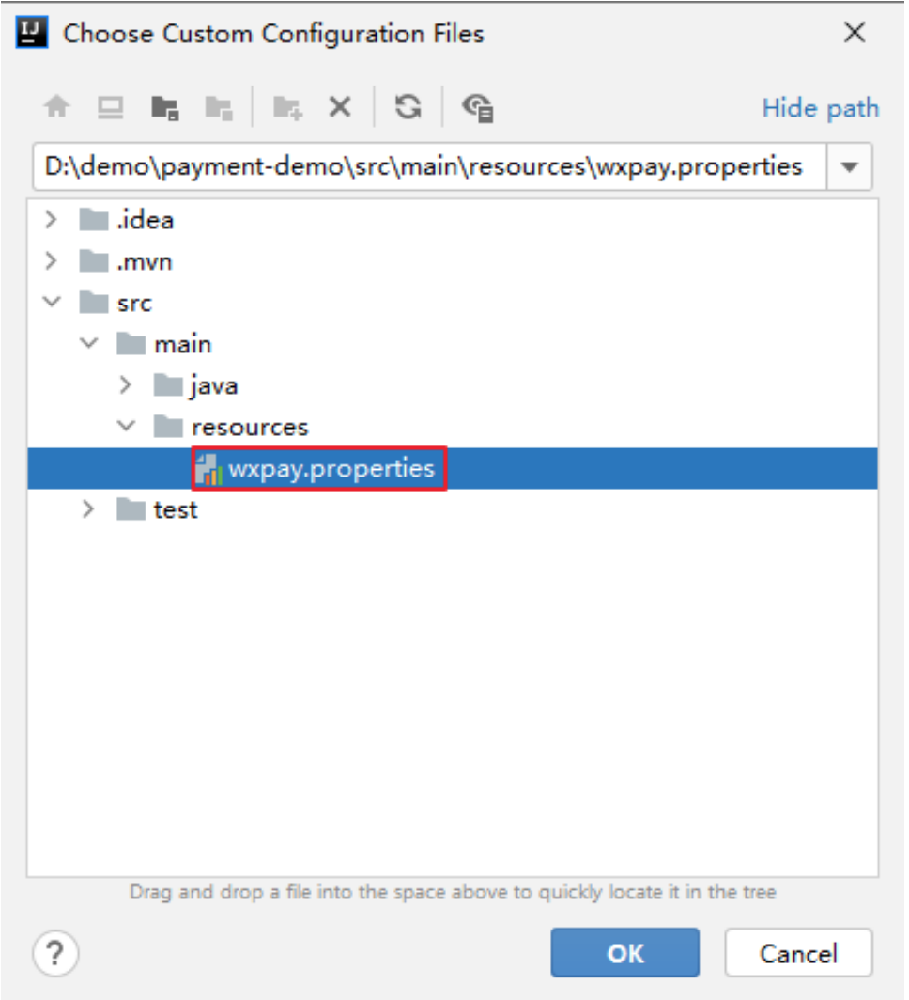

## 2 、加载商户私钥

### 2.1、复制商户私钥

##### 将下载的私钥文件复制到项目根目录下：

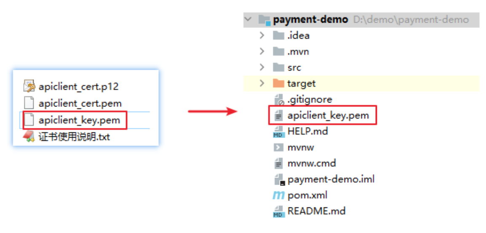

### 2.2、引入SDK

##### https://pay.weixin.qq.com/wiki/doc/apiv3/wechatpay/wechatpay6_0.shtml

##### 我们可以使用官方提供的 SDK，帮助我们完成开发。实现了请求签名的生成和应答签名的验证。


### 2.3、获取商户私钥

##### https://github.com/wechatpay-apiv3/wechatpay-apache-httpclient （如何加载商户私钥）

### 2.4、测试商户私钥的获取

##### 在 PaymentDemoApplicationTests 测试类中添加如下方法，测试私钥对象是否能够获取出来。

##### （将前面的方法改成public的再进行测试）

```
<dependency>
<groupId>com.github.wechatpay-apiv3</groupId>
<artifactId>wechatpay-apache-httpclient</artifactId>
<version>0.3.0</version>
</dependency>
```
###### /**

###### * 获取商户私钥

```
* @param filename
* @return
*/
public PrivateKey getPrivateKey(String filename){
```
```
try {
return PemUtil.loadPrivateKey(new FileInputStream(filename));
} catch (FileNotFoundException e) {
throw new RuntimeException("私钥文件不存在", e);
}
}
```
```
package com.xxx.paymentdemo;
```
```
import com.xxx.paymentdemo.config.WxPayConfig;
import org.junit.jupiter.api.Test;
import org.springframework.boot.test.context.SpringBootTest;
```
```
import javax.annotation.Resource;
import java.security.PrivateKey;
```
```
@SpringBootTest
class PaymentDemoApplicationTests {
```
```
@Resource
private WxPayConfig wxPayConfig;
```
###### /**

###### * 获取商户私钥

###### */

```
@Test
public void testGetPrivateKey(){
```
###### //获取私钥路径


## 3 、获取签名验证器和HttpClient

### 3.1、证书密钥使用说明

##### https://pay.weixin.qq.com/wiki/doc/apiv3_partner/wechatpay/wechatpay3_0.shtml

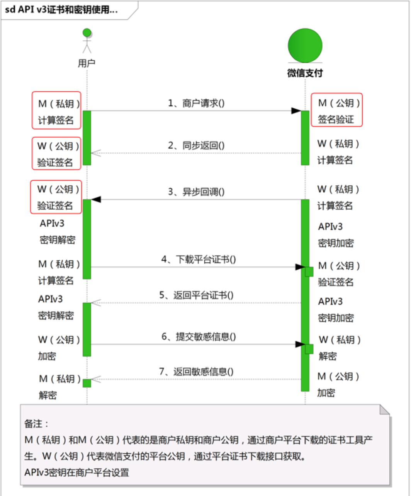

```
String privateKeyPath = wxPayConfig.getPrivateKeyPath();
```
###### //获取商户私钥

```
PrivateKey privateKey = wxPayConfig.getPrivateKey(privateKeyPath);
```
```
System.out.println(privateKey);
}
}
```

### 3.2、获取签名验证器

##### https://github.com/wechatpay-apiv3/wechatpay-apache-httpclient （定时更新平台证书功能）

##### 平台证书：平台证书封装了微信的公钥，商户可以使用平台证书中的公钥进行验签。

##### 签名验证器：帮助我们进行验签工作，我们单独将它定义出来，方便后面的开发。

### 3.4、获取 HttpClient 对象

##### https://github.com/wechatpay-apiv3/wechatpay-apache-httpclient （定时更新平台证书功能）

##### HttpClient 对象：是建立远程连接的基础，我们通过SDK创建这个对象。

###### /**

###### * 获取签名验证器

```
* @return
*/
@Bean
public ScheduledUpdateCertificatesVerifier getVerifier(){
```
###### //获取商户私钥

```
PrivateKey privateKey = getPrivateKey(privateKeyPath);
```
###### //私钥签名对象（签名）

```
PrivateKeySigner privateKeySigner = new PrivateKeySigner(mchSerialNo,
privateKey);
```
###### //身份认证对象（验签）

```
WechatPay2Credentials wechatPay2Credentials = new
WechatPay2Credentials(mchId, privateKeySigner);
```
###### // 使用定时更新的签名验证器，不需要传入证书

```
ScheduledUpdateCertificatesVerifier verifier = new
ScheduledUpdateCertificatesVerifier(
wechatPay2Credentials,
apiV3Key.getBytes(StandardCharsets.UTF_8));
```
```
return verifier;
}
```
###### /**

```
* 获取HttpClient对象
* @param verifier
* @return
*/
@Bean
public CloseableHttpClient getWxPayClient(ScheduledUpdateCertificatesVerifier
verifier){
```
###### //获取商户私钥

```
PrivateKey privateKey = getPrivateKey(privateKeyPath);
```

## 4 、API字典和相关工具

### 4.1、API列表

##### https://pay.weixin.qq.com/wiki/doc/apiv3/open/pay/chapter2_7_3.shtml

##### 我们的项目中要实现以下所有API的功能。

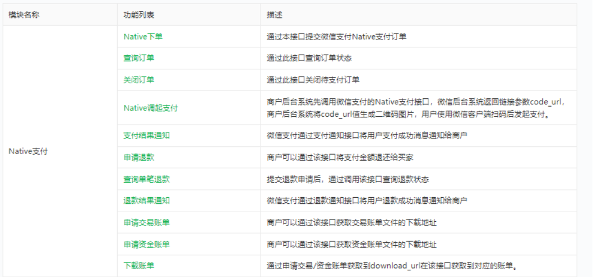

### 4.2、接口规则

##### https://pay.weixin.qq.com/wiki/doc/apiv3/wechatpay/wechatpay2_0.shtml

##### 微信支付 APIv3 使用 JSON 作为消息体的数据交换格式。

```
//用于构造HttpClient
WechatPayHttpClientBuilder builder = WechatPayHttpClientBuilder.create()
.withMerchant(mchId, mchSerialNo, privateKey)
.withValidator(new WechatPay2Validator(verifier));
// ... 接下来，你仍然可以通过builder设置各种参数，来配置你的HttpClient
```
```
// 通过WechatPayHttpClientBuilder构造的HttpClient，会自动的处理签名和验签，并进行证
书自动更新
CloseableHttpClient httpClient = builder.build();
```
```
return httpClient;
}
```
```
<!--json处理-->
<dependency>
<groupId>com.google.code.gson</groupId>
<artifactId>gson</artifactId>
</dependency>
```

### 4.3、定义枚举

##### 将资料文件夹中的 enums 目录复制到源码目录中。

##### 为了开发方便，我们预先在项目中定义一些枚举。枚举中定义的内容包括接口地址，支付状态等信息。

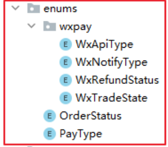

### 4.4、添加工具类

##### 将资料文件夹中的 util 目录复制到源码目录中，我们将会使用这些辅助工具简化项目的开发


## 5 、Native下单API


### 5.1、Native支付流程

##### https://pay.weixin.qq.com/wiki/doc/apiv3/apis/chapter3_4_4.shtml

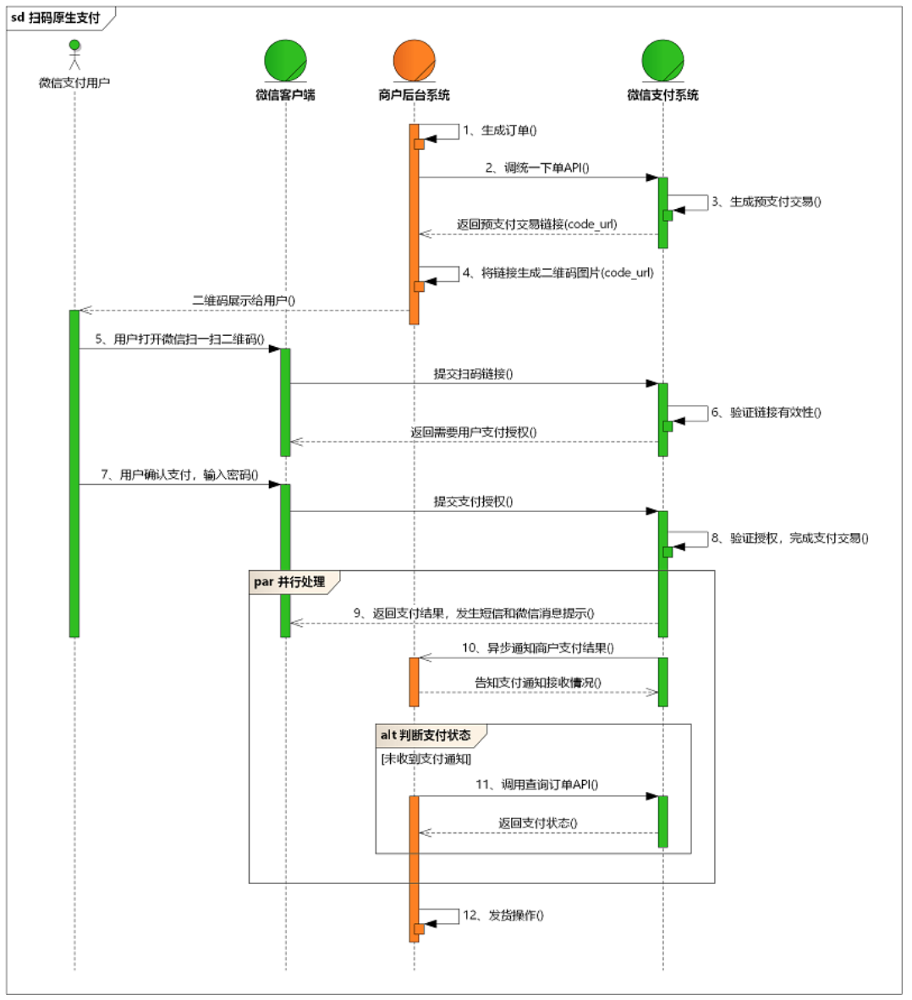

### 5.2、Native下单API

##### https://pay.weixin.qq.com/wiki/doc/apiv3/apis/chapter3_4_1.shtml

##### 商户端发起支付请求，微信端创建支付订单并生成支付二维码链接，微信端将支付二维码返回给商户

##### 端，商户端显示支付二维码，用户使用微信客户端扫码后发起支付。

#### （ 1 ）创建 WxPayController

```
package com.xxx.paymentdemo.controller;
```
```
import io.swagger.annotations.Api;
import lombok.extern.slf4j.Slf4j;
import org.springframework.web.bind.annotation.CrossOrigin;
import org.springframework.web.bind.annotation.RequestMapping;
```

#### （ 2 ）创建 WxPayService

##### 接口

##### 实现

#### （ 3 ）定义WxPayController方法

```
import org.springframework.web.bind.annotation.RestController;
```
```
@CrossOrigin
@RestController
@RequestMapping("/api/wx-pay")
@Api(tags = "网站微信支付")
@Slf4j
public class WxPayController {
```
###### }

```
package com.xxx.paymentdemo.service;
```
```
public interface WxPayService {
```
###### }

```
package com.xxx.paymentdemo.service.impl;
```
```
import com.xxx.paymentdemo.service.WxPayService;
import lombok.extern.slf4j.Slf4j;
import org.springframework.stereotype.Service;
```
```
@Service
@Slf4j
public class WxPayServiceImpl implements WxPayService {
```
###### }

```
@Resource
private WxPayService wxPayService;
```
###### /**

```
* Native下单
* @param productId
* @return
* @throws Exception
*/
@ApiOperation("调用统一下单API，生成支付二维码")
@PostMapping("/native/{productId}")
public R nativePay(@PathVariable Long productId) throws Exception {
```
```
log.info("发起支付请求");
```
###### //返回支付二维码连接和订单号

```
Map<String, Object> map = wxPayService.nativePay(productId);
```
```
return R.ok().setData(map);
```

##### R对象中添加 @Accessors(chain = true)，使其可以链式操作

#### （ 4 ）定义WxPayService方法

##### 参考：

##### API字典 -> 基础支付 -> Native支付 -> Native下单：

##### https://pay.weixin.qq.com/wiki/doc/apiv3/apis/chapter3_4_1.shtml

##### 指引文档 -> 基础支付 -> Native支付 -> 开发指引 ->【服务端】Native下单：

##### https://pay.weixin.qq.com/wiki/doc/apiv3/open/pay/chapter2_7_2.shtml

##### 接口

##### 实现

###### }

```
@Data
@Accessors(chain = true) //链式操作
public class R {
```
```
Map<String, Object> nativePay(Long productId) throws Exception;
```
```
@Resource
private WxPayConfig wxPayConfig;
```
```
@Resource
private CloseableHttpClient wxPayClient;
```
###### /**

```
* 创建订单，调用Native支付接口
* @param productId
* @return code_url 和 订单号
* @throws Exception
*/
@Override
public Map<String, Object> nativePay(Long productId) throws Exception {
```
```
log.info("生成订单");
```
###### //生成订单

```
OrderInfo orderInfo = new OrderInfo();
orderInfo.setTitle("test");
orderInfo.setOrderNo(OrderNoUtils.getOrderNo()); //订单号
orderInfo.setProductId(productId);
orderInfo.setTotalFee( 1 ); //分
orderInfo.setOrderStatus(OrderStatus.NOTPAY.getType());
//TODO：存入数据库
```
```
log.info("调用统一下单API");
```
###### //调用统一下单API

```
HttpPost httpPost = new
HttpPost(wxPayConfig.getDomain().concat(WxApiType.NATIVE_PAY.getType()));
```

// 请求body参数
Gson gson = new Gson();
Map paramsMap = new HashMap();
paramsMap.put("appid", wxPayConfig.getAppid());
paramsMap.put("mchid", wxPayConfig.getMchId());
paramsMap.put("description", orderInfo.getTitle());
paramsMap.put("out_trade_no", orderInfo.getOrderNo());
paramsMap.put("notify_url",
wxPayConfig.getNotifyDomain().concat(WxNotifyType.NATIVE_NOTIFY.getType()));

Map amountMap = new HashMap();
amountMap.put("total", orderInfo.getTotalFee());
amountMap.put("currency", "CNY");

paramsMap.put("amount", amountMap);

//将参数转换成json字符串
String jsonParams = gson.toJson(paramsMap);
log.info("请求参数：" + jsonParams);

StringEntity entity = new StringEntity(jsonParams,"utf-8");
entity.setContentType("application/json");
httpPost.setEntity(entity);
httpPost.setHeader("Accept", "application/json");

###### //完成签名并执行请求

CloseableHttpResponse response = wxPayClient.execute(httpPost);

try {
String bodyAsString = EntityUtils.toString(response.getEntity());//响应体
int statusCode = response.getStatusLine().getStatusCode();//响应状态码
if (statusCode == 200 ) { //处理成功
log.info("成功, 返回结果 = " + bodyAsString);
} else if (statusCode == 204 ) { //处理成功，无返回Body
log.info("成功");
} else {
log.info("Native下单失败,响应码 = " + statusCode+ ",返回结果 = " +
bodyAsString);
throw new IOException("request failed");
}

###### //响应结果

Map<String, String> resultMap = gson.fromJson(bodyAsString,
HashMap.class);
//二维码
String codeUrl = resultMap.get("code_url");

Map<String, Object> map = new HashMap<>();
map.put("codeUrl", codeUrl);
map.put("orderNo", orderInfo.getOrderNo());

return map;

} finally {
response.close();
}
}


### 5.3、签名和验签源码解析

#### （ 1 ）签名原理

##### 开启debug日志

##### 签名生成流程：

##### https://pay.weixin.qq.com/wiki/doc/apiv3/wechatpay/wechatpay4_0.shtml

##### 签名生成源码：

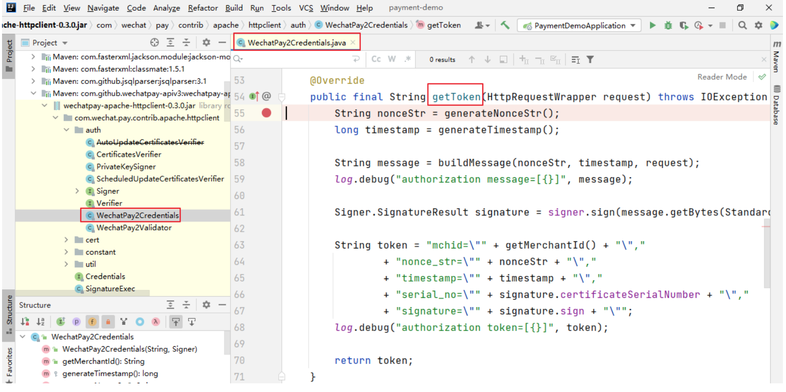

#### （ 2 ）验签原理

##### 签名验证流程：

##### https://pay.weixin.qq.com/wiki/doc/apiv3/wechatpay/wechatpay4_1.shtml

##### 签名验证源码：

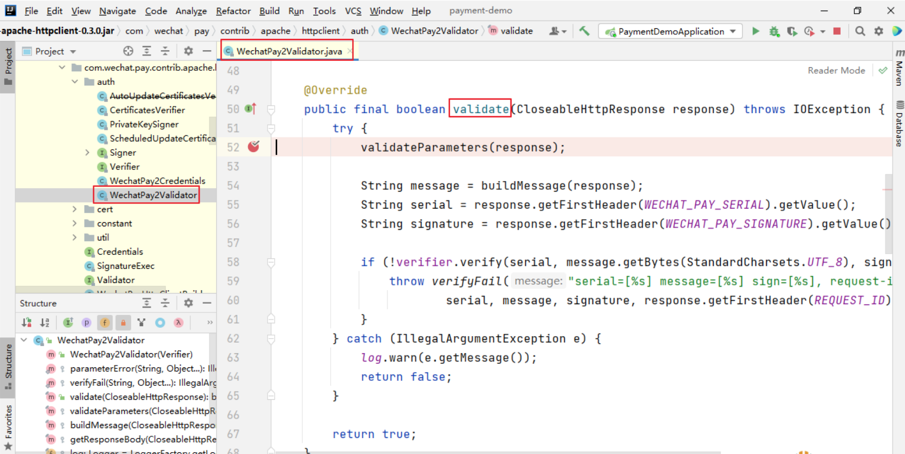

```
logging:
level:
root: info
```

### 5.4、创建课程订单

#### （ 1 ）保存订单

##### OrderInfoService

##### 接口：

##### 实现：

```
OrderInfo createOrderByProductId(Long productId);
```
```
@Resource
private ProductMapper productMapper;
```
```
@Override
public OrderInfo createOrderByProductId(Long productId) {
```
###### //查找已存在但未支付的订单

```
OrderInfo orderInfo = this.getNoPayOrderByProductId(productId);
if( orderInfo != null){
return orderInfo;
}
```
###### //获取商品信息

```
Product product = productMapper.selectById(productId);
```
###### //生成订单

```
orderInfo = new OrderInfo();
orderInfo.setTitle(product.getTitle());
orderInfo.setOrderNo(OrderNoUtils.getOrderNo()); //订单号
orderInfo.setProductId(productId);
orderInfo.setTotalFee(product.getPrice()); //分
orderInfo.setOrderStatus(OrderStatus.NOTPAY.getType());
baseMapper.insert(orderInfo);
```

##### 查找未支付订单：OrderInfoService中添加辅助方法

#### （ 2 ）缓存二维码

##### OrderInfoService

##### 接口：

##### 实现：

#### （ 3 ）修改WxPayServiceImpl 的 nativePay 方法

```
return orderInfo;
}
```
###### /**

```
* 根据商品id查询未支付订单
* 防止重复创建订单对象
* @param productId
* @return
*/
private OrderInfo getNoPayOrderByProductId(Long productId) {
```
```
QueryWrapper<OrderInfo> queryWrapper = new QueryWrapper<>();
queryWrapper.eq("product_id", productId);
queryWrapper.eq("order_status", OrderStatus.NOTPAY.getType());
// queryWrapper.eq("user_id", userId);
OrderInfo orderInfo = baseMapper.selectOne(queryWrapper);
return orderInfo;
}
```
```
void saveCodeUrl(String orderNo, String codeUrl);
```
###### /**

###### * 存储订单二维码

```
* @param orderNo
* @param codeUrl
*/
@Override
public void saveCodeUrl(String orderNo, String codeUrl) {
```
```
QueryWrapper<OrderInfo> queryWrapper = new QueryWrapper<>();
queryWrapper.eq("order_no", orderNo);
```
```
OrderInfo orderInfo = new OrderInfo();
orderInfo.setCodeUrl(codeUrl);
```
```
baseMapper.update(orderInfo, queryWrapper);
}
```
```
@Resource
private OrderInfoService orderInfoService;
```
###### /**

```
* 创建订单，调用Native支付接口
```

### 5.5、显示订单列表

##### 在我的订单页面按时间倒序显示订单列表

#### （ 1 ）创建OrderInfoController

```
* @param productId
* @return code_url 和 订单号
* @throws Exception
*/
@Override
public Map<String, Object> nativePay(Long productId) throws Exception {
```
```
log.info("生成订单");
```
###### //生成订单

```
OrderInfo orderInfo = orderInfoService.createOrderByProductId(productId);
String codeUrl = orderInfo.getCodeUrl();
if(orderInfo != null && !StringUtils.isEmpty(codeUrl)){
log.info("订单已存在，二维码已保存");
//返回二维码
Map<String, Object> map = new HashMap<>();
map.put("codeUrl", codeUrl);
map.put("orderNo", orderInfo.getOrderNo());
return map;
}
```
```
log.info("调用统一下单API");
```
###### //其他代码。。。。。。

```
try {
```
###### //其他代码。。。。。。

###### //保存二维码

```
String orderNo = orderInfo.getOrderNo();
orderInfoService.saveCodeUrl(orderNo, codeUrl);
```
###### //返回二维码

###### //其他代码。。。。。。

```
} finally {
response.close();
}
}
```
```
package com.xxx.paymentdemo.controller;
```
```
import com.xxx.paymentdemo.entity.OrderInfo;
import com.xxx.paymentdemo.service.OrderInfoService;
import com.xxx.paymentdemo.vo.R;
```

#### （ 2 ）定义 OrderInfoService 方法

##### 接口

##### 实现

## 6 、支付通知API

### 6.1、内网穿透

#### （ 1 ）访问ngrok官网

```
import io.swagger.annotations.Api;
import org.springframework.web.bind.annotation.CrossOrigin;
import org.springframework.web.bind.annotation.GetMapping;
import org.springframework.web.bind.annotation.RequestMapping;
import org.springframework.web.bind.annotation.RestController;
```
```
import javax.annotation.Resource;
import java.util.List;
```
```
@CrossOrigin //开放前端的跨域访问
@Api(tags = "商品订单管理")
@RestController
@RequestMapping("/api/order-info")
public class OrderInfoController {
```
```
@Resource
private OrderInfoService orderInfoService;
```
```
@ApiOperation("订单列表")
@GetMapping("/list")
public R list(){
```
```
List<OrderInfo> list = orderInfoService.listOrderByCreateTimeDesc();
return R.ok().data("list", list);
}
}
```
```
List<OrderInfo> listOrderByCreateTimeDesc();
```
###### /**

###### * 查询订单列表，并倒序查询

```
* @return
*/
@Override
public List<OrderInfo> listOrderByCreateTimeDesc() {
```
```
QueryWrapper<OrderInfo> queryWrapper = new QueryWrapper<OrderInfo>
().orderByDesc("create_time");
return baseMapper.selectList(queryWrapper);
}
```

##### https://ngrok.com/

#### （ 2 ）注册账号、登录

#### （ 3 ）下载内网穿透工具

##### ngrok-stable-windows-amd64.zip

#### （ 4 ）设置你的 authToken

##### 为本地计算机做授权配置

#### （ 5 ）启动服务

#### （ 6 ）测试外网访问

### 6.2、接收通知和返回应答

##### 支付通知API：https://pay.weixin.qq.com/wiki/doc/apiv3/apis/chapter3_4_5.shtml

#### （ 1 ）启动ngrok

#### （ 2 ）设置通知地址

##### wxpay.properties

##### 注意：每次重新启动ngrok，都需要根据实际情况修改这个配置

#### （ 3 ）创建通知接口

##### 通知规则：用户支付完成后，微信会把相关支付结果和用户信息发送给商户，商户需要接收处理

##### 该消息，并返回应答。对后台通知交互时，如果微信收到商户的应答不符合规范或超时，微信认

##### 为通知失败，微信会通过一定的策略定期重新发起通知，尽可能提高通知的成功率，但微信不保

##### 证通知最终能成功。（通知频率为

##### 15s/15s/30s/3m/10m/20m/30m/30m/30m/60m/3h/3h/3h/6h/6h - 总计 24h4m）

```
ngrok authtoken 6 aYc6Kp7kpxVr8pY88LkG_6x9o18yMY8BASrXiDFMeS
```
```
ngrok http 8090
```
```
你获得的外网地址/api/test
```
```
ngrok http 8090
```
```
wxpay.notify-domain=https://7d92-115-171-63-135.ngrok.io
```
###### /**

###### * 支付通知

###### * 微信支付通过支付通知接口将用户支付成功消息通知给商户

###### */

```
@ApiOperation("支付通知")
@PostMapping("/native/notify")
```

#### （ 4 ）测试失败应答

##### 用失败应答替换成功应答

#### （ 5 ）测试超时应答

##### 回调通知注意事项：https://pay.weixin.qq.com/wiki/doc/apiv3/Practices/chapter1_1_5.shtml

##### 商户系统收到支付结果通知，需要在 5 秒内返回应答报文，否则微信支付认为通知失败，后续会

##### 重复发送通知。

```
public String nativeNotify(HttpServletRequest request, HttpServletResponse
response){
```
```
Gson gson = new Gson();
Map<String, String> map = new HashMap<>();//应答对象
```
###### //处理通知参数

```
String body = HttpUtils.readData(request);
Map<String, Object> bodyMap = gson.fromJson(body, HashMap.class);
log.info("支付通知的id ===> {}", bodyMap.get("id"));
log.info("支付通知的完整数据 ===> {}", body);
```
###### //TODO : 签名的验证

###### //TODO : 处理订单

###### //成功应答：成功应答必须为 200 或 204 ，否则就是失败应答

```
response.setStatus( 200 );
map.put("code", "SUCCESS");
map.put("message", "成功");
return gson.toJson(map);
```
###### }

```
@PostMapping("/native/notify")
public String nativeNotify(HttpServletRequest request, HttpServletResponse
response) throws Exception {
```
```
Gson gson = new Gson();
Map<String, String> map = new HashMap<>();
```
```
try {
```
```
} catch (Exception e) {
```
```
e.printStackTrace();
// 测试错误应答
response.setStatus( 500 );
map.put("code", "ERROR");
map.put("message", "系统错误");
return gson.toJson(map);
}
}
```

### 6.3、验签

#### （ 1 ）工具类

##### 参考SDK源码中的 WechatPay2Validator 创建通知验签工具类 WechatPay2ValidatorForRequest

#### （ 2 ）验签

### 6.4、解密

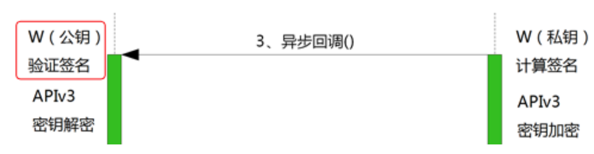
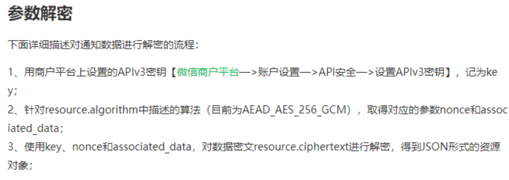


###### // 测试超时应答：添加睡眠时间使应答超时

```
TimeUnit.SECONDS.sleep( 5 );
```
```
@Resource
private Verifier verifier;
```
###### //签名的验证

```
WechatPay2ValidatorForRequest validator
= new WechatPay2ValidatorForRequest(verifier, body, requestId);
if (!validator.validate(request)) {
log.error("通知验签失败");
//失败应答
response.setStatus( 500 );
map.put("code", "ERROR");
map.put("message", "通知验签失败");
return gson.toJson(map);
}
```
```
log.info("通知验签成功");
//TODO : 处理订单
```

#### （ 1 ）WxPayController

##### nativeNotify 方法中添加处理订单的代码

#### （ 1 ）WxPayService

##### 接口：

##### 实现：

##### 辅助方法：

###### //处理订单

```
wxPayService.processOrder(bodyMap);
```
```
void processOrder(Map<String, Object> bodyMap) throws GeneralSecurityException;
```
```
@Override
public void processOrder(Map<String, Object> bodyMap) throws
GeneralSecurityException {
log.info("处理订单");
```
```
String plainText = decryptFromResource(bodyMap);
```
###### //转换明文

###### //更新订单状态

###### //记录支付日志

###### }

###### /**

###### * 对称解密

```
* @param bodyMap
* @return
*/
private String decryptFromResource(Map<String, Object> bodyMap) throws
GeneralSecurityException {
```
```
log.info("密文解密");
```
###### //通知数据

```
Map<String, String> resourceMap = (Map) bodyMap.get("resource");
//数据密文
String ciphertext = resourceMap.get("ciphertext");
//随机串
String nonce = resourceMap.get("nonce");
//附加数据
String associatedData = resourceMap.get("associated_data");
```

### 6.5、处理订单

#### （ 1 ）完善processOrder方法

#### （ 2 ）更新订单状态

##### OrderInfoService

##### 接口：

##### 实现：

```
log.info("密文 ===> {}", ciphertext);
AesUtil aesUtil = new
AesUtil(wxPayConfig.getApiV3Key().getBytes(StandardCharsets.UTF_8));
String plainText =
aesUtil.decryptToString(associatedData.getBytes(StandardCharsets.UTF_8),
```
```
nonce.getBytes(StandardCharsets.UTF_8),
ciphertext);
```
```
log.info("明文 ===> {}", plainText);
```
```
return plainText;
}
```
```
@Resource
private PaymentInfoService paymentInfoService;
```
```
@Override
public void processOrder(Map<String, Object> bodyMap) throws
GeneralSecurityException {
log.info("处理订单");
```
```
String plainText = decryptFromResource(bodyMap);
```
###### //转换明文

```
Gson gson = new Gson();
Map<String, Object> plainTextMap = gson.fromJson(plainText, HashMap.class);
String orderNo = (String)plainTextMap.get("out_trade_no");
```
###### //更新订单状态

```
orderInfoService.updateStatusByOrderNo(orderNo, OrderStatus.SUCCESS);
```
###### //记录支付日志

```
paymentInfoService.createPaymentInfo(plainText);
}
```
```
void updateStatusByOrderNo(String orderNo, OrderStatus orderStatus);
```
###### /**

###### * 根据订单编号更新订单状态

```
* @param orderNo
* @param orderStatus
```

#### （ 3 ）处理支付日志

##### PaymentInfoService

##### 接口：

##### 实现：

###### */

```
@Override
public void updateStatusByOrderNo(String orderNo, OrderStatus orderStatus) {
```
```
log.info("更新订单状态 ===> {}", orderStatus.getType());
```
```
QueryWrapper<OrderInfo> queryWrapper = new QueryWrapper<>();
queryWrapper.eq("order_no", orderNo);
```
```
OrderInfo orderInfo = new OrderInfo();
orderInfo.setOrderStatus(orderStatus.getType());
```
```
baseMapper.update(orderInfo, queryWrapper);
}
```
```
void createPaymentInfo(String plainText);
```
###### /**

###### * 记录支付日志

```
* @param plainText
*/
@Override
public void createPaymentInfo(String plainText) {
```
```
log.info("记录支付日志");
```
```
Gson gson = new Gson();
Map<String, Object> plainTextMap = gson.fromJson(plainText, HashMap.class);
```
```
String orderNo = (String)plainTextMap.get("out_trade_no");
String transactionId = (String)plainTextMap.get("transaction_id");
String tradeType = (String)plainTextMap.get("trade_type");
String tradeState = (String)plainTextMap.get("trade_state");
Map<String, Object> amount = (Map)plainTextMap.get("amount");
Integer payerTotal = ((Double) amount.get("payer_total")).intValue();
```
```
PaymentInfo paymentInfo = new PaymentInfo();
paymentInfo.setOrderNo(orderNo);
paymentInfo.setPaymentType(PayType.WXPAY.getType());
paymentInfo.setTransactionId(transactionId);
paymentInfo.setTradeType(tradeType);
paymentInfo.setTradeState(tradeState);
paymentInfo.setPayerTotal(payerTotal);
paymentInfo.setContent(plainText);
```
```
baseMapper.insert(paymentInfo);
}
```

### 6.6、处理重复通知

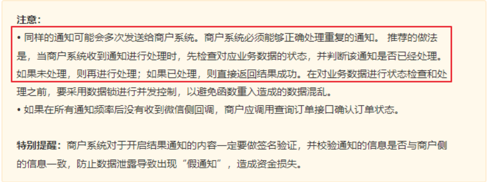

#### （ 1 ）测试重复的通知

#### （ 2 ）处理重复通知

##### 在 processOrder 方法中，更新订单状态之前，添加如下代码

##### OrderInfoService

##### 接口：

##### 实现：

###### //应答超时

###### //设置响应超时，可以接收到微信支付的重复的支付结果通知。

###### //通知重复，数据库会记录多余的支付日志

```
TimeUnit.SECONDS.sleep( 5 );
```
###### //处理重复通知

###### //保证接口调用的幂等性：无论接口被调用多少次，产生的结果是一致的

```
String orderStatus = orderInfoService.getOrderStatus(orderNo);
if (!OrderStatus.NOTPAY.getType().equals(orderStatus)) {
return;
}
```
```
String getOrderStatus(String orderNo);
```
###### /**

###### * 根据订单号获取订单状态

```
* @param orderNo
* @return
*/
@Override
public String getOrderStatus(String orderNo) {
```
```
QueryWrapper<OrderInfo> queryWrapper = new QueryWrapper<>();
queryWrapper.eq("order_no", orderNo);
OrderInfo orderInfo = baseMapper.selectOne(queryWrapper);
```

### 6.7、数据锁

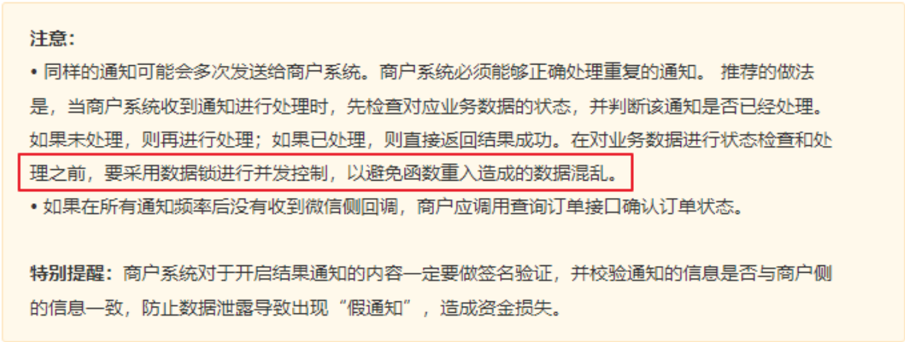

#### （ 1 ）测试通知并发

#### （ 2 ）定义ReentrantLock

##### 定义 ReentrantLock 进行并发控制。注意，必须手动释放锁。

###### //防止被删除的订单的回调通知的调用

```
if(orderInfo == null){
return null;
}
return orderInfo.getOrderStatus();
}
```
###### //处理重复的通知

###### //模拟通知并发

```
try {
TimeUnit.SECONDS.sleep( 5 );
} catch (InterruptedException e) {
e.printStackTrace();
}
```
###### //更新订单状态

###### //记录支付日志

```
private final ReentrantLock lock = new ReentrantLock();
```
```
@Override
public void processOrder(Map<String, Object> bodyMap) throws
GeneralSecurityException {
log.info("处理订单");
```
###### //解密报文

```
String plainText = decryptFromResource(bodyMap);
```
```
//将明文转换成map
Gson gson = new Gson();
```

## 7 、商户定时查询本地订单

### 7.1、后端定义商户查单接口

##### 支付成功后，商户侧查询本地数据库，订单是否支付成功

```
HashMap plainTextMap = gson.fromJson(plainText, HashMap.class);
String orderNo = (String)plainTextMap.get("out_trade_no");
```
###### /*在对业务数据进行状态检查和处理之前，

###### 要采用数据锁进行并发控制，

###### 以避免函数重入造成的数据混乱*/

###### //尝试获取锁：

```
// 成功获取则立即返回true，获取失败则立即返回false。不必一直等待锁的释放
if(lock.tryLock()){
try {
//处理重复的通知
//接口调用的幂等性：无论接口被调用多少次，产生的结果是一致的。
String orderStatus = orderInfoService.getOrderStatus(orderNo);
if(!OrderStatus.NOTPAY.getType().equals(orderStatus)){
return;
}
```
###### //模拟通知并发

```
try {
TimeUnit.SECONDS.sleep( 5 );
} catch (InterruptedException e) {
e.printStackTrace();
}
```
###### //更新订单状态

```
orderInfoService.updateStatusByOrderNo(orderNo,
OrderStatus.SUCCESS);
```
###### //记录支付日志

```
paymentInfoService.createPaymentInfo(plainText);
} finally {
//要主动释放锁
lock.unlock();
}
}
}
```

### 7.2、前端定时轮询查单

##### 在二维码展示页面，前端定时轮询查询订单是否已支付，如果支付成功则跳转到订单页面

#### （ 1 ）定义定时器

#### （ 2 ）查询订单

## 8 、用户取消订单API

##### 实现用户主动取消订单的功能

### 8.1、定义取消订单接口

##### WxPayController中添加接口方法

###### /**

###### * 查询本地订单状态

###### */

```
@ApiOperation("查询本地订单状态")
@GetMapping("/query-order-status/{orderNo}")
public R queryOrderStatus(@PathVariable String orderNo) {
```
```
String orderStatus = orderInfoService.getOrderStatus(orderNo);
if (OrderStatus.SUCCESS.getType().equals(orderStatus)) {//支付成功
return R.ok();
}
return R.ok().setCode( 101 ).setMessage("支付中...");
}
```
###### //启动定时器

```
this.timer = setInterval(() => {
//查询订单是否支付成功
this.queryOrderStatus()
}, 3000 )
```
###### // 查询订单状态

```
queryOrderStatus() {
```
```
orderInfoApi.queryOrderStatus(this.orderNo).then(response => {
console.log('查询订单状态：' + response.code)
```
###### // 支付成功后的页面跳转

```
if (response.code === 0 ) {
console.log('清除定时器')
clearInterval(this.timer)
// 三秒后跳转到订单列表
setTimeout(() => {
this.$router.push({ path: '/success' })
}, 3000 )
}
})
}
```

### 8.2、WxPayService

##### 接口

##### 实现

##### 关单方法

###### /**

###### * 用户取消订单

```
* @param orderNo
* @return
* @throws Exception
*/
@ApiOperation("用户取消订单")
@PostMapping("/cancel/{orderNo}")
public R cancel(@PathVariable String orderNo) throws Exception {
```
```
log.info("取消订单");
```
```
wxPayService.cancelOrder(orderNo);
return R.ok().setMessage("订单已取消");
}
```
```
void cancelOrder(String orderNo) throws Exception;
```
###### /**

###### * 用户取消订单

```
* @param orderNo
*/
@Override
public void cancelOrder(String orderNo) throws Exception {
```
###### //调用微信支付的关单接口

```
this.closeOrder(orderNo);
```
###### //更新商户端的订单状态

```
orderInfoService.updateStatusByOrderNo(orderNo, OrderStatus.CANCEL);
}
```
###### /**

###### * 关单接口的调用

```
* @param orderNo
*/
private void closeOrder(String orderNo) throws Exception {
```
```
log.info("关单接口的调用，订单号 ===> {}", orderNo);
```
###### //创建远程请求对象

```
String url = String.format(WxApiType.CLOSE_ORDER_BY_NO.getType(), orderNo);
url = wxPayConfig.getDomain().concat(url);
HttpPost httpPost = new HttpPost(url);
```
```
//组装json请求体
Gson gson = new Gson();
```

## 9 、微信支付查单API

### 9.1、查单接口的调用

##### 商户后台未收到异步支付结果通知时，商户应该主动调用《微信支付查单接口》，同步订单状态。

#### （ 1 ）WxPayController

```
Map<String, String> paramsMap = new HashMap<>();
paramsMap.put("mchid", wxPayConfig.getMchId());
String jsonParams = gson.toJson(paramsMap);
log.info("请求参数 ===> {}", jsonParams);
```
###### //将请求参数设置到请求对象中

```
StringEntity entity = new StringEntity(jsonParams,"utf-8");
entity.setContentType("application/json");
httpPost.setEntity(entity);
httpPost.setHeader("Accept", "application/json");
```
###### //完成签名并执行请求

```
CloseableHttpResponse response = wxPayClient.execute(httpPost);
```
```
try {
int statusCode = response.getStatusLine().getStatusCode();//响应状态码
if (statusCode == 200 ) { //处理成功
log.info("成功200");
} else if (statusCode == 204 ) { //处理成功，无返回Body
log.info("成功204");
} else {
log.info("Native下单失败,响应码 = " + statusCode);
throw new IOException("request failed");
}
```
```
} finally {
response.close();
}
}
```
###### /**

###### * 查询订单

```
* @param orderNo
* @return
* @throws URISyntaxException
* @throws IOException
*/
@ApiOperation("查询订单：测试订单状态用")
@GetMapping("query/{orderNo}")
public R queryOrder(@PathVariable String orderNo) throws Exception {
```
```
log.info("查询订单");
```
```
String bodyAsString = wxPayService.queryOrder(orderNo);
return R.ok().setMessage("查询成功").data("bodyAsString", bodyAsString);
}
```

#### （ 2 ）WxPayService

##### 接口

##### 实现

### 9.2、集成Spring Task

##### Spring 3.0后提供Spring Task实现任务调度

#### （ 1 ）启动类添加注解

##### statistics启动类添加注解

```
String queryOrder(String orderNo) throws Exception;
```
###### /**

###### * 查单接口调用

###### */

```
@Override
public String queryOrder(String orderNo) throws Exception {
```
```
log.info("查单接口调用 ===> {}", orderNo);
```
```
String url = String.format(WxApiType.ORDER_QUERY_BY_NO.getType(), orderNo);
url = wxPayConfig.getDomain().concat(url).concat("?
mchid=").concat(wxPayConfig.getMchId());
```
```
HttpGet httpGet = new HttpGet(url);
httpGet.setHeader("Accept", "application/json");
```
###### //完成签名并执行请求

```
CloseableHttpResponse response = wxPayClient.execute(httpGet);
```
```
try {
String bodyAsString = EntityUtils.toString(response.getEntity());//响应体
int statusCode = response.getStatusLine().getStatusCode();//响应状态码
if (statusCode == 200 ) { //处理成功
log.info("成功, 返回结果 = " + bodyAsString);
} else if (statusCode == 204 ) { //处理成功，无返回Body
log.info("成功");
} else {
log.info("Native下单失败,响应码 = " + statusCode+ ",返回结果 = " +
bodyAsString);
throw new IOException("request failed");
}
```
```
return bodyAsString;
```
```
} finally {
response.close();
}
}
```

#### （ 2 ）测试定时任务

##### 创建 task 包，创建 WxPayTask.java

### 9.3、定时查找超时订单

#### （ 1 ）WxPayTask

```
@EnableScheduling
```
```
package com.xxx.paymentdemo.task;
```
```
import lombok.extern.slf4j.Slf4j;
import org.springframework.scheduling.annotation.Scheduled;
import org.springframework.stereotype.Component;
```
```
@Slf4j
@Component
public class WxPayTask {
```
###### /**

###### * 测试

```
* (cron="秒 分 时 日 月 周")
* *：每隔一秒执行
* 0/3：从第 0 秒开始，每隔 3 秒执行一次
* 1-3: 从第 1 秒开始执行，到第 3 秒结束执行
* 1,2,3：第 1 、 2 、 3 秒执行
* ?：不指定，若指定日期，则不指定周，反之同理
*/
@Scheduled(cron="0/3 * * * * ?")
public void task1() {
log.info("task1 执行");
}
}
```
```
@Resource
private OrderInfoService orderInfoService;
```
```
@Resource
private WxPayService wxPayService;
```
###### /**

###### * 从第 0 秒开始每隔 30 秒执行 1 次，查询创建超过 5 分钟，并且未支付的订单

###### */

```
@Scheduled(cron = "0/30 * * * * ?")
public void orderConfirm() throws Exception {
log.info("orderConfirm 被执行......");
```
```
List<OrderInfo> orderInfoList = orderInfoService.getNoPayOrderByDuration( 5 );
```
```
for (OrderInfo orderInfo : orderInfoList) {
String orderNo = orderInfo.getOrderNo();
log.warn("超时订单 ===> {}", orderNo);
```

#### （ 2 ）OrderInfoService

##### 接口

##### 实现

### 9.4、处理超时订单

#### WxPayService

##### 核实订单状态

##### 接口：

##### 实现：

###### //核实订单状态：调用微信支付查单接口

```
wxPayService.checkOrderStatus(orderNo);
}
}
```
```
List<OrderInfo> getNoPayOrderByDuration(int minutes);
```
###### /**

```
* 找出创建超过minutes分钟并且未支付的订单
* @param minutes
* @return
*/
@Override
public List<OrderInfo> getNoPayOrderByDuration(int minutes) {
```
```
//minutes分钟之前的时间
Instant instant = Instant.now().minus(Duration.ofMinutes(minutes));
```
```
QueryWrapper<OrderInfo> queryWrapper = new QueryWrapper<>();
queryWrapper.eq("order_status", OrderStatus.NOTPAY.getType());
queryWrapper.le("create_time", instant);
List<OrderInfo> orderInfoList = baseMapper.selectList(queryWrapper);
return orderInfoList;
}
```
```
void checkOrderStatus(String orderNo) throws Exception;
```
###### /**

###### * 根据订单号查询微信支付查单接口，核实订单状态

###### * 如果订单已支付，则更新商户端订单状态，并记录支付日志

###### * 如果订单未支付，则调用关单接口关闭订单，并更新商户端订单状态

```
* @param orderNo
*/
@Override
public void checkOrderStatus(String orderNo) throws Exception {
```
```
log.warn("根据订单号核实订单状态 ===> {}", orderNo);
```

(^)

##### 6.8

##### 接口：

##### 实现：

###### //调用微信支付查单接口

```
String result = this.queryOrder(orderNo);
```
```
Gson gson = new Gson();
Map resultMap = gson.fromJson(result, HashMap.class);
```
###### //获取微信支付端的订单状态

```
Object tradeState = resultMap.get("trade_state");
```
###### //判断订单状态

```
if(WxTradeState.SUCCESS.getType().equals(tradeState)){
```
```
log.warn("核实订单已支付 ===> {}", orderNo);
```
###### //如果确认订单已支付则更新本地订单状态

```
orderInfoService.updateStatusByOrderNo(orderNo, OrderStatus.SUCCESS);
//记录支付日志
paymentInfoService.createPaymentInfo(result);
}
```
```
if(WxTradeState.NOTPAY.getType().equals(tradeState)){
log.warn("核实订单未支付 ===> {}", orderNo);
```
###### //如果订单未支付，则调用关单接口

```
this.closeOrder(orderNo);
```
###### //更新本地订单状态

```
orderInfoService.updateStatusByOrderNo(orderNo, OrderStatus.CLOSED);
}
```
###### }

```
OrderInfo getOrderByOrderNo(String orderNo);
```

## 11 、申请退款API

##### 文档：https://pay.weixin.qq.com/wiki/doc/apiv3/apis/chapter3_4_9.shtml

### 11.1、创建退款单

#### （ 1 ）根据订单号查询订单

##### OrderInfoService

##### 接口：

##### 实现：

#### （ 2 ）创建退款单记录

##### RefundsInfoService

##### 接口：

###### /**

###### * 根据订单号获取订单

```
* @param orderNo
* @return
*/
@Override
public OrderInfo getOrderByOrderNo(String orderNo) {
QueryWrapper<OrderInfo> queryWrapper = new QueryWrapper<>();
queryWrapper.eq("order_no", orderNo);
OrderInfo orderInfo = baseMapper.selectOne(queryWrapper);
```
```
return orderInfo;
}
```
```
OrderInfo getOrderByOrderNo(String orderNo);
```
###### /**

###### * 根据订单号获取订单

```
* @param orderNo
* @return
*/
@Override
public OrderInfo getOrderByOrderNo(String orderNo) {
```
```
QueryWrapper<OrderInfo> queryWrapper = new QueryWrapper<>();
queryWrapper.eq("order_no", orderNo);
OrderInfo orderInfo = baseMapper.selectOne(queryWrapper);
```
```
return orderInfo;
}
```
```
RefundInfo createRefundByOrderNo(String orderNo, String reason);
```

##### 实现：

### 11.2、更新退款单

##### RefundInfoService

##### 接口：

##### 实现：

```
@Resource
private OrderInfoService orderInfoService;
```
###### /**

###### * 根据订单号创建退款订单

```
* @param orderNo
* @return
*/
@Override
public RefundInfo createRefundByOrderNo(String orderNo, String reason) {
```
###### //根据订单号获取订单信息

```
OrderInfo orderInfo = orderInfoService.getOrderByOrderNo(orderNo);
```
###### //根据订单号生成退款订单

```
RefundInfo refundInfo = new RefundInfo();
refundInfo.setOrderNo(orderNo);//订单编号
refundInfo.setRefundNo(OrderNoUtils.getRefundNo());//退款单编号
refundInfo.setTotalFee(orderInfo.getTotalFee());//原订单金额(分)
refundInfo.setRefund(orderInfo.getTotalFee());//退款金额(分)
refundInfo.setReason(reason);//退款原因
```
###### //保存退款订单

```
baseMapper.insert(refundInfo);
```
```
return refundInfo;
}
```
```
void updateRefund(String content);
```
###### /**

###### * 记录退款记录

```
* @param content
*/
@Override
public void updateRefund(String content) {
```
```
//将json字符串转换成Map
Gson gson = new Gson();
Map<String, String> resultMap = gson.fromJson(content, HashMap.class);
```
###### //根据退款单编号修改退款单

```
QueryWrapper<RefundInfo> queryWrapper = new QueryWrapper<>();
queryWrapper.eq("refund_no", resultMap.get("out_refund_no"));
```

### 11.3、申请退款

#### （ 1 ）WxPayController

#### （ 2 ）WxPayService

##### 接口：

##### 实现：

###### //设置要修改的字段

```
RefundInfo refundInfo = new RefundInfo();
```
```
refundInfo.setRefundId(resultMap.get("refund_id"));//微信支付退款单号
```
###### //查询退款和申请退款中的返回参数

```
if(resultMap.get("status") != null){
refundInfo.setRefundStatus(resultMap.get("status"));//退款状态
refundInfo.setContentReturn(content);//将全部响应结果存入数据库的content字段
}
//退款回调中的回调参数
if(resultMap.get("refund_status") != null){
refundInfo.setRefundStatus(resultMap.get("refund_status"));//退款状态
refundInfo.setContentNotify(content);//将全部响应结果存入数据库的content字段
}
```
###### //更新退款单

```
baseMapper.update(refundInfo, queryWrapper);
}
```
```
@ApiOperation("申请退款")
@PostMapping("/refunds/{orderNo}/{reason}")
public R refunds(@PathVariable String orderNo, @PathVariable String reason)
throws Exception {
```
```
log.info("申请退款");
wxPayService.refund(orderNo, reason);
return R.ok();
}
```
```
void refund(String orderNo, String reason) throws Exception;
```
```
@Resource
private RefundInfoService refundsInfoService;
```
###### /**

###### * 退款

```
* @param orderNo
* @param reason
* @throws IOException
*/
@Transactional(rollbackFor = Exception.class)
@Override
public void refund(String orderNo, String reason) throws Exception {
```

log.info("创建退款单记录");
//根据订单编号创建退款单
RefundInfo refundsInfo = refundsInfoService.createRefundByOrderNo(orderNo,
reason);

log.info("调用退款API");

###### //调用统一下单API

String url =
wxPayConfig.getDomain().concat(WxApiType.DOMESTIC_REFUNDS.getType());
HttpPost httpPost = new HttpPost(url);

// 请求body参数
Gson gson = new Gson();
Map paramsMap = new HashMap();
paramsMap.put("out_trade_no", orderNo);//订单编号
paramsMap.put("out_refund_no", refundsInfo.getRefundNo());//退款单编号
paramsMap.put("reason",reason);//退款原因
paramsMap.put("notify_url",
wxPayConfig.getNotifyDomain().concat(WxNotifyType.REFUND_NOTIFY.getType()));//退
款通知地址

Map amountMap = new HashMap();
amountMap.put("refund", refundsInfo.getRefund());//退款金额
amountMap.put("total", refundsInfo.getTotalFee());//原订单金额
amountMap.put("currency", "CNY");//退款币种
paramsMap.put("amount", amountMap);

//将参数转换成json字符串
String jsonParams = gson.toJson(paramsMap);
log.info("请求参数 ===> {}" + jsonParams);

StringEntity entity = new StringEntity(jsonParams,"utf-8");
entity.setContentType("application/json");//设置请求报文格式
httpPost.setEntity(entity);//将请求报文放入请求对象
httpPost.setHeader("Accept", "application/json");//设置响应报文格式

###### //完成签名并执行请求，并完成验签

CloseableHttpResponse response = wxPayClient.execute(httpPost);

try {

###### //解析响应结果

String bodyAsString = EntityUtils.toString(response.getEntity());
int statusCode = response.getStatusLine().getStatusCode();
if (statusCode == 200 ) {
log.info("成功, 退款返回结果 = " + bodyAsString);
} else if (statusCode == 204 ) {
log.info("成功");
} else {
throw new RuntimeException("退款异常, 响应码 = " + statusCode+ ", 退款
返回结果 = " + bodyAsString);
}

###### //更新订单状态

orderInfoService.updateStatusByOrderNo(orderNo,
OrderStatus.REFUND_PROCESSING);


## 12 、查询退款API

##### 文档：https://pay.weixin.qq.com/wiki/doc/apiv3/apis/chapter3_4_10.shtml

### 12.1、查单接口的调用

#### （ 1 ）WxPayController

#### （ 2 ）WxPayService

##### 接口：

##### 实现：

###### //更新退款单

```
refundsInfoService.updateRefund(bodyAsString);
```
```
} finally {
response.close();
}
}
```
###### /**

###### * 查询退款

```
* @param refundNo
* @return
* @throws Exception
*/
@ApiOperation("查询退款：测试用")
@GetMapping("/query-refund/{refundNo}")
public R queryRefund(@PathVariable String refundNo) throws Exception {
```
```
log.info("查询退款");
```
```
String result = wxPayService.queryRefund(refundNo);
return R.ok().setMessage("查询成功").data("result", result);
}
```
```
String queryRefund(String orderNo) throws Exception;
```
###### /**

###### * 查询退款接口调用

```
* @param refundNo
* @return
*/
@Override
public String queryRefund(String refundNo) throws Exception {
```
```
log.info("查询退款接口调用 ===> {}", refundNo);
```
```
String url = String.format(WxApiType.DOMESTIC_REFUNDS_QUERY.getType(),
refundNo);
```

### 12.2、定时查找退款中的订单

#### （ 1 ）WxPayTask

#### （ 2 ）RefundInfoService

##### 接口

```
url = wxPayConfig.getDomain().concat(url);
```
```
//创建远程Get 请求对象
HttpGet httpGet = new HttpGet(url);
httpGet.setHeader("Accept", "application/json");
```
###### //完成签名并执行请求

```
CloseableHttpResponse response = wxPayClient.execute(httpGet);
```
```
try {
String bodyAsString = EntityUtils.toString(response.getEntity());
int statusCode = response.getStatusLine().getStatusCode();
if (statusCode == 200 ) {
log.info("成功, 查询退款返回结果 = " + bodyAsString);
} else if (statusCode == 204 ) {
log.info("成功");
} else {
throw new RuntimeException("查询退款异常, 响应码 = " + statusCode+ ",
查询退款返回结果 = " + bodyAsString);
}
```
```
return bodyAsString;
```
```
} finally {
response.close();
}
}
```
###### /**

###### * 从第 0 秒开始每隔 30 秒执行 1 次，查询创建超过 5 分钟，并且未成功的退款单

###### */

```
@Scheduled(cron = "0/30 * * * * ?")
public void refundConfirm() throws Exception {
log.info("refundConfirm 被执行......");
```
###### //找出申请退款超过 5 分钟并且未成功的退款单

```
List<RefundInfo> refundInfoList =
refundInfoService.getNoRefundOrderByDuration( 5 );
```
```
for (RefundInfo refundInfo : refundInfoList) {
String refundNo = refundInfo.getRefundNo();
log.warn("超时未退款的退款单号 ===> {}", refundNo);
```
###### //核实订单状态：调用微信支付查询退款接口

```
wxPayService.checkRefundStatus(refundNo);
}
}
```

##### 实现

### 12.3、处理超时未退款订单

#### WxPayService

##### 核实订单状态

##### 接口：

##### 实现：

```
List<RefundInfo> getNoRefundOrderByDuration(int minutes);
```
###### /**

```
* 找出申请退款超过minutes分钟并且未成功的退款单
* @param minutes
* @return
*/
@Override
public List<RefundInfo> getNoRefundOrderByDuration(int minutes) {
```
```
//minutes分钟之前的时间
Instant instant = Instant.now().minus(Duration.ofMinutes(minutes));
```
```
QueryWrapper<RefundInfo> queryWrapper = new QueryWrapper<>();
queryWrapper.eq("refund_status", WxRefundStatus.PROCESSING.getType());
queryWrapper.le("create_time", instant);
List<RefundInfo> refundInfoList = baseMapper.selectList(queryWrapper);
return refundInfoList;
}
```
```
void checkRefundStatus(String refundNo);
```
###### /**

###### * 根据退款单号核实退款单状态

```
* @param refundNo
* @return
*/
@Transactional(rollbackFor = Exception.class)
@Override
public void checkRefundStatus(String refundNo) throws Exception {
```
```
log.warn("根据退款单号核实退款单状态 ===> {}", refundNo);
```
###### //调用查询退款单接口

```
String result = this.queryRefund(refundNo);
```
```
//组装json请求体字符串
Gson gson = new Gson();
Map<String, String> resultMap = gson.fromJson(result, HashMap.class);
```
###### //获取微信支付端退款状态


(^)

## 13 、退款结果通知API

##### 文档：https://pay.weixin.qq.com/wiki/doc/apiv3/apis/chapter3_4_11.shtml

### 13.1、接收退款通知

##### WxPayController

```
String status = resultMap.get("status");
```
```
String orderNo = resultMap.get("out_trade_no");
```
```
if (WxRefundStatus.SUCCESS.getType().equals(status)) {
```
```
log.warn("核实订单已退款成功 ===> {}", refundNo);
```
###### //如果确认退款成功，则更新订单状态

```
orderInfoService.updateStatusByOrderNo(orderNo,
OrderStatus.REFUND_SUCCESS);
```
###### //更新退款单

```
refundsInfoService.updateRefund(result);
}
```
```
if (WxRefundStatus.ABNORMAL.getType().equals(status)) {
```
```
log.warn("核实订单退款异常 ===> {}", refundNo);
```
###### //如果确认退款成功，则更新订单状态

```
orderInfoService.updateStatusByOrderNo(orderNo,
OrderStatus.REFUND_ABNORMAL);
```
###### //更新退款单

```
refundsInfoService.updateRefund(result);
}
}
```
###### /**

###### * 退款结果通知

###### * 退款状态改变后，微信会把相关退款结果发送给商户。

###### */

```
@PostMapping("/refunds/notify")
public String refundsNotify(HttpServletRequest request, HttpServletResponse
response){
```
```
log.info("退款通知执行");
Gson gson = new Gson();
Map<String, String> map = new HashMap<>();//应答对象
```
```
try {
//处理通知参数
String body = HttpUtils.readData(request);
Map<String, Object> bodyMap = gson.fromJson(body, HashMap.class);
```

### 13.2、处理订单和退款单

##### WxPayService

##### 接口：

##### 实现：

```
String requestId = (String)bodyMap.get("id");
log.info("支付通知的id ===> {}", requestId);
```
###### //签名的验证

```
WechatPay2ValidatorForRequest wechatPay2ValidatorForRequest
= new WechatPay2ValidatorForRequest(verifier, requestId, body);
if(!wechatPay2ValidatorForRequest.validate(request)){
```
```
log.error("通知验签失败");
//失败应答
response.setStatus( 500 );
map.put("code", "ERROR");
map.put("message", "通知验签失败");
return gson.toJson(map);
}
log.info("通知验签成功");
```
###### //处理退款单

```
wxPayService.processRefund(bodyMap);
```
###### //成功应答

```
response.setStatus( 200 );
map.put("code", "SUCCESS");
map.put("message", "成功");
return gson.toJson(map);
```
```
} catch (Exception e) {
e.printStackTrace();
//失败应答
response.setStatus( 500 );
map.put("code", "ERROR");
map.put("message", "失败");
return gson.toJson(map);
}
}
```
```
void processRefund(Map<String, Object> bodyMap) throws Exception;
```
###### /**

###### * 处理退款单

###### */

```
@Transactional(rollbackFor = Exception.class)
@Override
public void processRefund(Map<String, Object> bodyMap) throws Exception {
```
```
log.info("退款单");
```
###### //解密报文


## 14 、账单

### 14.1、申请交易账单和资金账单

#### （ 1 ）WxPayController

#### （ 2 ）WxPayService

##### 接口：

```
String plainText = decryptFromResource(bodyMap);
```
```
//将明文转换成map
Gson gson = new Gson();
HashMap plainTextMap = gson.fromJson(plainText, HashMap.class);
String orderNo = (String)plainTextMap.get("out_trade_no");
```
```
if(lock.tryLock()){
try {
```
```
String orderStatus = orderInfoService.getOrderStatus(orderNo);
if (!OrderStatus.REFUND_PROCESSING.getType().equals(orderStatus)) {
return;
}
```
###### //更新订单状态

```
orderInfoService.updateStatusByOrderNo(orderNo,
OrderStatus.REFUND_SUCCESS);
```
###### //更新退款单

```
refundsInfoService.updateRefund(plainText);
```
```
} finally {
//要主动释放锁
lock.unlock();
}
}
}
```
```
@ApiOperation("获取账单url：测试用")
@GetMapping("/querybill/{billDate}/{type}")
public R queryTradeBill(
@PathVariable String billDate,
@PathVariable String type) throws Exception {
```
```
log.info("获取账单url");
```
```
String downloadUrl = wxPayService.queryBill(billDate, type);
return R.ok().setMessage("获取账单url成功").data("downloadUrl", downloadUrl);
}
```
```
String queryBill(String billDate, String type) throws Exception;
```

##### 实现

###### /**

###### * 申请账单

```
* @param billDate
* @param type
* @return
* @throws Exception
*/
@Override
public String queryBill(String billDate, String type) throws Exception {
log.warn("申请账单接口调用 {}", billDate);
```
```
String url = "";
if("tradebill".equals(type)){
url = WxApiType.TRADE_BILLS.getType();
}else if("fundflowbill".equals(type)){
url = WxApiType.FUND_FLOW_BILLS.getType();
}else{
throw new RuntimeException("不支持的账单类型");
}
```
```
url = wxPayConfig.getDomain().concat(url).concat("?
bill_date=").concat(billDate);
```
```
//创建远程Get 请求对象
HttpGet httpGet = new HttpGet(url);
httpGet.addHeader("Accept", "application/json");
```
```
//使用wxPayClient发送请求得到响应
CloseableHttpResponse response = wxPayClient.execute(httpGet);
```
```
try {
```
```
String bodyAsString = EntityUtils.toString(response.getEntity());
```
```
int statusCode = response.getStatusLine().getStatusCode();
if (statusCode == 200 ) {
log.info("成功, 申请账单返回结果 = " + bodyAsString);
} else if (statusCode == 204 ) {
log.info("成功");
} else {
throw new RuntimeException("申请账单异常, 响应码 = " + statusCode+ ",
申请账单返回结果 = " + bodyAsString);
}
```
###### //获取账单下载地址

```
Gson gson = new Gson();
Map<String, String> resultMap = gson.fromJson(bodyAsString,
HashMap.class);
return resultMap.get("download_url");
```
```
} finally {
response.close();
}
}
```

### 14.2、下载账单

#### （ 1 ）WxPayController

#### （ 2 ）WxPayService

##### 接口：

##### 实现：

```
@ApiOperation("下载账单")
@GetMapping("/downloadbill/{billDate}/{type}")
public R downloadBill(
@PathVariable String billDate,
@PathVariable String type) throws Exception {
```
```
log.info("下载账单");
String result = wxPayService.downloadBill(billDate, type);
```
```
return R.ok().data("result", result);
}
```
```
String downloadBill(String billDate, String type) throws Exception;
```
###### /**

###### * 下载账单

```
* @param billDate
* @param type
* @return
* @throws Exception
*/
@Override
public String downloadBill(String billDate, String type) throws Exception {
log.warn("下载账单接口调用 {}, {}", billDate, type);
```
```
//获取账单url地址
String downloadUrl = this.queryBill(billDate, type);
//创建远程Get 请求对象
HttpGet httpGet = new HttpGet(downloadUrl);
httpGet.addHeader("Accept", "application/json");
```
```
//使用wxPayClient发送请求得到响应
CloseableHttpResponse response = wxPayNoSignClient.execute(httpGet);
```
```
try {
```
```
String bodyAsString = EntityUtils.toString(response.getEntity());
```
```
int statusCode = response.getStatusLine().getStatusCode();
if (statusCode == 200 ) {
log.info("成功, 下载账单返回结果 = " + bodyAsString);
} else if (statusCode == 204 ) {
log.info("成功");
} else {
```
