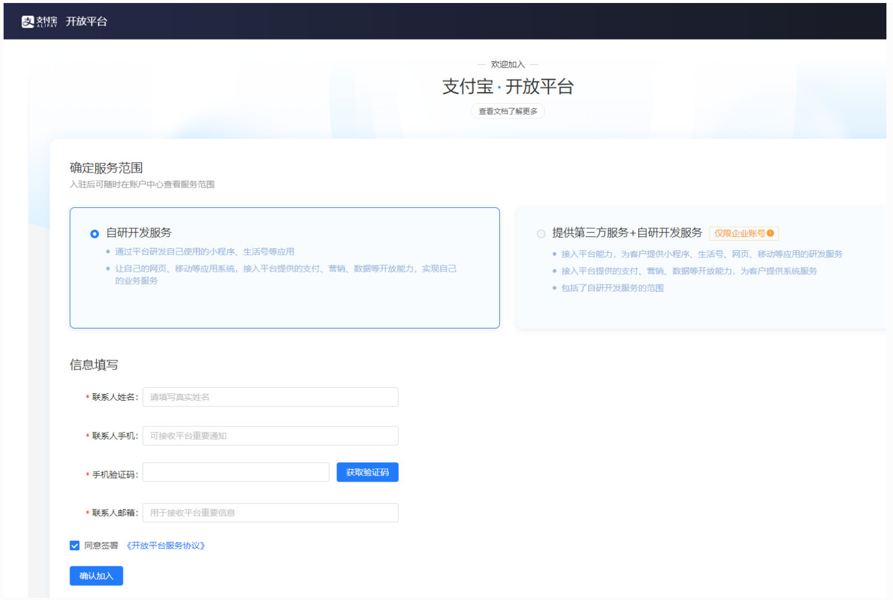
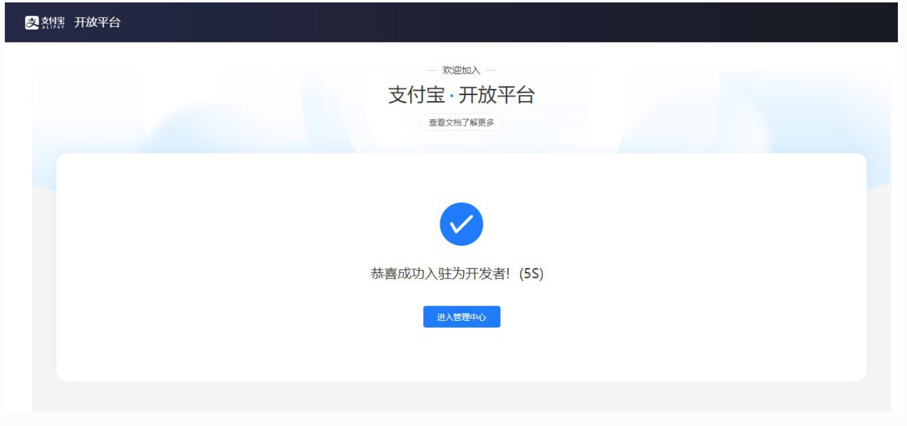
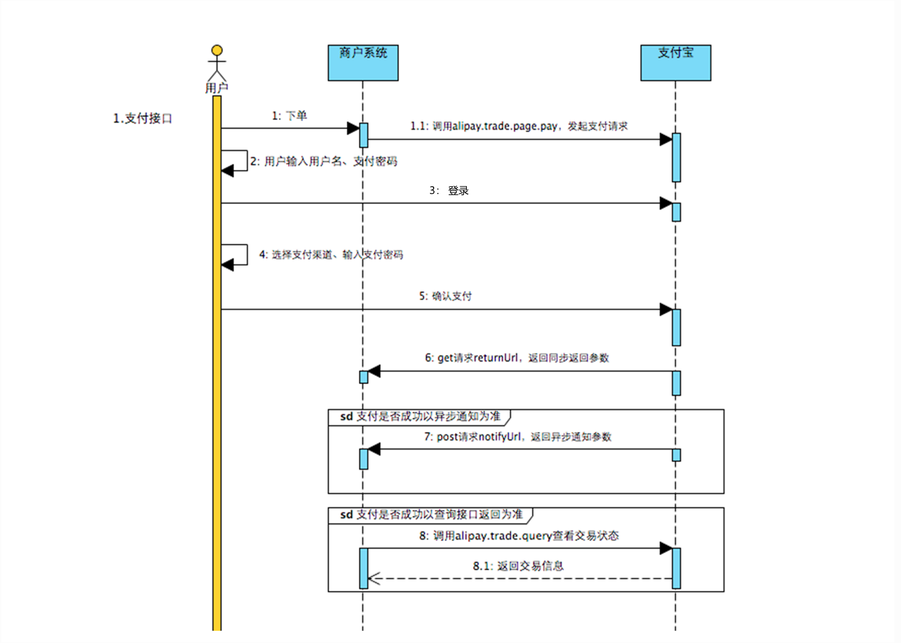

# 一、支付宝支付介绍和接入指引

## 1 、准备工作

## 1.1、创建案例项目

## 1.2、支付安全相关知识

## 2 、支付宝开放能力介绍

## 2.1、能力地图

##### 支付能力、支付扩展、资金能力、口碑能力、营销能力、会员能力、行业能力、安全能力、基础能力


### 2.2、电脑网站支付产品介绍

##### 应用场景、准入条件、计费模式

## 3 、接入准备

### 3.1、开放平台账号注册

##### https://open.alipay.com/

##### step1：


##### step2：



##### step3：



### 3.2、常规接入流程

##### 创建应用： 选择应用类型、填写应用基本信息、添加应用功能、配置应用环境（获取支付宝公

##### 钥、应用公钥、应用私钥、支付宝网关地址，配置接口内容加密方式）、查看 APPID

##### 绑定应用： 将开发者账号中的APPID和商家账号PID进行绑定

##### 配置秘钥： 即创建应用中的“配置应用环境”步骤

##### 上线应用： 将应用提交审核

##### 签约功能： 在商家中心上传营业执照、已备案网站信息等，提交审核进行签约


## 3.3、使用沙箱

##### 沙箱环境配置： https://opendocs.alipay.com/common/02kkv

##### 沙箱版支付宝的下载和登录： https://open.alipay.com/platform/appDaily.htm?tab=tool

# 二、运行和配置案例项目

## 1 、还原数据库

##### payment_demo.sql，执行以下命令还原数据库

## 2 、运行后端项目

##### 用idea打开payment-demo，确认maven仓库的位置，修改application.yml中的数据库连接配置，运行

##### 项目

## 3 、运行前端项目

##### 安装node.js，如果你希望方便的查看和修改前端代码，可以安装一个VSCode和相关插件，用VSCode打

##### 开前端项目payment-demo-front，运行前端项目

## 4 、引入支付参数

## 4.1、引入沙箱配置文件

##### 将之前准备好的 alipay-sandbox.properties 复制到项目的 resources 目录中

##### 并将其设置为 spring 配置文件

## 4.2、创建配置文件

##### 在config包中创建AlipayClientConfig

```
mysql -uroot -p <D:\支付\支付宝\0 4 - 资料\0 2 - 运行案例项目\payment_demo.sql
```
```
#先进入到前端项目目录
npm run serve
```

### 4.3、测试配置文件的引入

## 5 、引入服务端SDK

### 5.1、引入依赖

##### 参考文档：开放平台 => 文档 => 开发工具 => 服务端SDK => Java => 通用版 => Maven项目依赖

##### https://search.maven.org/artifact/com.alipay.sdk/alipay-sdk-java

### 5.2、创建客戶端连接对象

##### 创建带数据签名的客戶端对象

##### 参考文档：开放平台 => 文档 => 开发工具 => 技术接入指南 => 数据签名

```
package com.xxx.paymentdemo.config;
```
```
@Configuration
//加载配置文件
@PropertySource("classpath:alipay-sandbox.properties")
public class AlipayClientConfig {
```
```
}
```
```
package com.xxx.paymentdemo;
```
```
@SpringBootTest
@Slf4j
public class AlipayTests {
```
```
@Resource
private Environment config;
```
```
@Test
void testGetAlipayConfig(){
```
```
log.info("appid = " + config.getProperty("alipay.app-id"));
}
}
```
```
<!--SDK-->
<dependency>
<groupId>com.alipay.sdk</groupId>
<artifactId>alipay-sdk-java</artifactId>
<version>4.22.57.ALL</version>
</dependency>
```

##### https://opendocs.alipay.com/common/02kf5q

##### 参考文档中公钥方式完善 AlipayClientConfig 类，添加 alipayClient() 方法 初始化 AlipayClient 对象

```
package com.xxx.paymentdemo.config;
```
```
import com.alipay.api.*;
import org.springframework.context.annotation.Bean;
import org.springframework.context.annotation.Configuration;
import org.springframework.context.annotation.PropertySource;
import org.springframework.core.env.Environment;
```
```
import javax.annotation.Resource;
```
```
@Configuration
//加载配置文件
@PropertySource("classpath:alipay-sandbox.properties")
public class AlipayClientConfig {
```
```
//自动获取alipay-sandbox.properties中的配置
@Resource
private Environment config;
```
```
@Bean
public AlipayClient alipayClient() throws AlipayApiException {
```
```
AlipayConfig alipayConfig = new AlipayConfig();
//设置网关地址
alipayConfig.setServerUrl(config.getProperty("alipay.gateway-url"));
//设置应用Id
alipayConfig.setAppId(config.getProperty("alipay.app-id"));
//设置应用私钥
alipayConfig.setPrivateKey(config.getProperty("alipay.merchant-private-
key"));
//设置请求格式，固定值json
alipayConfig.setFormat(AlipayConstants.FORMAT_JSON);
//设置字符集
alipayConfig.setCharset(AlipayConstants.CHARSET_UTF8);
//设置支付宝公钥
alipayConfig.setAlipayPublicKey(config.getProperty("alipay.alipay-public-
key"));
//设置签名类型
alipayConfig.setSignType(AlipayConstants.SIGN_TYPE_RSA2);
//构造client
AlipayClient alipayClient = new DefaultAlipayClient(alipayConfig);
```
```
return alipayClient;
}
}
```

# 三、支付功能开发

## 1 、统一收单下单并支付⻚面

## 1.1、支付调用流程



##### https://opendocs.alipay.com/open/270/

## 1.2、接口说明

##### https://opendocs.alipay.com/apis/028r8t?scene=

##### 公共请求参数：所有接口都需要的参数

##### 请求参数：当前接口需要的参数

##### 公共响应参数：所有接口的响应中都包含的数据

##### 响应参数：当前接口的响应中包含的数据

## 1.3、发起支付请求

#### （ 1 ）创建 AliPayController

```
package com.xxx.paymentdemo.controller;
```

#### （ 2 ）创建 AliPayService

##### 接口

##### 实现

```
import com.xxx.paymentdemo.service.AliPayService;
import com.xxx.paymentdemo.vo.R;
import io.swagger.annotations.Api;
import io.swagger.annotations.ApiOperation;
import lombok.extern.slf4j.Slf4j;
import org.springframework.web.bind.annotation.*;
```
```
import javax.annotation.Resource;
```
```
@CrossOrigin
@RestController
@RequestMapping("/api/ali-pay")
@Api(tags = "网站支付宝支付")
@Slf4j
public class AliPayController {
```
```
@Resource
private AliPayService aliPayService;
```
```
@ApiOperation("统一收单下单并支付页面接口的调用")
@PostMapping("/trade/page/pay/{productId}")
public R tradePagePay(@PathVariable Long productId){
```
```
log.info("统一收单下单并支付页面接口的调用");
//支付宝开放平台接受 request 请求对象后
// 会为开发者生成一个html 形式的 form表单，包含自动提交的脚本
String formStr = aliPayService.tradeCreate(productId);
//我们将form表单字符串返回给前端程序，之后前端将会调用自动提交脚本，进行表单的提交
//此时，表单会自动提交到action属性所指向的支付宝开放平台中，从而为用户展示一个支付页面
return R.ok().data("formStr", formStr);
}
}
```
```
package com.xxx.paymentdemo.service;
```
```
public interface AliPayService {
String tradeCreate(Long productId);
}
```
```
package com.xxx.paymentdemo.service.impl;
```
```
import com.alibaba.fastjson.JSONObject;
import com.alipay.api.AlipayApiException;
import com.alipay.api.AlipayClient;
import com.alipay.api.request.AlipayTradePagePayRequest;
import com.alipay.api.response.AlipayTradePagePayResponse;
import com.xxx.paymentdemo.entity.OrderInfo;
import com.xxx.paymentdemo.service.AliPayService;
import com.xxx.paymentdemo.service.OrderInfoService;
```

import lombok.extern.slf4j.Slf4j;
import org.springframework.core.env.Environment;
import org.springframework.stereotype.Service;
import org.springframework.transaction.annotation.Transactional;

import javax.annotation.Resource;
import java.math.BigDecimal;

@Service
@Slf4j
public class AliPayServiceImpl implements AliPayService {

@Resource
private OrderInfoService orderInfoService;

@Resource
private AlipayClient alipayClient;

@Resource
private Environment config;

@Transactional
@Override
public String tradeCreate(Long productId) {

try {
//生成订单
log.info("生成订单");
OrderInfo orderInfo =
orderInfoService.createOrderByProductId(productId);

//调用支付宝接口
AlipayTradePagePayRequest request = new AlipayTradePagePayRequest();
//配置需要的公共请求参数
//request.setNotifyUrl("");
//支付完成后，我们想让页面跳转回谷粒学院的页面，配置returnUrl
request.setReturnUrl(config.getProperty("alipay.return-url"));

//组装当前业务方法的请求参数
JSONObject bizContent = new JSONObject();
bizContent.put("out_trade_no", orderInfo.getOrderNo());
BigDecimal total = new
BigDecimal(orderInfo.getTotalFee().toString()).divide(new BigDecimal("100"));
bizContent.put("total_amount", total);
bizContent.put("subject", orderInfo.getTitle());
bizContent.put("product_code", "FAST_INSTANT_TRADE_PAY");

request.setBizContent(bizContent.toString());

//执行请求，调用支付宝接口
AlipayTradePagePayResponse response =
alipayClient.pageExecute(request);

if(response.isSuccess()){
log.info("调用成功，返回结果 ===> " + response.getBody());
return response.getBody();
} else {


### 1.4、前端支付按钮

#### （ 1 ）index.vue

#### （ 2 ）aliPay.js

```
log.info("调用失败，返回码 ===> " + response.getCode() + ", 返回描述
===> " + response.getMsg());
throw new RuntimeException("创建支付交易失败");
}
} catch (AlipayApiException e) {
e.printStackTrace();
throw new RuntimeException("创建支付交易失败");
}
}
}
```
```
//确认支付
toPay() {
//禁用按钮，防止重复提交
this.payBtnDisabled = true
```
```
//微信支付
if (this.payOrder.payType === 'wxpay') {
......
```
```
//支付宝支付
} else if (this.payOrder.payType === 'alipay') {
```
```
//调用支付宝统一收单下单并支付页面接口
aliPayApi.tradePagePay(this.payOrder.productId).then((response) => {
//将支付宝返回的表单字符串写在浏览器中，表单会自动触发submit提交
document.write(response.data.formStr)
})
}
},
```
```
// axios 发送ajax请求
import request from '@/utils/request'
```
```
export default{
```
```
//发起支付请求
tradePagePay(productId) {
return request({
url: '/api/ali-pay/trade/page/pay/' + productId,
method: 'post'
})
}
}
```

## 2 、支付结果通知

### 2.1、设置异步通知地址

##### 在AliPayServiceImpl的tradeCreate方法中设置异步通知地址

### 2.2、启动内网穿透ngrok

### 2.3、修改内网穿透配置

##### 根据ngrok每次启动的情况，修改alipay-sandbox.properties文件中的alipay.notify-url

### 2.4、开发异步通知接口

#### （ 1 ）AliPayController

```
//配置需要的公共请求参数
//支付完成后，支付宝向谷粒学院发起异步通知的地址
request.setNotifyUrl(config.getProperty("alipay.notify-url"));
```
```
ngrok http 8090
```
```
# 服务器异步通知页面路径 需http://格式的完整路径，不能加?id=123这类自定义参数，必须外网可以正常
访问
# 注意：每次重新启动ngrok，都需要根据实际情况修改这个配置
alipay.notify-url=https://a863-180-174-204-169.ngrok.io/api/ali-pay/trade/notify
```
```
@Resource
private Environment config;
```
```
@Resource
private OrderInfoService orderInfoService;
```
```
@ApiOperation("支付通知")
@PostMapping("/trade/notify")
public String tradeNotify(@RequestParam Map<String, String> params){
```
```
log.info("支付通知正在执行");
log.info("通知参数 ===> {}", params);
```

String result = "failure";

try {
//异步通知验签
boolean signVerified = AlipaySignature.rsaCheckV1(
params,
config.getProperty("alipay.alipay-public-key"),
AlipayConstants.CHARSET_UTF8,
AlipayConstants.SIGN_TYPE_RSA2); //调用SDK验证签名

if(!signVerified){
//验签失败则记录异常日志，并在response中返回failure.
log.error("支付成功异步通知验签失败！");
return result;
}

// 验签成功后
log.info("支付成功异步通知验签成功！");

//按照支付结果异步通知中的描述，对支付结果中的业务内容进行二次校验，
//1 商户需要验证该通知数据中的 out_trade_no 是否为商户系统中创建的订单号
String outTradeNo = params.get("out_trade_no");
OrderInfo order = orderInfoService.getOrderByOrderNo(outTradeNo);
if(order == null){
log.error("订单不存在");
return result;
}

//2 判断 total_amount 是否确实为该订单的实际金额（即商户订单创建时的金额）
String totalAmount = params.get("total_amount");
int totalAmountInt = new BigDecimal(totalAmount).multiply(new
BigDecimal("100")).intValue();
int totalFeeInt = order.getTotalFee().intValue();
if(totalAmountInt != totalFeeInt){
log.error("金额校验失败");
return result;
}

//3 校验通知中的 seller_id（或者 seller_email) 是否为 out_trade_no 这笔单据的对应
的操作方
String sellerId = params.get("seller_id");
String sellerIdProperty = config.getProperty("alipay.seller-id");
if(!sellerId.equals(sellerIdProperty)){
log.error("商家pid校验失败");
return result;
}

//4 验证 app_id 是否为该商户本身
String appId = params.get("app_id");
String appIdProperty = config.getProperty("alipay.app-id");
if(!appId.equals(appIdProperty)){
log.error("appid校验失败");
return result;
}

//在支付宝的业务通知中，只有交易通知状态为 TRADE_SUCCESS时，
// 支付宝才会认定为买家付款成功。


#### （ 2 ）AliPayService

##### 接口

##### 实现

### 2.5、记录支付日志

#### PaymentInfoService

##### 接口

```
String tradeStatus = params.get("trade_status");
if(!"TRADE_SUCCESS".equals(tradeStatus)){
log.error("支付未成功");
return result;
}
```
```
//处理业务 修改订单状态 记录支付日志
aliPayService.processOrder(params);
```
```
//校验成功后在response中返回success并继续商户自身业务处理，校验失败返回failure
result = "success";
} catch (AlipayApiException e) {
e.printStackTrace();
}
return result;
}
```
```
void processOrder(Map<String, String> params);
```
```
/**
* 处理订单
* @param params
*/
@Transactional(rollbackFor = Exception.class)
@Override
public void processOrder(Map<String, String> params) {
```
```
log.info("处理订单");
```
```
//获取订单号
String orderNo = params.get("out_trade_no");
```
```
//更新订单状态
orderInfoService.updateStatusByOrderNo(orderNo, OrderStatus.SUCCESS);
```
```
//记录支付日志
paymentInfoService.createPaymentInfoForAliPay(params);
```
```
}
```
```
void createPaymentInfoForAliPay(Map<String, String> params);
```

##### 实现

### 2.6、更新订单状态记录支付日志

##### 在 processOrder 方法中，更新订单状态之前，添加如下代码

```
/**
* 记录支付日志：支付宝
* @param params
*/
@Override
public void createPaymentInfoForAliPay(Map<String, String> params) {
```
```
log.info("记录支付日志");
```
```
//获取订单号
String orderNo = params.get("out_trade_no");
//业务编号
String transactionId = params.get("trade_no");
//交易状态
String tradeStatus = params.get("trade_status");
//交易金额
String totalAmount = params.get("total_amount");
int totalAmountInt = new BigDecimal(totalAmount).multiply(new
BigDecimal("100")).intValue();
```
```
PaymentInfo paymentInfo = new PaymentInfo();
paymentInfo.setOrderNo(orderNo);
paymentInfo.setPaymentType(PayType.ALIPAY.getType());
paymentInfo.setTransactionId(transactionId);
paymentInfo.setTradeType("电脑网站支付");
paymentInfo.setTradeState(tradeStatus);
paymentInfo.setPayerTotal(totalAmountInt);
```
```
Gson gson = new Gson();
String json = gson.toJson(params, HashMap.class);
paymentInfo.setContent(json);
```
```
baseMapper.insert(paymentInfo);
}
```
```
//处理重复通知
//接口调用的幂等性：无论接口被调用多少次，以下业务执行一次
String orderStatus = orderInfoService.getOrderStatus(orderNo);
if (!OrderStatus.NOTPAY.getType().equals(orderStatus)) {
return;
}
```

### 2.7、数据锁

##### 在AliPayServiceImpl中定义 ReentrantLock 进行并发控制。注意，必须手动释放锁。

##### 完整的processOrder 方法

## 3 、订单表优化

```
private final ReentrantLock lock = new ReentrantLock();
```
```
/**
* 处理订单
* @param params
*/
@Transactional(rollbackFor = Exception.class)
@Override
public void processOrder(Map<String, String> params) {
```
```
log.info("处理订单");
```
```
//获取订单号
String orderNo = params.get("out_trade_no");
```
```
/*在对业务数据进行状态检查和处理之前，
要采用数据锁进行并发控制，
以避免函数重入造成的数据混乱*/
//尝试获取锁：
// 成功获取则立即返回true，获取失败则立即返回false。不必一直等待锁的释放
if(lock.tryLock()) {
try {
```
```
//处理重复通知
//接口调用的幂等性：无论接口被调用多少次，以下业务执行一次
String orderStatus = orderInfoService.getOrderStatus(orderNo);
if (!OrderStatus.NOTPAY.getType().equals(orderStatus)) {
return;
}
```
```
//更新订单状态
orderInfoService.updateStatusByOrderNo(orderNo, OrderStatus.SUCCESS);
```
```
//记录支付日志
paymentInfoService.createPaymentInfoForAliPay(params);
```
```
} finally {
//要主动释放锁
lock.unlock();
}
}
```
```
}
```

### 3.1、表修改

##### t_order_info表中添加payment_type字段

### 3.2、业务修改

#### （ 1 ）修改支付业务代码

##### 修改 AliPayServiceImpl 、WxPayServiceImpl 代码中对如下方法的调用，添加参数

###### PayType.ALIPAY.getType()

#### （ 2 ）修改OrderInfoService

##### 接口的createOrderByProductId方法中添加参数 String paymentType

##### 实现类的createOrderByProductId方法中添加参数String paymentType

##### 对getNoPayOrderByProductId方法的调用时添加参数paymentType

##### 生成订单的过程中添加orderInfo.setPaymentType(paymentType);

```
log.info("生成订单");
OrderInfo orderInfo = orderInfoService.createOrderByProductId(productId,
PayType.ALIPAY.getType());
```
```
OrderInfo createOrderByProductId(Long productId, String paymentType);
```
```
@Override
public OrderInfo createOrderByProductId(Long productId, String paymentType) {
```
```
//查找已存在但未支付的订单
OrderInfo orderInfo = this.getNoPayOrderByProductId(productId, paymentType);
if( orderInfo != null){
return orderInfo;
}
```
```
//获取商品信息
Product product = productMapper.selectById(productId);
```
```
//生成订单
orderInfo = new OrderInfo();
orderInfo.setTitle(product.getTitle());
orderInfo.setOrderNo(OrderNoUtils.getOrderNo()); //订单号
orderInfo.setProductId(productId);
orderInfo.setTotalFee(product.getPrice()); //分
orderInfo.setOrderStatus(OrderStatus.NOTPAY.getType()); //未支付
orderInfo.setPaymentType(paymentType);
baseMapper.insert(orderInfo);
```
```
return orderInfo;
}
```

##### 对getNoPayOrderByProductId方法的定义时添加参数paymentType

##### 添加查询条件queryWrapper.eq("payment_type", paymentType);

## 4 、统一收单交易关闭

### 4.1、定义用戶取消订单接口

##### 在AliPayController中添加方法

### 4.2、关单并修改订单状态

##### AliPayService接口

##### AliPayServiceImpl实现

```
/**
* 根据商品id查询未支付订单
* 防止重复创建订单对象
* @param productId
* @return
*/
private OrderInfo getNoPayOrderByProductId(Long productId, String paymentType)
{
```
```
QueryWrapper<OrderInfo> queryWrapper = new QueryWrapper<>();
queryWrapper.eq("product_id", productId);
queryWrapper.eq("order_status", OrderStatus.NOTPAY.getType());
queryWrapper.eq("payment_type", paymentType);
// queryWrapper.eq("user_id", userId);
OrderInfo orderInfo = baseMapper.selectOne(queryWrapper);
return orderInfo;
}
```
```
/**
* 用户取消订单
* @param orderNo
* @return
*/
@ApiOperation("用户取消订单")
@PostMapping("/trade/close/{orderNo}")
public R cancel(@PathVariable String orderNo){
```
```
log.info("取消订单");
aliPayService.cancelOrder(orderNo);
return R.ok().setMessage("订单已取消");
}
```
```
void cancelOrder(String orderNo);
```

### 4.3、调用支付宝接口

##### AliPayServiceImpl中添加辅助方法

### 4.4、测试

##### 注意： 针对二维码支付，只有经过扫码的订单才在支付宝端有交易记录。针对支付宝账号支付，只有经

##### 过登录的订单才在支付宝端有交易记录。

```
/**
* 用户取消订单
* @param orderNo
*/
@Override
public void cancelOrder(String orderNo) {
```
```
//调用支付宝提供的统一收单交易关闭接口
this.closeOrder(orderNo);
```
```
//更新用户订单状态
orderInfoService.updateStatusByOrderNo(orderNo, OrderStatus.CANCEL);
}
```
```
/**
* 关单接口的调用
* @param orderNo 订单号
*/
private void closeOrder(String orderNo) {
```
```
try {
log.info("关单接口的调用，订单号 ===> {}", orderNo);
```
```
AlipayTradeCloseRequest request = new AlipayTradeCloseRequest();
JSONObject bizContent = new JSONObject();
bizContent.put("out_trade_no", orderNo);
request.setBizContent(bizContent.toString());
AlipayTradeCloseResponse response = alipayClient.execute(request);
```
```
if(response.isSuccess()){
log.info("调用成功，返回结果 ===> " + response.getBody());
} else {
log.info("调用失败，返回码 ===> " + response.getCode() + ", 返回描述
===> " + response.getMsg());
//throw new RuntimeException("关单接口的调用失败");
}
```
```
} catch (AlipayApiException e) {
e.printStackTrace();
throw new RuntimeException("关单接口的调用失败");
}
}
```

## 5 、统一收单线下交易查询

### 5.1、查单接口的调用

##### 商戶后台未收到异步支付结果通知时，商戶应该主动调用《统一收单线下交易查询接口》，同步订单状

##### 态。

#### （ 1 ）AliPayController

#### （ 2 ）AliPayService

##### 接口

##### 实现

```
/**
* 查询订单
* @param orderNo
* @return
* @throws Exception
*/
@ApiOperation("查询订单：测试订单状态用")
@GetMapping("/trade/query/{orderNo}")
public R queryOrder(@PathVariable String orderNo) {
```
```
log.info("查询订单");
```
```
String result = aliPayService.queryOrder(orderNo);
return R.ok().setMessage("查询成功").data("result", result);
```
```
}
```
```
String queryOrder(String orderNo);
```
```
/**
* 查询订单
* @param orderNo
* @return 返回订单查询结果，如果返回null则表示支付宝端尚未创建订单
*/
@Override
public String queryOrder(String orderNo) {
```
```
try {
log.info("查单接口调用 ===> {}", orderNo);
```
```
AlipayTradeQueryRequest request = new AlipayTradeQueryRequest();
JSONObject bizContent = new JSONObject();
bizContent.put("out_trade_no", orderNo);
request.setBizContent(bizContent.toString());
```

### 5.2、定时查单

#### （ 1 ）创建AliPayTask

#### （ 2 ）修改OrderInfoService

```
AlipayTradeQueryResponse response = alipayClient.execute(request);
if(response.isSuccess()){
log.info("调用成功，返回结果 ===> " + response.getBody());
return response.getBody();
} else {
log.info("调用失败，返回码 ===> " + response.getCode() + ", 返回描述 ===> "
+ response.getMsg());
//throw new RuntimeException("查单接口的调用失败");
return null;//订单不存在
}
```
```
} catch (AlipayApiException e) {
e.printStackTrace();
throw new RuntimeException("查单接口的调用失败");
}
}
```
```
@Slf4j
@Component
public class AliPayTask {
```
```
@Resource
private OrderInfoService orderInfoService;
```
```
@Resource
private AliPayService aliPayService;
```
```
/**
* 从第 0 秒开始每隔 30 秒执行 1 次，查询创建超过 5 分钟，并且未支付的订单
*/
@Scheduled(cron = "0/30 * * * * ?")
public void orderConfirm() throws Exception {
```
```
log.info("orderConfirm 被执行......");
```
```
List<OrderInfo> orderInfoList = orderInfoService.getNoPayOrderByDuration( 1 ,
PayType.ALIPAY.getType());
```
```
for (OrderInfo orderInfo : orderInfoList) {
String orderNo = orderInfo.getOrderNo();
log.warn("超时订单 ===> {}", orderNo);
```
```
//核实订单状态：调用支付宝查单接口
//aliPayService.checkOrderStatus(orderNo);
}
}
}
```

##### 接口添加参数String paymentType

##### 实现添加参数 String paymentType，添加查询条件queryWrapper.eq("payment_type",

###### paymentType);

#### （ 3 ）修改WxPayTask

##### 将之前微信支付的方法调用也做一个优化

##### orderConfirm方法中对getNoPayOrderByDuration的调用添加参数 PayType.WXPAY.getType()

### 5.3、处理查询到的订单

#### （ 1 ）AliPayTask

##### 在定时任务的for循环最后添加以下代码

#### （ 2 ）AliPayService

##### 核实订单状态

```
List<OrderInfo> getNoPayOrderByDuration(int minutes, String paymentType);
```
```
/**
* 找出创建超过minutes分钟并且未支付的订单
* @param minutes
* @return
*/
@Override
public List<OrderInfo> getNoPayOrderByDuration(int minutes, String paymentType) {
```
```
//minutes分钟之前的时间
Instant instant = Instant.now().minus(Duration.ofMinutes(minutes));
```
```
QueryWrapper<OrderInfo> queryWrapper = new QueryWrapper<>();
queryWrapper.eq("order_status", OrderStatus.NOTPAY.getType());
queryWrapper.le("create_time", instant);
queryWrapper.eq("payment_type", paymentType);
```
```
List<OrderInfo> orderInfoList = baseMapper.selectList(queryWrapper);
return orderInfoList;
}
```
```
List<OrderInfo> orderInfoList = orderInfoService.getNoPayOrderByDuration( 1 ,
PayType.WXPAY.getType());
```
```
//核实订单状态：调用支付宝查单接口
aliPayService.checkOrderStatus(orderNo);
```

##### 接口：

##### 实现：

```
void checkOrderStatus(String orderNo);
```
```
/**
* 根据订单号调用支付宝查单接口，核实订单状态
* 如果订单未创建，则更新商户端订单状态
* 如果订单未支付，则调用关单接口关闭订单，并更新商户端订单状态
* 如果订单已支付，则更新商户端订单状态，并记录支付日志
* @param orderNo
*/
@Override
public void checkOrderStatus(String orderNo) {
```
```
log.warn("根据订单号核实订单状态 ===> {}", orderNo);
```
```
String result = this.queryOrder(orderNo);
```
```
//订单未创建
if(result == null){
log.warn("核实订单未创建 ===> {}", orderNo);
//更新本地订单状态
orderInfoService.updateStatusByOrderNo(orderNo, OrderStatus.CLOSED);
}
```
```
//解析查单响应结果
Gson gson = new Gson();
HashMap<String, LinkedTreeMap> resultMap = gson.fromJson(result,
HashMap.class);
LinkedTreeMap alipayTradeQueryResponse =
resultMap.get("alipay_trade_query_response");
```
```
String tradeStatus = (String)alipayTradeQueryResponse.get("trade_status");
if(AliPayTradeState.NOTPAY.getType().equals(tradeStatus)){
log.warn("核实订单未支付 ===> {}", orderNo);
```
```
//如果订单未支付，则调用关单接口关闭订单
this.closeOrder(orderNo);
```
```
// 并更新商户端订单状态
orderInfoService.updateStatusByOrderNo(orderNo, OrderStatus.CLOSED);
}
```
```
if(AliPayTradeState.SUCCESS.getType().equals(tradeStatus)){
log.warn("核实订单已支付 ===> {}", orderNo);
```
```
//如果订单已支付，则更新商户端订单状态
orderInfoService.updateStatusByOrderNo(orderNo, OrderStatus.SUCCESS);
```
```
//并记录支付日志
paymentInfoService.createPaymentInfoForAliPay(alipayTradeQueryResponse);
}
```
```
}
```

## 6 、统一收单交易退款

### 6.1、退款接口

#### （ 1 ）AliPayController

#### （ 2 ）AliPayService

##### 接口

##### 实现

```
/**
* 申请退款
* @param orderNo
* @param reason
* @return
*/
@ApiOperation("申请退款")
@PostMapping("/trade/refund/{orderNo}/{reason}")
public R refunds(@PathVariable String orderNo, @PathVariable String reason){
```
```
log.info("申请退款");
aliPayService.refund(orderNo, reason);
return R.ok();
}
```
```
void refund(String orderNo, String reason);
```
```
/**
* 退款
* @param orderNo
* @param reason
*/
@Transactional(rollbackFor = Exception.class)
@Override
public void refund(String orderNo, String reason) {
```
```
try {
log.info("调用退款API");
```
```
//创建退款单
RefundInfo refundInfo =
refundsInfoService.createRefundByOrderNoForAliPay(orderNo, reason);
```
```
//调用统一收单交易退款接口
AlipayTradeRefundRequest request = new AlipayTradeRefundRequest ();
```

### 6.2、创建退款记录

#### RefundInfoService

##### 接口

```
//组装当前业务方法的请求参数
JSONObject bizContent = new JSONObject();
bizContent.put("out_trade_no", orderNo);//订单编号
BigDecimal refund = new
BigDecimal(refundInfo.getRefund().toString()).divide(new BigDecimal("100"));
//BigDecimal refund = new BigDecimal("2").divide(new BigDecimal("100"));
bizContent.put("refund_amount", refund);//退款金额：不能大于支付金额
bizContent.put("refund_reason", reason);//退款原因(可选)
```
```
request.setBizContent(bizContent.toString());
```
```
//执行请求，调用支付宝接口
AlipayTradeRefundResponse response = alipayClient.execute(request);
```
```
if(response.isSuccess()){
log.info("调用成功，返回结果 ===> " + response.getBody());
```
```
//更新订单状态
orderInfoService.updateStatusByOrderNo(orderNo,
OrderStatus.REFUND_SUCCESS);
```
```
//更新退款单
refundsInfoService.updateRefundForAliPay(
refundInfo.getRefundNo(),
response.getBody(),
AliPayTradeState.REFUND_SUCCESS.getType()); //退款成功
```
```
} else {
log.info("调用失败，返回码 ===> " + response.getCode() + ", 返回描述 ===> "
+ response.getMsg());
```
```
//更新订单状态
orderInfoService.updateStatusByOrderNo(orderNo,
OrderStatus.REFUND_ABNORMAL);
```
```
//更新退款单
refundsInfoService.updateRefundForAliPay(
refundInfo.getRefundNo(),
response.getBody(),
AliPayTradeState.REFUND_ERROR.getType()); //退款失败
}
```
```
} catch (AlipayApiException e) {
e.printStackTrace();
throw new RuntimeException("创建退款申请失败");
}
}
```

##### 实现

### 6.3、更新退款记录

#### RefundInfoService

##### 接口

##### 实现

```
RefundInfo createRefundByOrderNoForAliPay(String orderNo, String reason);
```
```
/**
* 根据订单号创建退款订单
* @param orderNo
* @return
*/
@Override
public RefundInfo createRefundByOrderNoForAliPay(String orderNo, String reason) {
```
```
//根据订单号获取订单信息
OrderInfo orderInfo = orderInfoService.getOrderByOrderNo(orderNo);
```
```
//根据订单号生成退款订单
RefundInfo refundInfo = new RefundInfo();
refundInfo.setOrderNo(orderNo);//订单编号
refundInfo.setRefundNo(OrderNoUtils.getRefundNo());//退款单编号
```
```
refundInfo.setTotalFee(orderInfo.getTotalFee());//原订单金额(分)
refundInfo.setRefund(orderInfo.getTotalFee());//退款金额(分)
refundInfo.setReason(reason);//退款原因
```
```
//保存退款订单
baseMapper.insert(refundInfo);
```
```
return refundInfo;
}
```
```
void updateRefundForAliPay(String refundNo, String content, String refundStatus);
```
```
/**
* 更新退款记录
* @param refundNo
* @param content
* @param refundStatus
*/
@Override
public void updateRefundForAliPay(String refundNo, String content, String
refundStatus) {
```
```
//根据退款单编号修改退款单
QueryWrapper<RefundInfo> queryWrapper = new QueryWrapper<>();
queryWrapper.eq("refund_no", refundNo);
```

## 7 、统一收单交易退款查询

### 退款查询

#### （ 1 ）AliPayController

#### （ 2 ）AliPayService

##### 接口

##### 实现

```
//设置要修改的字段
RefundInfo refundInfo = new RefundInfo();
refundInfo.setRefundStatus(refundStatus);//退款状态
refundInfo.setContentReturn(content);//将全部响应结果存入数据库的content字段
```
```
//更新退款单
baseMapper.update(refundInfo, queryWrapper);
```
```
}
```
```
/**
* 查询退款
* @param orderNo
* @return
* @throws Exception
*/
@ApiOperation("查询退款：测试用")
@GetMapping("/trade/fastpay/refund/{orderNo}")
public R queryRefund(@PathVariable String orderNo) throws Exception {
```
```
log.info("查询退款");
```
```
String result = aliPayService.queryRefund(orderNo);
return R.ok().setMessage("查询成功").data("result", result);
}
```
```
String queryRefund(String orderNo);
```
```
/**
* 查询退款
* @param orderNo
* @return
*/
@Override
public String queryRefund(String orderNo) {
```
```
try {
```

## 8 、收单退款冲退完成通知

##### 退款存在退到银行卡场景下时，收单会根据银行回执消息发送退款完成信息。

##### 开发流程类似支付结果通知。

## 9 、对账

### 查询对账单下载地址接口

#### （ 1 ）AliPayController

```
log.info("查询退款接口调用 ===> {}", orderNo);
```
```
AlipayTradeFastpayRefundQueryRequest request = new
AlipayTradeFastpayRefundQueryRequest();
JSONObject bizContent = new JSONObject();
bizContent.put("out_trade_no", orderNo);
bizContent.put("out_request_no", orderNo);
request.setBizContent(bizContent.toString());
```
```
AlipayTradeFastpayRefundQueryResponse response =
alipayClient.execute(request);
if(response.isSuccess()){
log.info("调用成功，返回结果 ===> " + response.getBody());
return response.getBody();
} else {
log.info("调用失败，返回码 ===> " + response.getCode() + ", 返回描述 ===> "
+ response.getMsg());
//throw new RuntimeException("查单接口的调用失败");
return null;//订单不存在
}
```
```
} catch (AlipayApiException e) {
e.printStackTrace();
throw new RuntimeException("查单接口的调用失败");
}
}
```
```
/**
* 根据账单类型和日期获取账单url地址
*
* @param billDate
* @param type
* @return
*/
@ApiOperation("获取账单url")
@GetMapping("/bill/downloadurl/query/{billDate}/{type}")
public R queryTradeBill(
@PathVariable String billDate,
```

#### （ 2 ）AliPayService

##### 接口

##### 实现

```
@PathVariable String type) {
log.info("获取账单url");
String downloadUrl = aliPayService.queryBill(billDate, type);
return R.ok().setMessage("获取账单url成功").data("downloadUrl", downloadUrl);
}
```
```
String queryBill(String billDate, String type);
```
```
/**
* 申请账单
* @param billDate
* @param type
* @return
*/
@Override
public String queryBill(String billDate, String type) {
```
```
try {
```
```
AlipayDataDataserviceBillDownloadurlQueryRequest request = new
AlipayDataDataserviceBillDownloadurlQueryRequest();
JSONObject bizContent = new JSONObject();
bizContent.put("bill_type", type);
bizContent.put("bill_date", billDate);
request.setBizContent(bizContent.toString());
AlipayDataDataserviceBillDownloadurlQueryResponse response =
alipayClient.execute(request);
```
```
if(response.isSuccess()){
log.info("调用成功，返回结果 ===> " + response.getBody());
```
```
//获取账单下载地址
Gson gson = new Gson();
HashMap<String, LinkedTreeMap> resultMap =
gson.fromJson(response.getBody(), HashMap.class);
LinkedTreeMap billDownloadurlResponse =
resultMap.get("alipay_data_dataservice_bill_downloadurl_query_response");
String billDownloadUrl =
(String)billDownloadurlResponse.get("bill_download_url");
```
```
return billDownloadUrl;
} else {
log.info("调用失败，返回码 ===> " + response.getCode() + ", 返回描述 ===> "
+ response.getMsg());
throw new RuntimeException("申请账单失败");
}
```
```
} catch (AlipayApiException e) {
e.printStackTrace();
```

throw new RuntimeException("申请账单失败");
}
}


